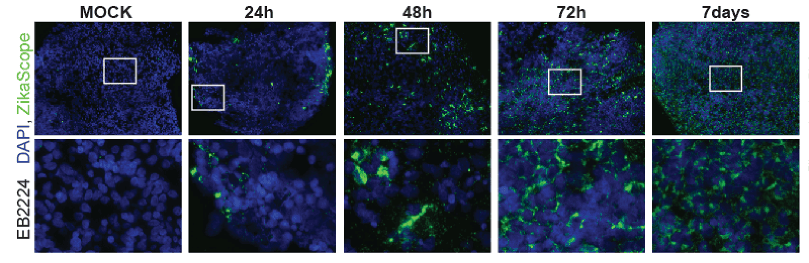
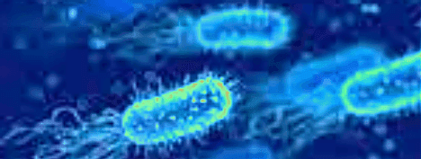
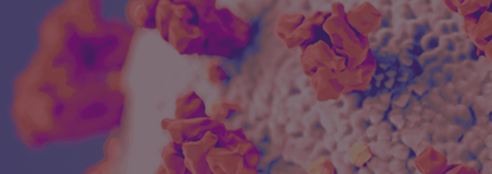
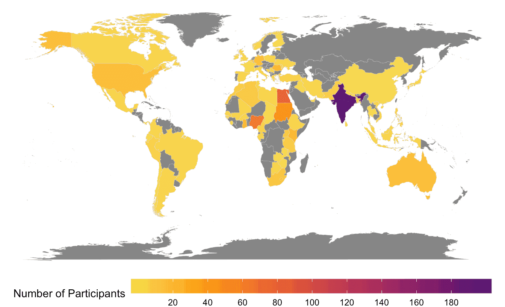
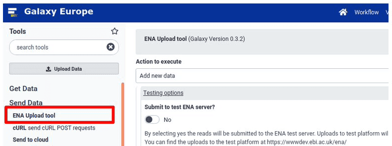

Hello all,

The September newsletter brings what feels like a lot of news, including

* A list of 12 recent use cases for UseGalaxy.eu, covering a broad spectrum of research.
* Want to help address misconceptions about Galaxy?
* The Galaxy Community Hub is now using Gridsome.
* ELIXIR community updates
* JXTX Foundation 2021 Awards
* 7 open positions in Belgium, Italy, and the US
* The Galaxy YouTube channel is growing up
* Upcoming events
* Galaxy Platforms News
* Recent Blog Posts
* Doc, Hub, and Training Updates
* Recent Publications
* and other news too.

Sit back, get comfortable, and explore the Galaxy...

Beatriz Serrano-Solano and Dave Clements, Editors

PS: Subscribe to the [Galaxy Announce mailing list](https://lists.galaxyproject.org/?count=100&all-lists=) and receive an email whenever this newsletter is published.

---

# Community News

<!-- Use cases -->

[Galaxy Use Cases](https://galaxyproject.eu/news?tag=UseCase)

Scientists from all over the world are using [UseGalaxy.eu](https://usegalaxy.eu/) for diverse research topics, check them out!

* [Zika virus effects on brain and brain tumours](https://galaxyproject.eu/posts/2021/06/18/use-case-harry-bulstrode/)
* [Genetics research on dairy cattle](https://galaxyproject.eu/posts/2021/06/25/use-case-tomas-klingstrom/)
* [Genomics, evolution, and ecology of organohalide-respiring bacteria](https://galaxyproject.eu/posts/2021/07/02/use-case-yi-yang/)
* [Colorectal cancer research](https://galaxyproject.eu/posts/2021/07/05/use-case-amir/)
* [Plant genomics](https://galaxyproject.eu/posts/2021/07/09/use-case-shaobin-zhong/)
* [Epigenomics and transcriptomics in cancer](https://galaxyproject.eu/posts/2021/07/16/use-case-mzwanele-ngubo/)
* [Heart research](https://galaxyproject.eu/posts/2021/07/23/use-case-tsai-sang/)
* [Circadian research](https://galaxyproject.eu/posts/2021/07/30/use-case-akanksha-bafna/)
* [Sex determination of fish species](https://galaxyproject.eu/posts/2021/08/13/use-case-joelle-lafond/)
* [Food safety research](https://galaxyproject.eu/posts/2021/08/20/use-case-carol-verheecke-vaessen/)
* [Antibody responses following vaccination](https://galaxyproject.eu/posts/2021/08/27/use-case-carolyn-nielsen/)
* [Marine turtle tumour disease](https://galaxyproject.eu/posts/2021/09/03/use-case-liam-whitmore/)

<!-- GGSC Misconceptions -->

[Participate in the *Galaxy Misconceptions* sub-committee](https://forms.gle/RCN87JEXxAR2srbv7)

Since the beginning of the Galaxy project, many negative (and very
often completely wrong) myths about the functionality and capability
of Galaxy have made their rounds in the scientific communities. The
[Global Galaxy Steering Committee](https://galaxyproject.org/community/steering/) has set up a [sub-committee](https://galaxyproject.org/community/steering/#subcommittees) to identify those myths and come up with ideas to tackle them.

**Wanna participate? Fill out this [short questionnaire](https://forms.gle/RCN87JEXxAR2srbv7).**

<!-- HUB2 -->

New Galaxy Community Hub Implementation

You may not have noticed, but things have changed a lot in the Galaxy Community Hub. We are happy to unveil the new Galaxy Community Hub. This is a ground-up rewrite of the back-end for the site you're reading right now, with Gridsome replacing Metalsmith.  A complete site restructure, and federation of Galaxy community sites is coming. [Read more](/news/2021-09-hub2/).

<!-- ELIXIR-Galaxy Community -->

[Updates from the ELIXIR Galaxy Community](https://galaxyproject.eu/posts/2021/08/24/new-elixir-galaxy-community-website/)

The ELIXIR Galaxy Community has updated the ELIXIR website including the goals with a special emphasis on the interactions with the local, domain-specific and global communities. The new website also lists the recent accomplishments, training, SARS-CoV-2 related resources and much more!  [Read more](https://elixir-europe.org/communities/galaxy).

<!-- JXTX Foundation -->

[JXTX Foundation Awards Scholarships for Genome Informatics 2021](https://jxtxfoundation.org/news/2021-08-jxtx-awardees/)

[JXTX: The James P. Taylor Foundation for Open Science](https://jxtxfoundation.org/about) is pleased to [announce the recipients of the 2021 JXTX Scholarships](https://jxtxfoundation.org/news/2021-08-jxtx-awardees/). The JXTX Foundation provides support for students to attend conferences in computational biology and data science, where they can present their work and form connections with other researchers in the field.

<!-- hiring -->

[Galaxy Career Center](/careers/)

The [Galaxy Career Center](/careers/) lists any open Galaxy related positions that we know about.  Currently there are openings at

* Sciensano in Belgium
* GSK in Italy
* NEB in Massachusetts, US
* GalaxyWorks in the US
* Cleveland Clinic in Ohio, US
* Johns Hopkins University in Maryland, US

<!-- Galaxy Arabic -->

<iframe src="https://www.youtube.com/embed/jOlTfKUUZS4" title="YouTube video player" frameborder="0" allow="accelerometer; autoplay; clipboard-write; encrypted-media; gyroscope; picture-in-picture" allowfullscreen></iframe>

[New video for the Galaxy Arabic community](https://www.youtube.com/embed/jOlTfKUUZS4)

Engy Nasr and Abdulrahman Yahia Azab have recorded a video introducing Galaxy to the Arabic-speaking community.

<!-- 500 subscribers YT -->

[We reached 500 subscribers on Youtube!](https://www.youtube.com/c/GalaxyProject)

The Youtube channel of the Galaxy project has reached 500 subscribers, thank you all!

# Event News

There is not a lot going on in August, but what is happening is compelling.  See all [upcoming events here](/events/):

<!-- Paper Cuts -->

[September Papercuts](/events/2021-09-papercuts/)

**16 September, Online, Global**

Please join us for the [CoFest day](/events/2021-09-papercuts/) on September 16 to help the Galaxy Ecosystem become a better place, and to help new contributors come on board.

This month the [Spanish GTN community](https://training.galaxyproject.org/archive/2021-06-01/news/2021/05/20/spanish_project_begins.html) will meet to work on the curated tutorials, at 6 pm CEST. Get in touch with [Wendi Bacon](https://training.galaxyproject.org/archive/2021-06-01/hall-of-fame/nomadscientist/) to participate.

We will be on [Matrix](https://matrix.to/#/#galaxyproject_Lobby:gitter.im) for chat all day long, please take advantage of both to communicate with your collaborators around the world.

<!-- BioHackathon -->

[Galaxy @ BioHackathon 2021](/events/2021-11-biohackathon-europe/)

**Registration closes 17 September**

Galaxy [is featured in at least 7 projects at BioHackathon Europe 2021](/events/2021-11-biohackathon-europe/), being held in Barcelona and online, 8-12 November.  Registration is available on a first come, first serve basis. Registration is free, but space is limited. [Register by September 17](https://www.biohackathon-europe.org/registration.html).

<!-- Hybrid Assembly -->

[Hybrid de novo genome assembly](https://www.biocommons.org.au/events/hybrid-assembly)

**7 October, Online, Australia**

Learn to create and assess genome assemblies from Illumina and Nanopore reads using data from a *Bacillus Subtilis* strain.

**Apply by 29 September.**

<!-- microGalaxy -->

[microGalaxy Community call](https://docs.google.com/document/d/13VjcUjStuIp7bK29e74k8Nqb7N4lmVcg1ioArEWr254/edit#heading=h.bbaf3ie81wri)

**23 September, Online**

microGalaxy is a [new community focusing on microbial analysis with Galaxy](https://docs.google.com/document/d/1btaPVcrE9Hr6gLQUsqdxHKX9IvtWaWINkLZ3_NcOhe8/edit). The second meeting of microGalaxy will happen on [September 23rd at 2 pm CEST](https://arewemeetingyet.com/Berlin/2021-09-23/14:00/microGalaxy) and will last for 2 hours. The topic will be “Citizen-led science and education”, with 2 talks and discussions around and beyond this topic. Anyone interested is welcome to join: details will be added to the [meeting minutes](https://docs.google.com/document/d/13VjcUjStuIp7bK29e74k8Nqb7N4lmVcg1ioArEWr254/edit).

<!-- Galaxy Dev Round Table -->

[Galaxy Developer Roundtable](/community/devroundtable/)

Galaxy Developer Round Table meetups in September are:

**No Round Table Meetings in September**

As you can see, we still [need volunteers (like you!) to lead the discussion on your favorite topic](https://bit.ly/gxdevroundtablepresent).

<!-- covid workshop -->

[SARS-CoV-2 Data Analysis and Monitoring with Galaxy](https://galaxyproject.eu/event/2021-09-15-sars-cov-2-training/)

**20 October, Online**

Yet another workshop to build capacity in SARS-CoV-2 data analysis! It will be a 1-day event with pre-recorded lectures, hands-on and demos. During the workshop, there will be live support in chat and live Questions & Answers sessions.
 Registration will open soon, stay tuned!

# Galaxy Platforms News

The [Galaxy Platform Directory](/use/) lists resources for easily running your analysis on Galaxy, including publicly available servers, cloud services, and containers and VMs that run Galaxy.  Here's the recent platform news we know about:

<!-- Galaxy @ SLU -->

[Galaxy@SLU](/use/galaxy-slu/)

The [Galaxy@SLU server](http://pharmacology.slu.edu/) aims to provide standard and custom-built bioinformatics tools with special focus on ChIP-Seq, RNA-Seq, Gene Expression and Cancer Genomics. It is supported by the [Zhang Lab](https://medfaculty.slu.edu/details/1581/jinsong-zhang) at the [Department of Pharmacology and Physiology](https://www.slu.edu/medicine/medical-education/graduate-programs/pharmacology-physiology/index.php), [Saint Louis University School of Medicine](https://www.slu.edu/medicine/index.php).

<!-- COVID19 France -->

[COVID19.UseGalaxy.fr](/use/covid-19-fr/)

A COVID-19 focused version of the UseGalaxy.fr server.  This server provides numerous workflows for COVID-19 analysis.

<!-- UseGalaxy.* -->

[UseGalaxy.*](/usegalaxy/) News

* [New high memory computers fast-track insights into large genomes](https://www.biocommons.org.au/news/galaxy-aus-high-memory-test) at Galaxy Australia
* Lots of tool updates on [UseGalaxy.eu](https://galaxyproject.eu/news?tag=tools) and [UseGalaxy.org.au](https://usegalaxy-au.github.io/galaxy/news.hgtml).

# Galactic Blog Posts

<!-- Cancer Informatics -->

[Cancer informatics working group T2 update](/news/2021-09-cancer-informatics-wg-update/)

By Luke Sargent.

An update on some of our work in our NCII TCR project and our  NCI HTAN center: multiplex tissue image analysis and the beautiful [iobio applications](https://iobio.io/) are coming to Galaxy.

<!-- Galaxy 21.05 upgrade and cluster_venv -->

[Galaxy 21.05 upgrade and cluster_venv](http://pvh.wp.sanbi.ac.za/2021/08/28/galaxy-21-05-upgrade-and-cluster_venv/)

By Peter van Heusden.

Using a specific venv for running on the cluster that is *configured* on the cluster.

# Doc, Hub, and Training Updates

<!-- SARS-CoV-2 Data Analysis and Monitoring with Galaxy -->

[Outcomes of the workshop 'SARS-CoV-2 Data Analysis and Monitoring with Galaxy'](https://galaxyproject.eu/posts/2021/08/26/covid-workshop-summary/)

The Galaxy community has recently organised a workshop on SARS-CoV-2 Data Analysis and Monitoring with Galaxy. The goal was to build capacity, both in the analysis and data management sides of SARS-CoV-2, based on the acquired expertise since the beginning of the pandemic. On a broader scope, sharing the experience in SARS-CoV-2 data analysis, and fostering the principles of open data, open science and open infrastructure are key aspects in the current public health global situation.

Researchers in all career stages (PhD students, senior researchers…) and different roles (clinicians, laboratory manager, technicians…) have joined the workshop. In total, the registration surpassed the __750 participants from 82 countries__!

<!-- TIaaS flyer -->

[Sponsored by EOSC-Life](https://galaxyproject.eu/posts/2021/08/24/tiaas-flyer/)

<!-- How to reproduce -->

[How to reproduce published Galaxy analyses](https://training.galaxyproject.org/training-material/topics/introduction/tutorials/galaxy-reproduce/tutorial.html)

By [Melanie Föll](https://training.galaxyproject.org/training-material/hall-of-fame/foellmelanie/) and [Anne Fouilloux](https://training.galaxyproject.org/training-material/hall-of-fame/annefou/)

How to reproduce analyses performed in the Galaxy framework:

* load published data into Galaxy
* run a published Galaxy workflow
* how histories can be inspected and re-used

<!-- How to reproduce -->

Submitting raw sequencing reads to ENA

By [Miguel Roncoroni](https://training.galaxyproject.org/training-material/hall-of-fame/roncoronimiguel/)

How to submit raw viral sequence reads to the European Nucleotide Archive using Galaxy's **ENA upload tool**.  See the

* [Slides](https://training.galaxyproject.org/training-material/topics/galaxy-interface/tutorials/upload-data-to-ena/slides.html#1)
* [Tutorial](https://training.galaxyproject.org/training-material/topics/galaxy-interface/tutorials/upload-data-to-ena/tutorial.html)

# Publications

Pub curation activities [are on a semi-hiatus right now](/news/2020-08-10k-pubs/#the-future) but a few publications referencing, using, extending, and implementing Galaxy were added to the [Galaxy Publication Library](https://www.zotero.org/groups/galaxy) anyway.  Here are the new open access *Galactic* and *Stellar* pubs:

[GALAXY Workflow for Bacterial Next-Generation Sequencing De Novo Assembly and Annotation](https://doi.org/10.1002/cpz1.242)

Wee, S. K., & Yap, E. P. H. (2021). *Current Protocols*, 1(9), e242. https://doi.org/10.1002/cpz1.242

[Moving translational mass spectrometry imaging towards transparent and reproducible data analyses: A case study of an urothelial cancer cohort analyzed in the Galaxy framework](https://doi.org/10.1101/2021.08.09.455649)

Föll, M. C., Volkmann, V., Enderle-Ammour, K., Wilhelm, K., Guo, D., Vitek, O., Bronsert, P., & Schilling, O. (2021). *BioRxiv*, 2021.08.09.455649. https://doi.org/10.1101/2021.08.09.455649

[CryptoGenotyper: A new bioinformatics tool for rapid Cryptosporidium identification](https://doi.org/10.1016/j.fawpar.2021.e00115)

Yanta, C. A., Bessonov, K., Robinson, G., Troell, K., & Guy, R. A. (2021). *Food and Waterborne Parasitology*, 23, e00115. https://doi.org/10.1016/j.fawpar.2021.e00115

[A SARS-CoV-2 sequence submission tool for the European Nucleotide Archive](https://doi.org/10.1093/bioinformatics/btab421)

Roncoroni, M., Droesbeke, B., Eguinoa, I., De Ruyck, K., D’Anna, F., Yusuf, D., Grüning, B., Backofen, R., & Coppens, F. (2021). *Bioinformatics*, btab421. https://doi.org/10.1093/bioinformatics/btab421

# Releases

<!-- GLS -->

[Galaxy Language Server 0.6.0](https://github.com/galaxyproject/galaxy-language-server/releases/tag/v0.6.0)

This release contains the [Galaxy Language Server](https://github.com/galaxyproject/galaxy-language-server) and the [Galaxy Tools Visual Studio Code Extension](https://github.com/galaxyproject/galaxy-language-server/tree/master/client).

The standalone version of the language server is available as a [PyPI package](https://pypi.org/project/galaxy-language-server/).

The Galaxy Tools Extension is available at [Open VSX Registry](https://open-vsx.org/extension/davelopez/galaxy-tools) and [Visual Studio Marketplace](https://marketplace.visualstudio.com/items?itemName=davelopez.galaxy-tools).

# Other News

<!-- ELIXIR And IFB reports -->

[Annual reports 2020: ELIXIR and IFB](https://galaxyproject.eu/posts/2021/09/10/reports-ifb-elixir/)

The [ELIXIR](https://elixir-europe.org/sites/default/files/documents/annual-report-2020.pdf) and [IFB](https://www.france-bioinformatique.fr/en/activity-reports/) annual reports for 2020 are out, take a look at them and find out how Galaxy is involved.

<!-- SANBI GCC Leadership -->

[SANBI provides leadership at Galaxy Community Conference](https://www.sanbi.ac.za/sanbi-provides-leadership-at-galaxy-community-conference/)

An excellent summary of GCC2021 by Peter van Heusden, including many highlights.

