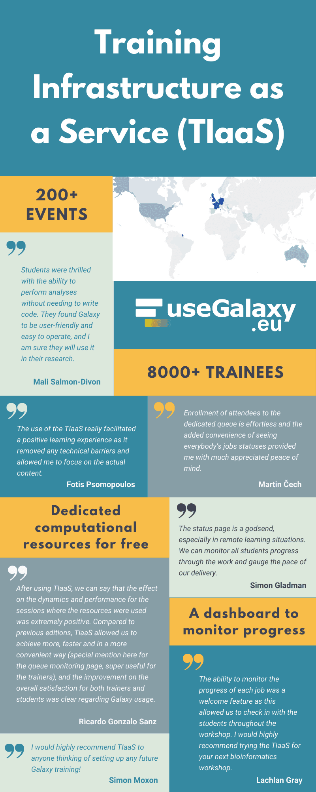

Hello all,

The August newsletter brings news of GCC2021 (just finished) and GCC2022 (in Minneapolis); **[the launch of the Galaxy India community, and open positions in 7 countries](#community-news)**; **[event news](#event-news)**; **[Galaxy platform news](#galaxy-platforms-news)**; **[training and doc updates](#doc-hub-and-training-updates)**;
recent **[open-access Galaxy-related publications](#publications)**; and **[other news too](#other-news).**

Dave Clements and Beatriz Serrano-Solano, Editors

PS: Subscribe to the [Galaxy Announce mailing list](https://lists.galaxyproject.org/?count=100&all-lists=) and receive an email whenever this newsletter is published.

---

# Featured news

<!-- GCC2022 -->

[GCC2022]()

[GCC2022]()

<!-- GCC2022 -->

Hub2 

Text 

# Community News

<!-- Use cases -->

[Galaxy Use Cases](https://galaxyproject.eu/news?tag=UseCase)

Scientists from all over the world are using [UseGalaxy.eu](https://usegalaxy.eu/) for diverse research topics, check them out!

* [Zika virus effects on brain and brain tumours](https://galaxyproject.eu/posts/2021/06/18/use-case-harry-bulstrode/)
* [Genetics research on dairy cattle](https://galaxyproject.eu/posts/2021/06/25/use-case-tomas-klingstrom/)
* [Genomics, evolution, and ecology of organohalide-respiring bacteria](https://galaxyproject.eu/posts/2021/07/02/use-case-yi-yang/)
* [Colorectal cancer research](https://galaxyproject.eu/posts/2021/07/05/use-case-amir/)
* [Plant genomics](https://galaxyproject.eu/posts/2021/07/09/use-case-shaobin-zhong/)
* [Epigenomics and transcriptomics in cancer](https://galaxyproject.eu/posts/2021/07/16/use-case-mzwanele-ngubo/)
* [Heart research](https://galaxyproject.eu/posts/2021/07/23/use-case-tsai-sang/)
* [Circadian research](https://galaxyproject.eu/posts/2021/07/30/use-case-akanksha-bafna/)
* [Sex determination of fish species](https://galaxyproject.eu/posts/2021/08/13/use-case-joelle-lafond/)
* [Food safety research](https://galaxyproject.eu/posts/2021/08/20/use-case-carol-verheecke-vaessen/)
* [Antibody responses following vaccination](https://galaxyproject.eu/posts/2021/08/27/use-case-carolyn-nielsen/)
* [Marine turtle tumour disease](https://galaxyproject.eu/posts/2021/09/03/use-case-liam-whitmore/)

<!-- GGSC Misconceptions -->

[Participate in the *Galaxy Misconceptions* sub-committee](https://forms.gle/RCN87JEXxAR2srbv7)

Since the beginning of the Galaxy project, many negative (and very
often completely wrong) myths about the functionality and capability
of Galaxy have made their rounds in the scientific communities. The
[Global Galaxy Steering Committee](https://galaxyproject.org/community/steering/) has set up a [sub-committee](https://galaxyproject.org/community/steering/#subcommittees) to identify those myths and come up with ideas to tackle them.

**Wanna participate? Fill out this [short questionnaire](https://forms.gle/RCN87JEXxAR2srbv7).**

<!-- ELIXIR-Galaxy Community -->

[Updates from the ELIXIR Galaxy Community](https://galaxyproject.eu/posts/2021/08/24/new-elixir-galaxy-community-website/
)

The ELIXIR Galaxy Community has updated the ELIXIR website including the goals with a special emphasis on the interactions with the local, domain-specific and global communities. The new website also lists the recent accomplishments, training, SARS-CoV-2 related resources and much more!

Check out all the news at https://elixir-europe.org/communities/galaxy

<!-- Galaxy Arabic -->

[New video for the Galaxy Arabic community](https://www.youtube.com/embed/jOlTfKUUZS4)

Engy Nasr and Abdulrahman Yahia Azab have recorded a video introducing Galaxy to the arabic-speaking community.

<iframe width="260" src="https://www.youtube.com/embed/jOlTfKUUZS4" title="YouTube video player" frameborder="0" allow="accelerometer; autoplay; clipboard-write; encrypted-media; gyroscope; picture-in-picture" allowfullscreen></iframe> 

<!-- 500 subscribers YT -->

 <!-- can't find it Dave -->

[We reached 500 subscribers on Youtube!](https://www.youtube.com/c/GalaxyProject)

The Youtube channel of the Galaxy project has reached 500 subscribers, thank you all!

<!-- hiring -->

[Galaxy Career Center - NOT UPDATED](/careers/index.md)

**Ten new positions were added to the [Galaxy Career Center](/careers/index.md) in the last month.**  Many of them close soon:

* Australia, closes 11 August
* Norway, closes 15 August
* France x 3, 1 closes 22 August, 2 close 1 September
* the Netherlands, 22 August
* Germany, closes 31 August

There are also "open until filled" positions in the US (x7) and Belgium. Take a look.

# Event News

There is not a lot going on in August, but what is happening is compelling.  See all [upcoming events here](/events/index.md):

<!-- BioHackathon -->

[Galaxy @ BioHackathon 2021](/events/2021-11-biohackathon-europe/index.md)

Galaxy [is featured in at least 7 projects at BioHackathon Europe 2021](/events/2021-11-biohackathon-europe/index.md), being held in Barcelona and online, 8-12 November.  Registration is available on a first come, first serve basis. Registration is free, but space is limited. [Register now](https://www.biohackathon-europe.org/registration.html).

<!-- Galaxy Dev Round Table -->

[Galaxy Developer Roundtable](/community/devroundtable/index.md)

September's Galaxy Developer Round Table meetups are:

**September 16: TBD**

**September 30: TBD**

As you can see, we still [need volunteers (like you!) to lead the discussion on your favorite topic](https://bit.ly/gxdevroundtablepresent).

<!-- Paper Cuts -->

[September Papercuts](/events/2021-09-papercuts/index.md)

**16 September, Online, Global**

Please join us for the [CoFest day](/events/2021-09-papercuts/index.md) on September 16 to help the Galaxy Ecosystem become a better place, and to help new contributors come on board.

This month the [Spanish GTN community](https://training.galaxyproject.org/archive/2021-06-01/news/2021/05/20/spanish_project_begins.html) will meet to work on the curated tutorials, at 6 pm CEST. Get in touch with [Wendi Bacon](https://training.galaxyproject.org/archive/2021-06-01/hall-of-fame/nomadscientist/) to participate.

We will be on [Gitter](https://gitter.im/galaxyproject/Lobby) for chat all day long, please take advantage of both to communicate with your collaborators around the world.

# Galaxy Platforms News

The [Galaxy Platform Directory](/use/index.md) lists resources for easily running your analysis on Galaxy, including publicly available servers, cloud services, and containers and VMs that run Galaxy.  Here's the recent platform news we know about:

<!-- UseGalaxy.* -->

[UseGalaxy.*](/usegalaxy/index.md) News

* Lots of tool updates on [UseGalaxy.eu](https://galaxyproject.eu/news?tag=tools) and [UseGalaxy.org.au](https://usegalaxy-au.github.io/galaxy/news.hgtml).

# Doc, Hub, and Training Updates

<!-- SARS-CoV-2 Data Analysis and Monitoring with Galaxy -->

[Outcomes of the workshop 'SARS-CoV-2 Data Analysis and Monitoring with Galaxy'](https://galaxyproject.eu/posts/2021/08/26/covid-workshop-summary/)

The Galaxy community has recently organised a workshop on SARS-CoV-2 Data Analysis and Monitoring with Galaxy. The goal was to build capacity, both in the analysis and data management sides of SARS-CoV-2, based on the acquired expertise since the beginning of the pandemic. On a broader scope, sharing the experience in SARS-CoV-2 data analysis, and fostering the principles of open data, open science and open infrastructure are key aspects in the current public health global situation.

Researchers in all career stages (PhD students, senior researchers…) and different roles (clinicians, laboratory manager, technicians…) have joined the workshop. In total, the registration surpassed the __750 participants from 82 countries__!

 <!-- TIaaS flyer - Dave, feel free to remove -->

[Training Infrastructure as a Service (TIaaS) in UseGalaxy.eu sponsored by EOSC-Life](https://galaxyproject.eu/posts/2021/08/24/tiaas-flyer/)

 

# Publications

Pub curation activities [are on a semi-hiatus right now](/src/blog/2020-08-10k-pubs/index.md#the-future) but a few publications referencing, using, extending, and implementing Galaxy were added to the [Galaxy Publication Library](https://www.zotero.org/groups/galaxy) anyway.  Here are the new open access *Galactic* and *Stellar* pubs:

[paper title](link)

# Other News

 

<!-- ELIXIR And IFB reports -->

[Annual reports 2020: ELIXIR and IFB](https://galaxyproject.eu/posts/2021/09/10/reports-ifb-elixir/)

The [ELIXIR](https://elixir-europe.org/sites/default/files/documents/annual-report-2020.pdf) and [IFB](https://www.france-bioinformatique.fr/en/activity-reports/) annual reports for 2020 are out, take a look at them and find out how Galaxy is involved.

