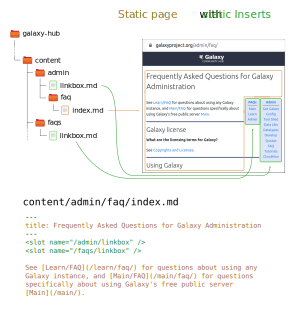

You may not have noticed, but things have changed a lot around here! Today we are happy to unveil the new Galaxy Community Hub. This is a ground-up rewrite of the back-end for the site you're reading right now.

Under the hood, the biggest change is that we've moved from the [Metalsmith](https://metalsmith.io/) static site generator to [Gridsome](https://gridsome.org/). Gridsome is also a static site generator, but an advanced one built on [Vue](https://vuejs.org/) and focused on a fast browsing experience and the ability to pull content from anywhere.

You may notice the site feeling a bit more responsive, but otherwise it should be the same as before. In this first phase, our goal has been to replicate the same, familiar Hub, but mainly to provide authors with an improved experience.

## Author-friendly features

### Unified content directory

Central to this improved experience is a unified content directory. All static content is kept in Markdown files in the `content/` directory of the site. And we focused on letting authors group their files according to where they're used. All the files for one page should be kept in the same place.

#### Directory hierarchy == url hierarchy

As before, the path to the Markdown file is the same as the url it will appear at. Just write your Markdown in `content/news/2021-09-hub2/index.md` to create a news post at `galaxyproject.org/news/2021-09-hub2/`.

<div class="img-resizer trim-p right" style="width: 500px; margin: 0 0 2em 1em; border: 1px solid #212529">


</div>

#### Static content in dynamic pages

The site also has dynamically generated pages like [galaxyproject.org/news/](/news/). This automatically lists all the news posts. The list of posts is dynamic, but the page also has static text like the footer at the bottom. Previously, this static text was hardcoded (in [Pug](https://pugjs.org)) in the middle of the dynamic code. Now it can easliy be kept in its natural format: Markdown. So the text in the footer of [galaxyproject.org/news/](/news/) is now in `content/news/footer.md` .

<div class="clearfix"></div>
<div class="img-resizer trim-p right" style="width: 500px; margin: 0 0 2em 1em; border: 1px solid #212529">



</div>

#### Repeated static content blocks

There are several pages on this site dedicated to [GCC 2019](/events/gcc2019/). And they all share a common header. This is true of many groups of pages that share a common element. In the old Hub, you would write that element in a Markdown file in a separate `partials/` directory. Then you'd insert it into each page with custom syntax we devised (like `{{> Events/GCC2019/Header }}`). But in the new Hub, you just keep the Markdown file in the same `content/` directory as everything else. For example, this header now lives at `content/events/gcc2019/header.md`, right next to the main GCC 2019 page. And now the syntax for inserting it is with the standards-based Vue element `<slot>`. In this case:  
`<Insert name="/events/gcc2019/header" />`.

<div class="clearfix"></div>
<div class="img-resizer trim-p right" style="width: 500px; margin: 0 0 2em 1em; border: 1px solid #212529">


</div>

#### Organize by page, not by file type

Of course, a website isn't just text! Webpages would be pretty dry without some visuals. Most static site generators prefer authors to store all images in their own directory like `static/images`, separate from the Markdown. But if you're only using an image in one, specific page, the most natural place to put it is in the directory for that page! The old Hub allowed this and we've put a lot of effort into preserving that ability in the new Hub.

<div class="clearfix"></div>

### Configurable, path-based page groupings

The new Hub is written to be as configurable as possible. So groups of pages like blog posts, news posts, events, and careers are defined in a simple section of `config.json`. Just give a category name and the path the pages are found under:

```
  "categories": {
    "/blog":  "blog",
    "/events": "events",
    "/news": "news",
    "/careers": "careers"
  },
```

Then every page under, say, `/blog/` will be tagged with `blog`, letting you easily query for all blog posts in your dynamic pages.

### The power of Vue.js

With the new Hub, we can harness the power of Vue.js. Authors can now use Vue components natively in their Markdown files. This lets us create standard, reusable components like video embeds or source code excerpts, and use them directly in a page's source. Even more exciting is the fact that Galaxy's frontend is also written largely in Vue. This means the potential for authors to include live Galaxy objects like workflows or datasets in their posts.

### Content federation

Finally, one repetitive task faced by authors is cross posting content from other communities. No Galaxy community is an island. So [galaxyproject.org](https://galaxyproject.org) loves to highlight events and happenings from Galaxy communities around the world like [galaxyproject.eu](https://galaxyproject.eu/) and [usegalaxy-au.github.io](https://usegalaxy-au.github.io). In fact, 54% of events posted on [galaxyproject.org](https://galaxyproject.org) are links to posts on other sites. Currently, this is done by manually creating a file with the post's metadata like the title and url.

But Gridsome's strength is its ecosystem with dozens of existing [plugins](https://gridsome.org/plugins/) for automatically pulling in content from external sources. There are plugins for reading from a CMS, RSS, Github, Google Sheets, or even Twitter, to name a few. So we can set up a system for automatically pulling in content from any other site the authors designate. [galaxyproject.eu](https://galaxyproject.eu/) already encodes the metadata for each post in JSON+LD and [galaxyproject.org](https://galaxyproject.org) will soon. As this standard spreads, each Galaxy community will be able to easily share content from the rest of the world.

## The Beta

### Compatibility

One feature of the new Hub is its modern Markdown parser. The old Hub used a very old, beta version of the [marked](https://marked.js.org/) Markdown parser. This allowed very freeform mixing of HTML and Markdown, but it was not very standards-compliant. The new Hub uses the [remark](https://remark.js.org/) parser, which conforms to the [CommonMark](https://commonmark.org/) standard.

The benefit is that the Markdown we write in the future will be portable to any other system or parser we might want. But the downside is that many old pages will break. We've already fixed most of the popular pages, but there are plenty we still need to get to. Unfortunately this was inevitable, even if we'd stuck with the old Hub. If we ever wanted to update the existing parser to a more reliable and secure version, we'd face the same thing. But if you notice broken pages that you think we should prioritize, please do let us know.

### Bug reporting

The new Hub features all the major functionality of the old one. But there are some minor features still being added and some rough corners here and there. So if you notice something broken, don't be too surprised, but *do* let us know on [Github](https://github.com/galaxyproject/galaxy-hub/issues), [gitter](https://gitter.im/galaxyproject/hub2),  or [email](mailto:outreach@galaxyproject.org?subject=Community%20Hub%20issue).

## Extensibility

We've made sure that the framework underlying the new Hub is generalizable and flexible. There are many communities around the world that have their own hubs, and others that don't but might want one. We'd like to be able to share the benefits of the new framework. It's already customizable enough that you could just [clone it](https://github.com/galaxyproject/galaxy-hub), delete our content, and adapt it to your situation. But we will soon formally separate out the framework and maintain it in its own repository, ready to be cloned and used.

## Thanks

We're excited to finally share what we've been working on for months now. And we're excited to start adding some really cool new features that you *will* notice!

We'd like to thank all the Galaxy Team members who helped get us to this point. In particular we want to acknowledge all the time, effort, and support [Dave Clements](/people/dave-clements/) and [Beatriz Serrano-Solano](https://galaxyproject.eu/people#beatrizserrano) have contributed to this project.

