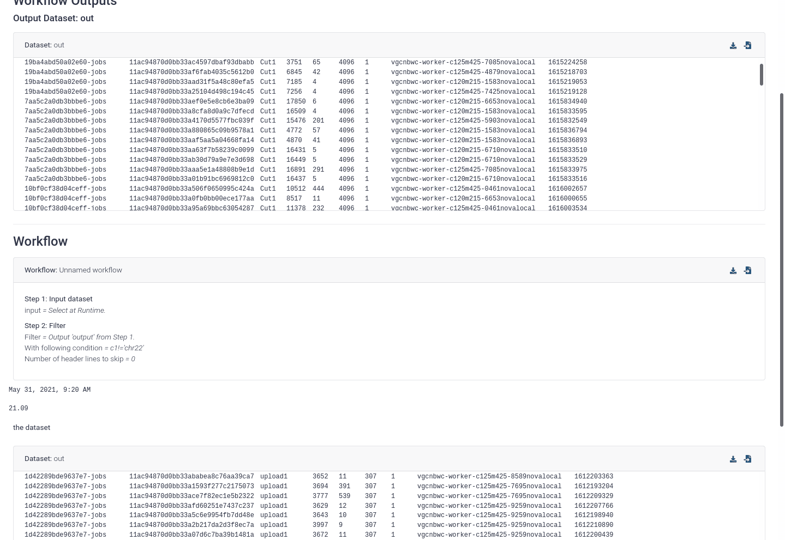

Dear Community,

The Galaxy Committers team is pleased to announce the release of Galaxy 21.09.

- **[Developer and admin release announcement](https://docs.galaxyproject.org/en/master/releases/21.09_announce.html)** 
- **[User release announcement](https://docs.galaxyproject.org/en/master/releases/21.09_announce_user.html)**.

A few release highlights are:

### Tool Panel Views

We now have "Tool Panel Views"! These are different views into the same toolbox and might help make it easier to find the tools you want. In the future, there are plans to create user-customisable toolboxes, but until then go explore the new EDAM Ontology-based toolboxes which organise tools around scientific areas or processes. For example, a category like "Filtering" might have tools like "select lines" or "filter bam by quality", both doing the same process of filtering, despite their different file types and formats.

<iframe width="560" height="315" src="https://www.youtube-nocookie.com/embed/vCapB1xHjZg" frameborder="0" allow="accelerometer; autoplay; clipboard-write; encrypted-media; gyroscope; picture-in-picture" allowfullscreen></iframe>

Unfortunately, not all tools are fully annotated yet, and while we also pull terms from [bio.tools](https://bio.tools/), this still doesn't get us full coverage and many tools will still appear under a large section "Uncategorized". Hopefully, this will improve as users and tool developers annotate these tools with the appropriate terms that help everyone find them.

### Collections (Beta History Updates)

Did you ever create *a collection with the wrong dbkey or datatype*? Well, in the Beta History you can now **change collections' datatypes and dbkeys**! This should save a lot of time for everyone working with large datasets ([Pull Request 11799](https://github.com/galaxyproject/galaxy/pull/11799/)).

<iframe width="560" height="315" src="https://www.youtube-nocookie.com/embed/aPgMcTuzEJ4" frameborder="0" allow="accelerometer; autoplay; clipboard-write; encrypted-media; gyroscope; picture-in-picture" allowfullscreen></iframe>

Additionally, did a *collection ever fail* for you? And you wondered why? Now you can find out with the **view details button for collections** ([Pull Request 12261](https://github.com/galaxyproject/galaxy/pull/12261))!

### Importing Data

Selecting datasets from the Remote Files view has gotten easier! Now, you can select folders and files and import at once all of the datasets recursively in those folders. Previously, you could only select files within a folder, so this is a huge improvement in the usability of such a key new feature of Galaxy ([Pull Request 12310](https://github.com/galaxyproject/galaxy/pull/12310)). But with great power comes great responsibility, be careful not to import the entirety of NCBI!

<iframe width="560" height="315" src="https://www.youtube-nocookie.com/embed/XcZgQbGojh8" frameborder="0" allow="accelerometer; autoplay; clipboard-write; encrypted-media; gyroscope; picture-in-picture" allowfullscreen></iframe>

### Reports

Report components used to try and arrange themselves in a smart way, but due to some issues with the floating of report components these will now be full width until we can figure out a good way to provide a similar feature allowing you to control the layout of the report ([Pull Request 12085](https://github.com/galaxyproject/galaxy/pull/12085)).

### Enhancements for Working with Remote Data and Distributed Computing Resources

Many fixes and enhancements were made to improve how Galaxy can import and
write to remote data using the configured file source plugins. In addition to
the History Export functionality, which can write to remote locations, we have
added an ``Export datasets`` Tool for exporting individual Datasets and Dataset
collections to configured remote locations. The Tool will automatically
maintain the name and structure of Datasets and Dataset Collections. We have
added the possibility to import entire folders of remote data and made the
data selection dialog more intuitive. We also added numerous improvements and
fixes to the extended metadata collection strategy and [Pulsar](https://github.com/galaxyproject/pulsar),
so that many more tools are able to run in [Pulsar](https://github.com/galaxyproject/pulsar)
and write data back to storage without passing through Galaxy first.

### Migration to FastAPI and Extended Documentation of API Routes

We have modernized and migrated many more API routes to FastAPI and have
extended the documentation and validation of these routes.

### Migration to SQLAlchemy 1.4 and Declarative Mapping

Galaxy is now using [SQLAlchemy](https://www.sqlalchemy.org/) version 1.4,
which is a prerequisite for asynchronously interacting with the database. We
also modernized the way our database models are defined to the more commonly
used Declarative Mapping approach, which is more concise and better
documented.

### Modernization of Tool Form Interface

The tool form interface has been almost completely migrated from
[Backbone](https://backbonejs.org) to [Vue](https://vuejs.org/).
This improves the reactivity of parameter validation and enables the migration of
tool parameters to Vue, which will also allow us to add many more types of
tool parameters. We further migrated the tool form variant for the Workflow
Editor, the Workflow run form and the Show Dataset Parameter page to Vue.

### New User Welcome Page

We have added a page that new users will be directed to after creating a new Galaxy account.

### Release Notes

Please see the [full release notes](https://docs.galaxyproject.org/en/latest/releases/21.09_announce.html) for a lot more
details and instructions for upgrading your Galaxy installation.

Thanks for using Galaxy!
