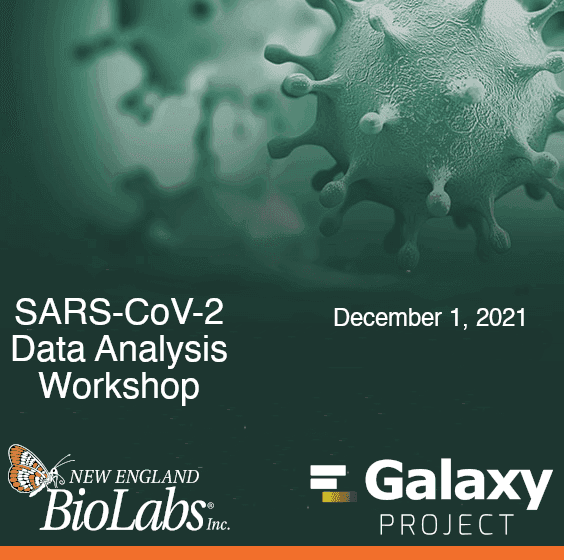

Happy November from Galaxy!

The November newsletter is thin, *but powerful*:

* [Galaxy India Launches this Month](#community-news)
* [7 new openings (13 total)](#community-news)
* [9 upcoming Events](#event-news)
* [Blog posts on SARS-CoV-2 training in Africa; Sunsetting CloudLaundh; and TIaaS](#galactic-blog-posts)
* [UseGalaxy.* Updates](#galaxy-platforms-news)
* [Other News too: BY-COVID Launches](#other-news)

Have something for the next newsletter?  Please let us know and we will spread the word.

Beatriz Serrano-Solano and Dave Clements, Editors

PS: Subscribe to the [Galaxy Announce mailing list](https://lists.galaxyproject.org/?count=100&all-lists=) and receive an email whenever this newsletter is published.

---

# Community News

<!-- InBix 2021 & Galaxy India Launch -->

[Galaxy India Launch & InBix2021 Pre-Conference Galaxy Workshop](https://neist.res.in/inbix2021/workshop.html)

**9-10 November**

This 2-day pre-[InBix2021](https://neist.res.in/inbix2021/) workshop will feature talks and hands-on exercises, **and the formal launch of the [Galaxy India Community](https://galaxyproject.in/).**  

Presenters include include
[Christopher B Barnett](http://www.chemistry.uct.ac.za/cem/staff/academic/barnett),
[Anshu Bhardwaj](https://www.imtech.res.in/contact/staff/dr-anshu-bhardwaj/107),
[Simon Bray](https://github.com/simonbray),
[Sona Charles](http://www.spices.res.in/ms-sona-charles),
[Dave Clements](/people/dave-clements/),
[Stephan Flemming](https://github.com/stephanflemming),
[Selvaraman Nagamani](https://scholar.google.com/citations?user=aIQz3DkAAAAJ&hl=en),
and [Gareth Price](https://qfab.org/team-member/dr-gareth-price).

Early [registration](https://easychair.org/cfp/InBix2021) ends November 5. BIOCLUES members can register for free.

<!-- hiring -->

[Galaxy Career Center](/careers/)

Seven new openings were added to the [Galaxy Career Center](/careers/) in October. The Career Center lists any open Galaxy related positions that we know about.  Currently there are openings at

* Limagrain, Chappes, France
* Computational Biology Program, Oregon Health & Science University, Portland, Oregon, US
* RECETOX, Brno, Czechia, **closes November 15**
* Centre for Bioinformatics, University of Oslo, ELIXIR Norway, Oslo, Norway, **closes November 1**
* Pfizer, Cambridge, Massachusetts, US
* DAWSON, Uniformed Services University of the Health Sciences (USUHS), Bethesda, Maryland, US
* ELIXIR Belgium, VIB-UGent Center for Plant Systems Biology, Ghent, Belgium
* Helmholtz Zentrum München, Germany, **closes November 25**
* Tufts University in Massachusetts
* Sciensano, Belgium
* NEB in Massachusetts, US
* Cleveland Clinic in Ohio, US
* Johns Hopkins University in Maryland, US

# Event News

See all [upcoming events here](/events/):

<!-- FORCeS 2021 -->

[Tools in Climate Science: Linking
Observations with Modelling](https://forces-project.eu/events/forces-escience-course-tools-in-climate-science-linking-observations-with-modelling/)

**1-8 November, Tjärnö Marine Biological Laboratory, Sweden**

The course will introduce the role of aerosols and clouds in Earth’s climate system along with observational techniques, Earth system models, climate forcing and climate model evaluation through a series of lectures and tutorials.

<!-- AusBioCommons Showcase -->

[Australian BioCommons Showcase](https://www.biocommons.org.au/2021-showcase)

**3-5 November, Online**

We’ll meet online over three afternoons to share achievements, challenges and future directions, including of course, [Galaxy Australia](https://usegalaxy.org.au/).

<!-- Genome Annotation & Large Data -->

[Genome annotation & Galaxy Large Data Handling workshop](https://www.elixir-czech.cz/events/genome-annotation-galaxy-large-data-handling-online-workshop-nov-2021)

**4 November, Online**

Hands-on introduction to advanced Galaxy features and best practices of processing hundreds of datasets simultaneously; followed by Galaxy for repetitive sequence analysis and genome annotation. Enrollment is limited to 50.

<!-- Galaxy Dev Round Table -->

[Galaxy Developer Round Table](/community/devroundtable/)

The Galaxy Developer Round Table meetup in November is:

* [**November 11: Separated data PVC: How it works and potential missed implications**](https://galaxyproject.org/events/2021-11-11-dev-roundtable/) by Alexandru Mahmoud.

We are [seeking volunteers (like you!) to lead the discussion on your favorite topic](https://bit.ly/gxdevroundtablepresent) at future roundtables.

<!-- Paper Cuts -->

[November Papercuts](/events/2021-11-papercuts/)

**18 November, Online, Global**

Please join us for the [CoFest day](/events/2021-11-papercuts/) on November 18 to help the Galaxy Ecosystem become a better place, and to help new contributors come on board.

We will be on [Matrix](https://matrix.to/#/#galaxyproject_Lobby:gitter.im) for chat all day long, please take advantage of both to communicate with your collaborators around the world.

<!-- GTÑ -->

[Spanscriptomics: Análisis de células únicas usando Galaxy](https://gallantries.github.io/galaxy-workshop/events/spanscriptomics/)

**29-30 November, Online, UK**

Curso de análisis de células únicas con Galaxy en español. [¡Regístrate ya!](https://openuniversity.onlinesurveys.ac.uk/reserva-tu-lugar-en-el-taller-analisis-de-datos-single-ce)

--

Single-cell workshop in Spanish. [Register now!](https://openuniversity.onlinesurveys.ac.uk/reserva-tu-lugar-en-el-taller-analisis-de-datos-single-ce)

<!-- FROGS -->

[FROGS: tools for bioinformatics and statistics analyses with amplicon metagenomics data](http://bioinfo.genotoul.fr/index.php/events/metagenomic-amplicons-and-stats-with-frogs/)

**29 November - 2 December, INRA, Toulouse-Auzeville, France**

Learn to work with NGS data of 16S, 18S, ITS … DNA using our Galaxy instance and the [FROGS pipeline](http://frogs.toulouse.inrae.fr/).

<!-- COVID workshop -->

[SARS-CoV-2 Data Analysis and Monitoring with Galaxy](https://galaxyproject.eu/event/2021-09-15-sars-cov-2-training/)

**1 December, Online**

A workshop to build capacity in SARS-CoV-2 data analysis! It will be a 1-day event with pre-recorded lectures, hands-on and demos. During the workshop, there will be live support in chat and live Questions & Answers sessions.

Registration will open soon, stay tuned!

<!-- Assemblage et Annotation de génome -->

[Formation Assemblage et Annotation de génome 2021](https://wwz.ifremer.fr/Recherche/Departements-scientifiques/Departement-Infrastructures-de-Recherche-et-Systemes-d-Information/Bioinformatique/Animations-scientifiques/Formation-Assemblage-et-Annotation-de-genome-2021)

**1er au 3 décembre, Station Biologique, Roscoff, France**

Initier les participant.e.s aux concepts et à l'usage des méthodes bioinformatiques pour l’assemblage de novo et l’annotation de génomes à partir de technologies de séquençage short (Illumina) et long reads (PacBio / Oxford Nanopore).

# Galaxy Platforms News

The [Galaxy Platform Directory](/use/) lists resources for easily running your analysis on Galaxy, including publicly available servers, cloud services, and containers and VMs that run Galaxy.  Here's the recent platform news we know about:

<!-- UseGalaxy.* -->

[UseGalaxy.*](/usegalaxy/) News

* Lots of tool updates on [UseGalaxy.eu](https://galaxyproject.eu/news?tag=tools) and [UseGalaxy.org.au](https://usegalaxy-au.github.io/galaxy/news.hgtml).
* New use cases published in [UseGalaxy.eu](https://galaxyproject.eu/news?tag=UseCase):
    * [microRNAs in heart disease](https://galaxyproject.eu/posts/2021/10/11/use-case-ileana-duran/)
    * [cellular specification, differentiation and morphogenesis of the mucociliary epithelium](https://galaxyproject.eu/posts/2021/10/12/use-case-sarah-bowden/)

# Galactic Blog Posts

<!-- Teaching SARS Analysis -->

[SARS-CoV-2 analysis training with Galaxy: a perspective from Africa](https://depot.galaxyproject.org/hub/attachments/blog/2021-10-sars-training-africa/sasbi-newsletter-2021-10.pdf#page=4)

By Peter van Heusden.

The switch to online bioinformatics training forced by the COVID-19 pandemic has opened spaces  for  collaboration  in  ways that  were  previously limited  by geography.

<!-- Sunsetting CloudLaunch -->

[Sunsetting the CloudLaunch service](/news/2021-10-sunsetting-cloudlaunch/)

By Enis Afgan.

There are now better alternatives to using Galaxy on the cloud.

<!-- TIaaS feedback -->

[Training Infrastructure Feedback](https://galaxyproject.eu/posts/2021/10/18/tiaas-Theodora-Tsirka/)

By Theodora Tsirka.

Theodora run a workshop in the Training School on Microbiome Sequencing and Data Analysis in Greece.

# Other News

<!-- BY-COVID kick-off -->

[BY-COVID: A new EU project for pandemic preparedness](https://galaxyproject.eu/posts/2021/10/13/bycovid-kickoff/)

BeYond-COVID is a new Horizon Europe project that will tackle the data challenges that can hinder effective pandemic response.

