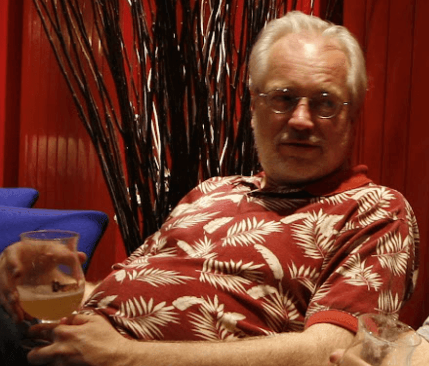

Our dear colleague and friend [Dave Clements](https://galaxyproject.org/people/dave-clements/), or simply DaveC, is [changing jobs](https://galaxyproject.org/blog/2021-12-clements/). After 11 years with the Galaxy Project, the longest continuous streak anywhere for him, he will leave Galaxy this month to become the Outreach Director at Anaconda. He will continue to be a member of the Global Galaxy Steering Committee. If you are reading this, you are a member of the warm and welcoming worldwide Galaxy Community whose creation was spearheaded by DaveC.  In 2011, he joined two PIs inexperienced in community leadership and he changed Galaxy forever. Here are just a few transformations that DaveC led: exponential growth of the Galaxy Community, expansion of training efforts, coordination across Galaxy groups worldwide, and, of course, bringing all of us together by organizing all [the Galaxy Community Conferences](https://galaxyproject.org/gcc/) since 2011. His cool demeanor, witty communication, and wisdom carried us through many crises as well as wins. Thank you DaveC for helping make Galaxy one of the most popular platforms for bioinformatics in the world, for teaching us the power of community, and for sharing your positive energy in every encounter. We wish you the best in your future endeavors and hope that you’ll stop by from time to time to visit the Galaxy community that you did so much for.

> DaveC in natural habitat at [GCC 2011](https://galaxyproject.org/gcc2011/Home.html) in Lunteren, Netherlands.
