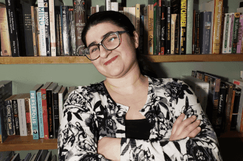

Hello! My name is Assunta DeSanto, and I'm (primarily) a developer for Galaxy's UI.  I dabble in other parts of the Galaxy Community, of course, and most recently have been stepping in to some of the outreach roles that need tending to. (We miss you, Dave!)

I've been a member of the Galaxy Community since April of 2020, when I began a position with Nekrutenko Labs, out of Penn State University.  Starting a new job amid a global pandemic, it took some coaxing to branch out into the public eye, but I have arrived! :dancer:

Beyond my time spent coding and helping service the community through outreach, I enjoy reading, hiking, cooking, and baking. I've got a doggo, two cats, and an energetic child to keep me busy, as well. I'm helpful, thoughtful, and optimistic -- so if you ever need help, feel free to ping me. You can find me on Matrix @assuntad23. 

Fun Fact: I used to be an English teacher for middle and high school students, so I can proofread too!