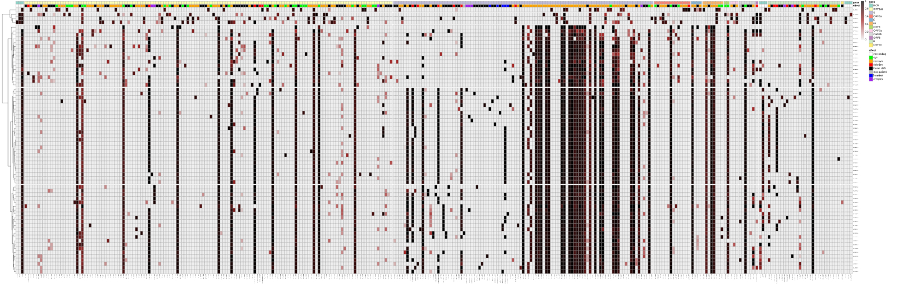
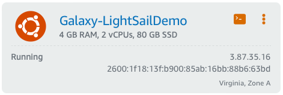
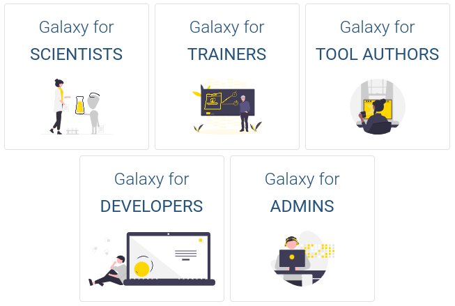
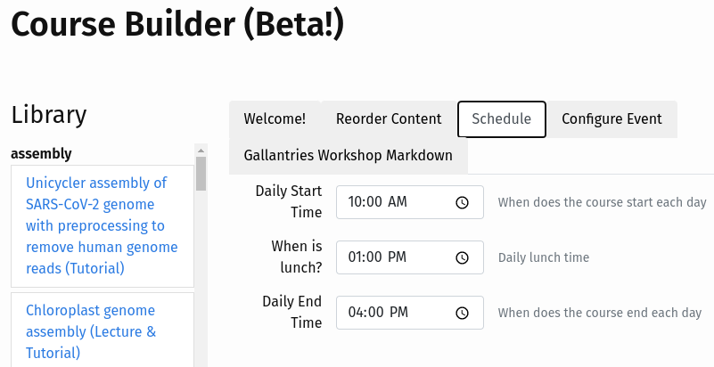

Greetings! 

Happy February! This month's newsletter brings with it a few changes that we want you to be aware of:
1. As many of you already know, __Dave Clements__ has left the Galaxy project for an exciting opportunity with Anaconda.  You can find his goodbye blog post, and Anton's parting words to him in the Galactic Blog. He has done so much for the Galaxy Communty, and because he gave so much, it's going to be hard for us to do it without him, without missing him a whole awful lot. 
2. __Assunta DeSanto__ has stepped in to help fill in Dave's shoes, as best she can, while we search for a replacement.  Haven't met Assunta yet? That's okay. Check out this introductory blog post!
3. Going forward, __the Galaxy newsletter will be delivered quarterly__ rather than monthly. This means you'll hear from us less often (boo!), but that the newsletter will be filled with richer content that captures more of the big picture happenings of our Galaxy Community. 
4. We have a couple of new segments for you: _**"Meet the Community"**_ blog posts where we introduce core team members and other folk from the wider community, and a section called _**"Watch this Next!"**_ where we highlight a video from the community. 

We are excited to continue delivering the Galactic News to you, albeit less frequently and with one less star in our cluster, but with no less love for our wonderful Galaxy Community. 

Beatriz Serrano-Solano and Assunta DeSanto, Editors

PS: Subscribe to the [Galaxy Announce mailing list](https://lists.galaxyproject.org/?count=100&all-lists=) and receive an email whenever this newsletter is published.

---

# Community News

<!-- Omicron and SARS-CoV-2 genome surveillance -->

[Omicron and SARS-CoV-2 genome surveillance](https://galaxyproject.eu/posts/2021/11/29/omicron-and-galaxy/)

Since November, the new SARS-CoV-2 lineage B.1.1.529 is making the headlines.

Find all the details about the evolution of the Omicron variant and reproduce it yourself using Galaxy!

<!-- Stats help Forum -->

[An overview and statistics on the Galaxy Help Forum](https://galaxyproject.eu/posts/2021/11/25/ghelp-stats/)

The Galaxy Help Forum (GHelp) is one of the primary meeting places where Galaxy users turn to searching for answers. Get insights into the usage in the forum in this post by Cristóbal Gallardo.

<!-- EOSC-Life industry grant -->

[Accessible and scalable detection and identification of foodborne pathogens, a project with Biolytix and funded by EOSC-Life](https://galaxyproject.eu/posts/2021/12/08/pathogen-detection-eosc-life-grant/)

Thanks to funding from EOSC-Life, the Freiburg Galaxy team will work in 2022 with Biolytix, a Swiss Small and Medium-sized Enterprise specialized in molecular biology and microbiological analyses, toward Accessible and scalable detection and identification of foodborne pathogens.

<!-- Australian BioCommons -->

[Leveraging Galaxy Australia to teach proteomics](https://www.biocommons.org.au/news/galaxy-proteomics-training)

Matt Padula, a Senior Lecturer at their School of Life Sciences, and Director of the UTS Proteomics Core Facility,  shared his experience using Galaxy Australia:

_‘When it comes to actually training students in proteomics you have to develop a whole lot of materials that are specific for certain pipelines and then along comes Galaxy… Galaxy has made life a little bit simpler’_

<!-- hiring -->

[Galaxy Career Center](/careers/index.md)

There are several new positions listed in the [Galaxy Career Center](/careers/index.md) recently. The Career Center lists any open Galaxy related positions that we know about. Currently there are openings at

* The Open University, UK
* Johns Hopkins University, US: 4 open positions!
* RECETOX, Czechia
* University of Freiburg, Germany
* Pfizer, US
* VIB, Belgium
* Cleveland Clinic, US

# Event News

See all [upcoming events here](/events/index.md):

<!-- smorgasbord -->

[GTN Smörgåsbord 2](https://gallantries.github.io/posts/2021/12/14/smorgasbord2-tapas/)

**14-18 March, Online**

This event allows you to get a taste of all the GTN has to offer. Be sure to register for the course to get access to the virtual, asynchronous, 5-day training event!

<!-- GAT -->

[Galaxy Admin Training](http://localhost:8080/events/2022-03-admin-training/)

**14-18 March, Online**

The ins and outs of setting up your own production quality Galaxy server. Online and asynchronous. Be sure to apply for the event before February 18th.

<!-- Paper Cuts -->

**17 February, 17 March, 21 April**

Please join us for the CoFest day on the third Thursday of each month (February 17, March 17, and April 21) to help the Galaxy Ecosystem become a better place, and to help new contributors come on board.

We will be on Gitter for chat all day long, please take advantage of both to communicate with your collaborators around the world.

<!-- GalaxyIntro -->

[Galaxy Introduction for Life Scientists](https://www.sib.swiss/training/course/20220427_GALXY)

**27 April**

This course will give a general introduction on the galaxy web-page structure, how to import data, run tools, and share analyses. Participants will run a whole NGS analysis using an RNA-seq dataset as an example.

# Galaxy Platforms News

The [Galaxy Platform Directory](/use/index.md) lists resources for easily running your analysis on Galaxy, including publicly available servers, cloud services, and containers and VMs that run Galaxy.  Here's the recent platform news we know about:

<!-- Usegalaxy.eu surpassed 40K users -->

[Usegalaxy.eu surpassed 40,000 registered users](https://galaxyproject.eu/posts/2022/01/20/reached-4000-users/)

By end of 2021, the European Galaxy server has over 40,000 registered users. Thanks to all for using Galaxy!

<!-- Galaxy@AuBi -->

[New Platform: Galaxy@AuBi](https://galaxyproject.org/use/galaxy-aubi/)

Galaxy@AuBi includes most standard tools for DNA/RNA analysis and additional ones on project demands.

<!-- UseGalaxy.* -->

[UseGalaxy.*](/usegalaxy/index.md) News

* The infrastructure where Galaxy is hosted at the University of Freiburg [has been awarded with the international certification for information security management systems (ISMS) ISO/IEC 27001](https://www.pr.uni-freiburg.de/pm-en/press-releases-2022/university-of-freiburg2019s-it-security-management-certified-by-tuv-sud?set_language=en), and by doing so affirms that the IT environment meets key security objectives: confidentiality, integrity and availability of research data.

* Usegalaxy.eu project infrastructure and [CVE-2021-44228 vulnerability](https://galaxyproject.eu/posts/2021/12/16/log4j/).

* Report about the [4th de.NBI Cloud User meeting](https://galaxyproject.eu/posts/2021/11/17/4th-denbi-cloud-meeting/).

* Lots of tool updates on [UseGalaxy.eu](https://galaxyproject.eu/news?tag=tools) and [UseGalaxy.org.au](https://usegalaxy-au.github.io/galaxy/news.html).

# Galactic Blog Posts

<!-- Post Dave -->

[Thanks, for absolutely everything.](https://galaxyproject.org/blog/2021-12-clements/)

By Dave Clements.

Dave's last day with the Galaxy project was last December 17 to join Anaconda as Open Source Community Manager.

<!-- Post Anton -->

[DaveC: The founder of Galaxy Community](https://galaxyproject.org/blog/2021-12-davec-founder-galaxy-community/)

By Anton Nekrutenko.

Anton wrote a farewell post to Dave on his last day with the Galaxy project...

<!-- Meet the community -->

[Meet the Community: Assunta DeSanto](https://galaxyproject.org/blog/2022-01-27-introduce-assunta-desanto/)

By Assunta DeSanto.

Assunta is a developer for Galaxy's UI, want to know more? Check [her introduction](https://galaxyproject.org/blog/2022-01-27-introduce-assunta-desanto/) on the Galactic Blog.

<!-- TIaaS feedback -->

[Training Infrastructure feedback: FORCeS eScience course](https://galaxyproject.eu/posts/2021/11/13/tiaas-anne/)

By Anne Fouilloux.

Anne gave a training on Climate Sicence in Sweden last November. Find out the [whole story](https://galaxyproject.eu/posts/2021/11/13/tiaas-anne/)!

<!-- AWS -->

[How to set up Galaxy for research on AWS using Amazon Lightsail](https://aws.amazon.com/blogs/publicsector/how-to-set-up-galaxy-for-research-on-aws-using-amazon-lightsail/)

By AWS Public Sector Blog.

Galaxy can be deployed on Amazon Lightsail, a compute service available from Amazon Web Services that allows customers to deploy applications at a predictable monthly cost.

<!-- Outreachy -->

[Updates from our Outreachy interns](https://www.outreachy.org/outreachy-december-2021-internship-round)

By [Maria Pia](https://firstoutreachy.wordpress.com/2021/12/11/week-1-introduce-yourself/), [Rahmot Afolabi](https://afolabi-rahmot.dreamwidth.org/2021/12/10/) and [Chinonye Mildred Egenti](https://chinonyemildred.com/meet-me/).

The Galaxy project's interns have written a series of blog posts introducing themselves and their experience with the Galaxy ecosystem.

* [Chinonye's experience](https://chinonyemildred.com/my-outreachy-experience/)
* [Rahmot's experience](https://www.linkedin.com/pulse/my-galaxys-outreachy-contribution-experience-rahmot-afolabi)
* [Pia's experience](https://firstoutreachy.wordpress.com/2021/11/02/my-experience-with-galaxy-training-network/) 
* [Galaxy Communities, how many are there?](https://firstoutreachy.wordpress.com/2021/11/02/galaxy-communities-how-many-are-there/) - by Maria Pia
* [Week 5 :Think About Your Audience](https://firstoutreachy.wordpress.com/2022/01/07/week-5-think-about-your-audience/) - by Maria Pia

<!-- Ross 1 -->

[A contributor's guide to the Galaxy](https://galaxyproject.org/blog/2022-01-14-users-guide-to-contribution-ross/)

By Ross Lazarus.

Ross guides us through the different ways to contribute to Galaxy. And guess what... code is just one way! [Read more](https://galaxyproject.org/blog/2022-01-14-users-guide-to-contribution-ross/).

<!-- Ross 2 -->

[A user's guide to the virtual, automated, computing Lab Notebook in Galaxy](https://galaxyproject.org/blog/2022-01-17-replicating-computation-ross/)

By Ross Lazarus.

Galaxy strives at reproducibility, [read](https://galaxyproject.org/blog/2022-01-17-replicating-computation-ross/) how to replicate your analysis in a transparent way.

<!-- Ross 3 -->

[Commoditising open computing in Galaxy](https://galaxyproject.org/blog/2022-01-16-open-scientific-computing-ross/)

By Ross Lazarus.

Ross sees transparent, reproducible open computing as a public good. Find his thoughts in [this blog post](https://galaxyproject.org/blog/2022-01-16-open-scientific-computing-ross/).

<!-- Ross 4 -->

[Galaxy as a sharing infrastructure and how this enables efficient user support](https://galaxyproject.org/blog/2022-01-18-reproducibility-and-support-bjoern/)

By Bjoern Gruening, Cristóbal Gallardo, Jennifer Hillman-Jackson, Ross Lazarus.

Do you know how to share artifacts in Galaxy and how that helps the support team? Check out [this post](https://galaxyproject.org/blog/2022-01-18-reproducibility-and-support-bjoern/).

# Doc, Hub, and Training Updates

<!-- Hub restructuring -->

[Content restructuring of the Community Hub](https://galaxyproject.org/)

We are working on restructuring the content of the Galaxy Community Hub, tailoring the content to the different users profiles:

* Scientists
* Trainers
* Tools Authors
* Developers
* Admins

<!-- OpenAPI 3 specifications -->

[New Feature: GTN API with OpenAPI 3 specification](https://training.galaxyproject.org/training-material/news/2021/11/10/api.html)

The GTN has exposed an API with a lot of the metadata from the GTN allowing you to list tutorials, find topics and tutorials that are interesting, and render these in external sites or use in a programatic way. [Check out the API now!](https://training.galaxyproject.org/training-material/api/)

<!-- GTN Video library -->

[New Feature: GTN Video Library](https://training.galaxyproject.org/training-material/news/2021/11/23/video-library.html)

The online events in the past year have developed into a large collection of training videos around the GTN materials, created by the Galaxy community.

To make these videos easier to find, the GTN now list the available videos in the overview box at the top of each tutorial.

<!-- GTN Course Builder -->

[GTN Course Builder Beta](https://gallantries.github.io/video-library/course-builder)

You can now create your own course with the videos in the GTN Video Library thanks to the [Course Builder](https://gallantries.github.io/video-library/course-builder). Select videos, arrange them in your preferred order, set up times and and voilà! You have your training ready to go! 

<!-- New FAQs -->

[New FAQs: How does the GTN stay FAIR and Collaborative](https://training.galaxyproject.org/training-material/news/2021/12/01/FAIR.html)

The GTN does a lot of work to adhere to the best practices for FAIR training materials in an automatic way derived from its infrastructure. [Find out](https://training.galaxyproject.org/training-material/faqs/gtn/collaborative_development.html) how contributing simple markdown tutorials can result in fantastically FAIR training.

<!-- Updates & new tutorials -->

[New Tutorials: PacBio data QC and Genome Assembly, and Genome Annotation with Funannotate](https://training.galaxyproject.org/training-material/news/2021/12/01/assembly-annotation.html)

There are new tutorials and updated/new slides in the GTN, including a new collection of training material for genome assembly and annotation focused on the complete analysis of the genome of a fungus species (Mucor mucedo).

<!-- Support for annotating Funding Agencies -->

[GTN support for annotating funding agencies](https://training.galaxyproject.org/training-material/news/2021/12/14/funding.html)

The GTN supports annotating Funding Agencies on training materials to better recognise all of the sources of contribution.

Funding Agencies and Grants can be recognised include a funding statement describing their contributions or the specific award number. 

# Releases

<!-- GLS -->

[Galaxy Language Server 0.7.1](https://github.com/galaxyproject/galaxy-language-server/releases/tag/v0.7.1)

Various bug fixes and improved integrated planemo testing experience in the release 0.7.1 of the [Galaxy Language Server](https://github.com/galaxyproject/galaxy-language-server/releases/tag/v0.7.1) and the [Galaxy Tools Visual Studio Code Extension](https://github.com/galaxyproject/galaxy-language-server/tree/master/client).

