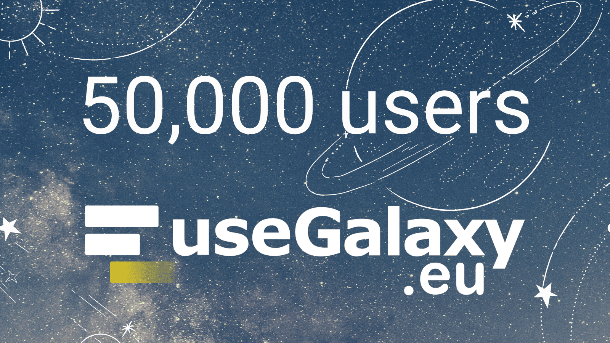

  

  

 

The [European Galaxy server](https://usegalaxy.eu/) was [officially launched on __March 15, 2018__](https://usegalaxy-eu.github.io/posts/2018/03/15/usegalaxy-eu/) during the first [Galaxy User Conference](https://usegalaxy-eu.github.io/posts/2018/03/15/y-galaxy-user-conference-a-successful-first-day/) in Freiburg. Despite the short timespan, many things have changed since then: __from 800 users at that time till the 50,000 that we've reached this year!__ 

The European Galaxy server provides __free computing resources to scientist all over the world__ (more than 100 countries!). The aim is to __support scientists__ at all career stages and __regardless of their socioeconomic background__, so that everybody gets the same chances to perform data analysis. Some of our users have shared with us some [interesting scientific uses cases](https://usegalaxy-eu.github.io/news?tag=UseCase) and [publications in scientific journals](https://usegalaxy-eu.github.io/citations) that show the importance of the use of the services in the scientific progress.

Not only the amount of registered users have grown, the number of [tools installed](https://usegalaxy-eu.github.io/tools) is now over 2,800, 47M jobs have been run, 260K workflows have been executed... The training activities have also increased, reaching 13K trainees using [Training Infrastructure as a Service (TIaaS)](https://usegalaxy-eu.github.io/posts/2021/08/24/tiaas-flyer/) in [different aspects of science](https://usegalaxy-eu.github.io/news?tag=TIaaS). The [Pulsar Network](https://pulsar-network.readthedocs.io/) has now 12 nodes in Europe ([UFR](https://www.uni-freiburg.de/), [de.NBI Cloud](https://www.denbi.de/), [CESNET](https://www.cesnet.cz/), [IBIOM-CNR](http://www.ibiom.cnr.it/), [ReCaS-Bari](https://www.recas-bari.it/index.php/en/), [VIB](https://vib.be), [VSC](https://www.vscentrum.be/), [Tecnico ULisboa](https://tecnico.ulisboa.pt/en/), [GenOuest](https://www.genouest.org/), [Diamond Light Source](https://www.diamond.ac.uk/Home.html), [UIB](https://www.uib.no/en) and [CSC](https://www.csc.fi/)). Take a look at these and other impressive numbers in our factsheet:

 

  

  

  

And we wanted to celebrate this important milestone with __all the people that have supported us__ in all sorts of ways: facility management, technical support from the [compute center](https://www.rz.uni-freiburg.de) to manage an increasing [hardware infrastructure](https://usegalaxy-eu.github.io/news?tag=hardware), our sponsors, the EU office at the University of Freiburg, the [Backofen lab](https://www.bioinf.uni-freiburg.de/~backofen/), the [Faculty of Medicine](https://www.med.uni-freiburg.de/), the member sites ([Erasmus MC](https://galaxyproject.org/erasmusmc/), [VIB](https://galaxyproject.org/belgium/), [Pasteur](https://galaxyproject.org/pasteur/), [Genouest](https://galaxyproject.org/genouest/), [ELIXIR-IT/Laniakea](https://galaxyproject.org/elixir-it/), [ELIXIR-FR/IFB](https://galaxyproject.org/ifb/)), our power users, the past and [current members](https://usegalaxy-eu.github.io/people) of the team and the rest of the Galaxy community!
  

<twitter tweet="1539857403788787712"></twitter>
 

__Big thanks__ to everybody that has contributed to the success of UseGalaxy.eu and to each of the 50K users for using Galaxy! Next stop: 100K!

import Flickr from '@/components/Flickr.vue';

  <Flickr title="50k user workshop" link="https://www.flickr.com/photos/134305289@N03/52168204601/in/shares-eLN9iG/" coverWidth="640" coverHeight="427" cover="https://live.staticflickr.com/65535/52168204601_12fc4c1f4a.jpg"></Flickr>

