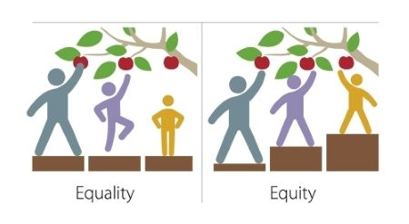
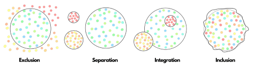

In our last blog post, we wrote a brief introduction to what the [Galaxy Well-being and Mental Health project](https://galaxyproject.org/blog/2022-06-29-galaxy-wellbeing-project/) is and what it entails. Now, let’s break down the key terms we are using in this project.

# What is Well-being?

**Well-being** can be defined as the overall sense of health characterized by positive functioning. It has two aspects which are subjective and objective well-being. The subjective well-being aspect focuses on parts of our lives that we determine ourselves through subjective evaluation. This could be how we feel about ourselves, how we form meaningful relationships, how we measure our potential and success, or our sense of purpose. The objective well-being aspect views well-being in terms of quantitative factors or material resources such as economy, health, and education. Well-being is considered to constitute 8 main dimensions which are emotional, social, occupational, physical, spiritual, environmental, intellectual and financial. If any of these dimensions are neglected over time, it will be detrimental to our well-being.

# What is Mental Health?

**Mental health**, according to [WHO](https://www.who.int/), can be understood as a “*state of well-being in which the individual realizes his or her own abilities, can cope with the normal stresses of life, can work productively and fruitfully, and is able to make a contribution to his or her community.*”

# What is Diversity, Equity and Inclusion (DEI)?

**Diversity** comprises all the ways in which individuals or groups differ. It includes age, ability, national origin, religion, socioeconomic status, sexual orientation, language, education, marital status, physical appearance, values, outlook and such. Diversity is beneficial in so many ways as it promotes the existence of different perspectives and experiences which accelerates the growth of the individual as well as the organization and increases creativity, productivity and overall success.

**Equity** is a practice that promotes fair and equitable access, opportunities, treatment, and results for everyone. It aims to create the desired outcome for everyone involved by allocating resources tailored to one’s needs. Equity recognizes that everyone is not the same and comes from diverse backgrounds with different experiences. Equity should not be confused with the concept of equality where everyone is given the same access and resources. As expressed by this quote “Equality is giving everyone the same pair of shoes. Equity is giving everyone a pair of shoes that fits.”

**Inclusion** puts diversity into action by fostering an environment in which all individuals with different ideas, backgrounds, and viewpoints may grow and succeed. Having diversity alone is not enough and must strive to create an inclusive environment where everyone has a sense of belongingness, feels welcomed and have access to resources to contribute and participate in an environment without barriers. Inclusion requires openness, acceptance, and collaboration. It should not be used synonymously with words such as integration where people have access but are expected to adapt to the way of a particular environment.

Diversity, Equity and Inclusion are interrelated, and all must exist for a healthy work environment.

