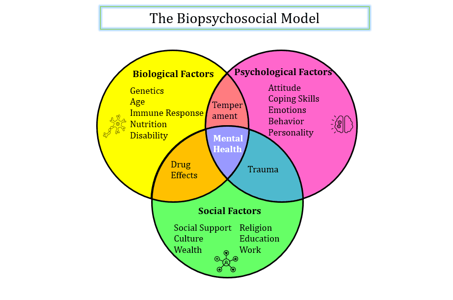

Mental health is essential for good health and quality of life. It plays a role in how well individuals, families, communities, and society function. A growing body of research indicates that having a high level of mental health reduces the chance of developing mental illness and that having a poor level of mental health increases the risk. Poor mental health can substantially influence how well we can cope in our everyday lives, resulting in minor to quite significant changes.

Positive mental health has been shown to have advantages in both work and non-work settings. People who report good mental health do better at work, have better physical health, and have better relationships with others (Lyubomirsky et al., 2005; Huppert, 2009). According to Wright et al. (2007), good mental health has also been linked to greater levels of job satisfaction and performance, which can predict better organizational productivity and performance.

# What are some risk factors for poor mental health?

The Biopsychosocial model of mental health provides a comprehensive analysis of the biological, psychological, and social variables that interact to affect the prevalence and severity of mental health concerns in the community. According to this model, people are influenced by 
* Biological factors like a person's nervous or immune system, age, or genetics
* Psychological factors could be personal factors like experience and behavior, personality traits, or coping mechanisms.
* Social context factors such as work, socio-economic status, or level of social support

These factors interact and have implications for the cause and treatment of various mental health issues. Although specific factors than others may more severely impact different people, it is likely that many people are affected by a complex combination of components. 

# What are some indicators of poor mental health?

There are several indicators and symptoms of poor mental health to watch out for. Each of us will exhibit one or more of these at some point. The most important issue is the severity, duration, frequency, and what effect it is having. Having poor mental health might include 
* Low mood
* Poor concentration 
* Irritability
* Sleep difficulties 
* Fatigue
* Aggression
* Lack of interest in day-to-day activities
* Social withdrawal

Each of these behaviors might be exhibited by anyone and are not necessarily an indication of a mental health issue. However, it is recommended to seek guidance from a health care provider if some of the behaviors indicated persist over an extended period and negatively affect a person's functioning.

# What are the statistics on mental health problems?

* 1 in every 8 people in the world lives with a mental disorder ([WHO](https://www.who.int/news-room/fact-sheets/detail/mental-disorders)).

* The cost of lost productivity due to depression and anxiety to the global economy is estimated to be US$ 1 trillion annually ([WHO](https://www.who.int/teams/mental-health-and-substance-use/promotion-prevention/mental-health-in-the-workplace)).

* 792 million people (10.7% of the world's population) have at least one mental illness. Anxiety disorders and depression are the two most prevalent mental disorders which make up more than half of all cases. Depression affects 3.4 percent of the world's population (264 million people), whereas anxiety disorders impact 3.8 percent of the world's population (284 million people) ([Our World in Data](https://ourworldindata.org/mental-health)).

* Out of 1501 respondents, 59% of workers reported facing negative effects of job-related stress, including a loss of interest, motivation, or energy (26%), trouble concentrating (21%), and a lack of effort at work (19%) ([APA](https://www.apa.org/pubs/reports/work-well-being/compounding-pressure-2021#:~:text=Nearly%20three%20in%20five%20employees,effort%20at%20work%20(19%25))).

* Out of 1501 respondents, 37% of workers believe that offering mental health resources and regularly recognizing contributions (36%) may help foster a psychologically healthy workplace ([APA](https://www.apa.org/pubs/reports/work-well-being/compounding-pressure-2021#:~:text=Nearly%20three%20in%20five%20employees,effort%20at%20work%20(19%25))).

* According to [OSMI Mental Health in Tech Survey 2021](https://osmi.typeform.com/report/Fja7Jb9K/t5F4sKEyeGhGgU7V), out of 131 responses, 43 people (32.8%) reported having a mental disorder, and 24 people (18.3%) reported possibly having a mental health disorder.

# References

Huppert, F. A. (2009). Psychological well‐being: Evidence regarding its causes and consequences. *Applied Psychology: Health and Well‐being*, *1*(2), 137-164.

Lyubomirsky, S., King, L., & Diener, E. (2005). The benefits of frequent positive affect: Does happiness lead to success? *Psychological Bulletin*, *131*(6), 803.

Wright, T. A., Cropanzano, R., & Bonett, D. G. (2007). The moderating role of employee positive well-being on the relation between job satisfaction and job performance. *Journal of Occupational Health Psychology*, *12*(2), 93.

