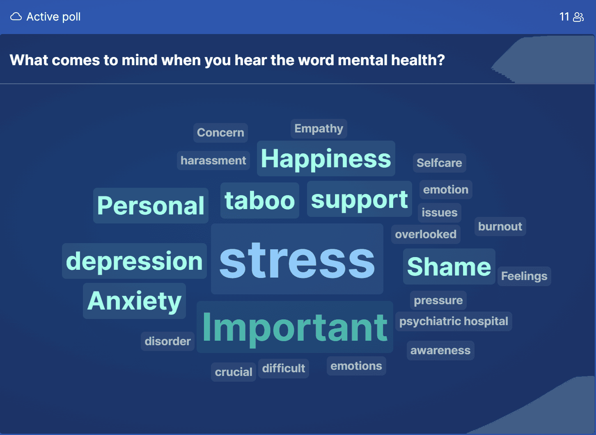

The Galaxy Well-being and Mental Health Project [Birds of a Feather (BoF) session](https://gcc2022.sched.com/event/15sBx/bof-galaxy-well-being-and-mental-health-project) of the 2022 Galaxy Community Conference (GCC2022) was held online on Wednesday, July 20, 2022. As the project is part of [Outreachy](https://www.outreachy.org/), we kicked off the meeting with a little introduction to Galaxy’s participation in the program and continued with the project for the rest of the session. 

At the beginning of the presentation of the project, we presented our participants with a word cloud poll where they could fill in as many words as they liked to the question “What comes to mind when you hear the word mental health?” This gave us a lot of insight into what people associated mental health with. In the poll, there were many words related to mental health problems, words linked to the need to address mental health, and positive words associated with mental health.

The image above illustrates the word cloud poll, where bigger words represent more people filling the same words. In this poll, stress was the most answered word.

Another interesting section of the session was the five questions we asked to get the communities intake on mental health, diversity, equity, inclusion, and values. We asked the following:

* What can we do as a community to improve mental health and increase diversity, equity, and inclusion?
* What are some issues you think should be addressed by this project?
* What do you think is the best way to approach and introduce the topic to the community?
* What are the obstacles for raising awareness on mental health in the community?
* What are the values of the community? What are your values that you bring to the community? 

Based on the answers we have got, we have highlighted the main points raised by the participants.

**Project scope**: The need to have a clear scope on what this project will address in the community regarding mental health, diversity, equity, and inclusion due to having different personal challenges such as losing one’s dog that could impact mental health and interfere with work. Those challenges are not created/triggered by the community or the project environment, and therefore do not fall within the scope of the project.

**Research and analysis**: The need to understand where issues arise in the community and how to address them.

**Project culture**: The need to create a culture that openly talks about mental health, provides support, reduces stigma, and has clearly defined and shared values.

**Work-life balance**: The need to keep the work-life balance by reducing workload and overwork.

**Ideas for education/awareness**: We have received many suggestions on how to raise awareness and educate about mental health through events, having surveys, writing and raising discussions, and through the [Code of Conduct](https://galaxyproject.org/community/coc/). There were also suggestions on what topics to consider when raising awareness, such as how to detect problems, distress, burnout, what is considered right or wrong behaviour and techniques to improve.

**Onboarding**: The need to mentor newcomers and provide directions and guidance as sometimes technical conversations in channels could make newcomers feel overwhelmed and intimidated, discouraging them from asking questions. The need to do some outreach activities in schools and undergraduate level was also mentioned.

**Interactions**: The need to have social events that initiate and improve community interactions.

**Appreciation**: The need to recognize and appreciate contributions more was suggested.

**Community support**: There were suggestions on creating support groups and chat channels to support people facing mental health issues, as well as to discuss mental health and DEI.

**Diversity, equity, and inclusion (DEI)**: The need to clearly define what diversity, equity, and inclusion is and what factors it addresses as there seems to be a lack of sufficient understanding on the topic. We had suggestions on how to increase DEI, supporting underrepresented communities, having active discussions on DEI, improving accessibility, having a DEI committee, measuring and collecting data on DEI, and specifying the vision and goal of the project regarding DEI.

**Note**: We have written a series of blogs on the [Galactic blog page](https://galaxyproject.org/blog/) that addresses some of the issues raised by the community in the BoF session, such as what DEI is, how to work with time zone differences, and what the risk factors and indicators of mental health problems could be. There is also a [Galaxy Mentor Network](https://galaxy-mentor-network.netlify.app/) that newcomers can join to receive support, mentorship and easily navigate through the Galaxy ecosystem and engage with the community.

The BoF session's presentation slide could be accessed [here](https://docs.google.com/presentation/d/1fnW5eAhOj-kCDTJypGuLF-tvgEuoQF__77Jrt_gtFfU/edit?usp=sharing), whereas the document with questions presented to the participants and their answers could be accessed [here](https://docs.google.com/document/d/1KOjXXPI0c55-ZL8a1XN3Xhq_A9LfuaufxqoIkS8uvL4/edit?usp=sharing).
