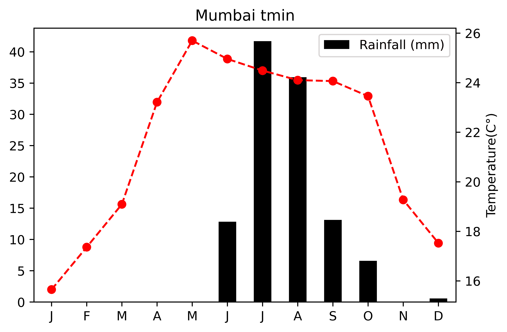

# What is climate? 

[Climate](https://en.wikipedia.org/wiki/Climate) is the long-term, around 30 years, average weather over a particular region. It’s the typical pattern of temperature, precipitation, and wind and how those change seasonally throughout the year. 

# What does climate look like?
Have a look around. Whatever you see is a part of the biosphere. Due to its massiveness, a collective study of this biosphere is nearly impossible. Thus the terrestrial part of the biosphere has been divided into smaller but enormous slices named “Biomes”. No two biomes are alike and the climate determines the boundary of a biome and the abundance of plants and animals found in them.

There are five major biomes in the world : **aquatic**, **grassland**, **forest**, **desert**, and **tundra**. Following are the best examples of the five biomes: **Pacific Ocean** (aquatic), **Eurasian steppe** (grassland), **Amazon rainforests** (forest), **Sahara** (desert) and **Kalaallit Nunaat high arctic** (tundra). 

*This biome map is an illustration made by Sabine Deviche from [an article written by Karla Moeller](https://askabiologist.asu.edu/explore/biomes). It shows both land (terrestrial) and water (aquatic) based habitat types.*

The daily weather might be fluctuating a lot in these biomes. But a long-term trend is the answer to the climate patterns. So a question arises, how is the climate at a place represented?
Scientists use a  [Climatogram](http://mrswhittsweb.pbworks.com/w/file/fetch/103526601/climatograms%20unknown%20graphs.pdf) . A climatogram is a graph with a double-Y axis that plots the average monthly temperature & precipitation in a biome. The climate depends on a number of factors but the temperature and precipitation are the major ones which are decisive in the depiction of climate.
The precipitation is shown with a bar graph and is labelled on the left y-axis. The temperature is shown with a line graph, which is labelled on the right y-axis. The months of the year are the x-axis. Following are the [climatograms of major cities of the world](https://lh3.googleusercontent.com/-Uyc7LG2ktfg/VNW3LvQ7IrI/AAAAAAAAohE/5us7H7XxSPc/s1600/climographs.png).

Looking at the climatograms plotted by [Teresa Glass](https://sites.google.com/site/teresaglassessinvestigations/lessons/biology/biomes-and-climographs), we infer that the city of Tindouf, Algeria must be of a desert biome with very scarce winter rainfall and high temperatures. On the other hand, Barrow in Alaska has a very cold climate with little rainfall during the monsoons and winters. The climate of Peru is hot and humid with high rainfall throughout the year and a nearly constant temperature.  Los Angeles also experiences some tricky weather with winter rainfalls and moderate temperatures. The city of Mangalore in India experiences moderate temperatures with heavy monsoons and some winter rainfall.

# Why do different places have different climates?

The main source of heat for the planet is the Sun. Earth has an [ellipsoidal](https://oceanservice.noaa.gov/facts/earth-round.html#:~:text=The%20Earth%20is%20an%20irregularly%20shaped%20ellipsoid.&text=While%20the%20Earth%20appears%20to,actually%20closer%20to%20an%20ellipsoid.) shape, thus different regions receive heat in different proportions. The equator receives direct rays of the sun, thus heats the most. The rays not only heat the land and ocean surfaces but also heats the air above them. This serves to be the major region from where the hot air rises up and forms air currents which further drives the [global conveyor belt system](https://education.nationalgeographic.org/resource/global-conveyor-belt). This eventually transports the moisture and ocean water throughout the globe. This uneven distribution of temperature leads to different patterns of wind, rain and heat which eventually produces a varied climate pattern throughout the globe. But wait! Don’t you think this can lead to extreme temperature differences? The very reason we don’t experience extremes in temperatures and precipitation is due to the atmosphere. The atmosphere acts as a blanket of air around the earth and helps to prevent the heat produced due to solar insolation, from escaping directly into space. And thus a moderate temperature is maintained. Thus it can be concluded that the atmosphere along with solar heating is the major reason for varied climate patterns around the globe.

# What can cause climate change?

A few degrees can make a world of difference. Ice around 3 miles thick used to cover most of the Northern Hemisphere during the last glacial age. Is it obvious to think that glacial melting is a natural phenomenon and has been happening for a very long time? Are we just panicking over a natural phenomenon that was bound to be happening in time?
Well, during the last ice age, people journeyed across the land connecting North America and Asia. The land was visible. Today, the Bering Sea bridge is about 50 meters below the current water level. This indicates that the sea level has risen by 50 meters in around 18,000 years. Considering a very rough average, the expected sea level rise should be close to 2.7 mm/year, in order to submerge anything as high as the Bering Sea Bridge. Currently, the average global rise in sea level temperature is accelerating at the rate of 3.7 mm/year which is around 37% higher. Well, the melting is natural but its rate is something that can’t be regarded as natural. There must be some underlying factors that have led to this rough increase.
Overall, a change in temperature and precipitation over a region can affect its climate. There are many underlying factors that lead to changing patterns of precipitation and global atmospheric and surface temperature. The rising levels of greenhouse gases such as carbon dioxide, methane, water vapor, etc. are leading to enhanced trapping of heat within the atmosphere of the world. Thus leading to rising temperatures. This has led to higher land and ocean surface temperatures. As a result, the rate of evaporation has gone up, further increasing the global precipitation rate. There are many less obvious factors such as Albedo which have great significance in Earth's heat exchange processes.

# What is Albedo?

The growing population brings the need for more land for shelter. This has led to deforestation and changing patterns of land use. The more construction of roads and urbanization a city has, the lesser will be the albedo. You might wonder, what actually is albedo? It is defined as the proportion of light reflected from a surface. The albedo is estimated by measuring the solar radiation reflected from a region of Earth and comparing that with the insolation. Any bright or white colored surface reflects most of the light or heat falling on it. Thus the reflected light or heat does not get trapped inside the earth and is mostly returned to space. This does not contribute to increasing in Earth’s temperature. These surfaces are said to have high albedo values. On the contrary, the dark-colored objects such as concrete roads, tar and gravel roofs, etc. absorb the heat falling on them. This contributes to an increase in Earth’s temperature. The albedo increases with latitude because solar zenith angle, cloud coverage, and snow cover all increase with latitude. The increased [aerosol burden](https://www.ipcc.ch/site/assets/uploads/2018/02/WG1AR5_Chapter07_FINAL-1.pdf) is related to excessive burning of fossil fuels which has increased the levels of aerosols and suspended particulate matters in the atmosphere. More of these [absorbing aerosols](https://www.nature.com/scitable/knowledge/library/aerosols-and-their-relation-to-global-climate-102215345/) lead to the heat being trapped inside the surface of the earth. The highest albedo values are attributed to the ice caps and glacial ice. Most of the sunlight falling on these is reflected and this prevents the heating of the polar waters. With the reduction in ice caps, the temperature of these water bodies is bound to increase. Thus we can expect accelerated melting of polar ice caps due to reducing albedo. 

In order to achieve lower absorption of heat, many  man-made solutions are taken into account. For instance in the Arctic, some try to use synthetic materials (like micro glass spheres) to increase the albedo of the forming ice and lower the temperatures. In the Alps, other people try to cover the remaining snow with white sheets and reduce the melting. In other places, roads are built with materials which do not absorb so much heat. Some building roofs and walls are painted white, vegetation is planted (which also keeps moisture), etc. inorder to increase the albedo values and reduce the absorption of solar radiation.

# What is the domain of climate science?

We know the world is shifting towards a more critical phase, scientists and researchers, all over the world are working hard for the betterment of the current health of the planet. Just like a patient, in order to get rid of its ailments, the Earth has to go through a diagnosis, treatment, and rehabilitation process. We will discuss the treatment and prevention aspects in the next blog. Thus this blog can bring forth the various diagnostic processes for earth’s health conditions.
The very first diagnostic step began in the early 19th century when ice ages and other natural changes in paleoclimate were first suspected and the natural greenhouse effect was first identified. Since then, there have been researches. There are some very important satellites constantly orbiting the earth and collecting data with respect to climate variables such as aerosols, ocean temperature, ocean color, albedo, ocean chlorophyll content, and thousands of others. The category of satellites used to monitor short-term weather patterns, climate change, and natural disasters are called [Earth Observation Satellites](https://en.wikipedia.org/wiki/List_of_Earth_observation_satellites).

Some of the important satellites that are revolutionary in the field of climate change are [MERRA](https://gmao.gsfc.nasa.gov/reanalysis/MERRA-2/), [MODIS AQUA](https://oceancolor.gsfc.nasa.gov/data/aqua/), [MODIS TERRA](https://terra.nasa.gov/about/terra-instruments/modis), [LANDSAT 8](https://landsat.gsfc.nasa.gov/satellites/landsat-8/), [GLDAS](https://ldas.gsfc.nasa.gov/gldas), [SENTINEL-1B](https://ldas.gsfc.nasa.gov/gldas) and [GOSAT](https://www.gosat.nies.go.jp/en/)

		
There are many new initiatives with a special focus on the coastal cities that are at a risk of submergence. The [falcon -9](https://www.spacex.com/vehicles/falcon-9/) carried the [Sentinel -6](https://www.eumetsat.int/sentinel-6#:~:text=Once%20the%20state%2Dof%2Dthe,the%20oceans%2C%20weather%20and%20coastlines.) to the Earth’s orbit. What does the Sentinel-6 satellite do? The Sentinel-6 mission is part of the Copernicus programme initiative, the main objective of the Sentinel-6 mission is to measure sea surface topography with high accuracy and reliability to support ocean forecasting systems, environmental monitoring and climate monitoring.

The data these satellites record are available to the common public in the following formats: [ASCII](https://www.xmswiki.com/wiki/SMS:ASCII_Dataset_Files_*.dat), [netCDF4](https://unidata.github.io/netcdf4-python/), [HDF5](https://docs.h5py.org/en/stable/high/dataset.html), [TIFF](https://ieee-dataport.org/data-formats/tif-1), [SHP](https://en.wikipedia.org/wiki/Shapefile), etc. There are plenty of Python ad R libraries to study these datasets. One of the best and popular code-free option is the Galaxy climate platform, with easy to understand UI. Thus as a part of my internship, I will be utlising this server to analyse the commonly used datasets in my region. This can ease the process to a great extent as the new user has to just upload his data and execute my workflow. I’ll be sharing the datasets I’ve used and the corresponding Jupyter notebooks of my analysis in the next blog. In the meanwhile, let’s explore the climatogram of Mumbai city and the tool I prepared.

# Use Case: The city of Mumbai

We have a lot of rain in Mumbai. Being a coastal city, the climate is moderate throughout the year. During winters, a temperature of 11 degrees Celcius makes us shiver, as we are not used to extreme temperatures. Wet winters and summers are uncommon but possible. But the trends have started moving towards the extremes in a few years. This summer of 2022 was experienced as the hottest summer in 122 years. The Indian Meteorological department has declared a yellow alert for the city as last week, Mumbai received over 200 mm of rain in 36 hours, 69% of the July average received in 5 days. The collective water stock in the seven reservoirs that supply drinking water to Mumbai is now at 88.20 percent. Yes, this very evidently depicts climate change. As we have discussed above, we study the climate using climatograms, let's have a look at the climatograms of the Mumbai region.

## Climatogram

It can be inferred from the climatogram that the climate of Mumbai is moderate and humid. Heavy rainfall in the monsoon months of June to October is clearly indicated. 
Some rainfall is also witnessed during the winter months but it is of low intensity.
Find the analysis in a Jupyter Notebook [here](https://github.com/Quickbeasts51429/CLIMATOGRAPH/blob/main/Climography%202%20(1).ipynb).

## Heatmap

The above heatmap represents the [ERA-5 (fifth generation ECMWF reanalysis for the global climate and weather for the past 4 to 7 decades) Monthly mean](https://cds.climate.copernicus.eu/cdsapp#!/dataset/reanalysis-era5-single-levels-monthly-means?tab=overview) surface temperature over Mumbai for the last 65 years. The visualisation shows that the temperatures are highest near May and June. Somewhat a little high temperatures are also witnessed during October. Find the analysis in a Jupyter Notebook [here](https://github.com/NordicESMhub/galaxy-climate/blob/main/climate-heatmap/heatmap.ipynb).

# What tool is being developed?

Here comes the most awaited part, “[THE TIME SERIES EXTRACTION AND VISUALISATION TOOL](https://github.com/galaxyecology/tools-ecology/pull/58)”. So basically, I was working on the creation of a tool that extracts time series data containing a .csv file from a NetCDF file. Added to the extraction, the tool also plots a well-defined time series over a selected area and time. The tool is built on Python and wrapped in an XML wrapper class. The most intriguing and troublesome part for me was the testing. Beginning with the Windows Operating system, I faced an ocean of challenges and finally concluded that the process was not Windows’ cup of tea. I shifted to Kali Linux and did a lot of experimentation with environment creation and tool testing. Finally, my mentor Anne Fouilloux came to my rescue and the tool is now almost ready to be deployed. Huge Thanks!
This was all for this blog, meet you in the next blog where we will be discussing the missions and organizations involved in the climate change action. You will also get to know what currently I am working on. So, don’t miss that and until then happy **August!**

