We conducted a survey to assess the stressors faced in open-source communities and to understand the communities’ perceptions and knowledge regarding mental health. Two versions of the survey were distributed using Google form, one for the Galaxy community and one for other open-source communities. Work stress was assessed using the [Work Stress Questionnaire](https://www.gu.se/sites/default/files/2020-03/wsq-engelska.pdf) (Holmgren, 2008), which consists of 21 questions. The final version of the questionnaire consisted of 23 slightly modified questions tailored to the open-source community. This means that we took into consideration factors such as flexible working hours and replaced words with terms used in an open source project, such as using roadmap instead of goals, tasks instead of work assignment, management body, collaborators, contributors, or CoC Committee instead of a supervisor.

The [Mental Health Knowledge Questionnaire](https://www.ncbi.nlm.nih.gov/pmc/articles/PMC6245628/table/Tab3/?report=objectonly) (Li et al., 2018) was used to assess knowledge and awareness regarding mental health. The questionnaire consisted of 20 questions and was distributed in its original form. The survey also included demographic questions such as age, gender, ethnicity, location, hours spent per week working on the project, role in the project, history of mental health problems, and feeling of inclusion and exclusion in the project.

In addition, at the end of the work stress and mental health knowledge questionnaire, we added optional short answer questions to help us acquire any additional information and identify topics that were not addressed by the questionnaires.

Overall the survey consisted of
* 9 demographic questions
* 23 main work stress questions
* 20 mental health knowledge questions
* 2 optional questions for work stress and mental health knowledge

There were some differences between the two surveys in wording and what they inquired about (for the demographic questions). For example, in the Galaxy community survey for work stress, the questions were written as “Do you have the possibility to influence decisions in the Galaxy community project?” whereas, in other open-source community version survey, it was "Do you have the possibility to influence decisions in the open-source project?” In the demographic question section, the Galaxy community survey question was written as “Have you ever felt excluded or discriminated against from the Galaxy community project?” whereas, in other open-source community version survey, it was “Have you ever felt excluded or discriminated against from an open source project?”

We opened the survey to participants for about a month, and 14 people from the Galaxy community filled the Galaxy community version of the survey, whereas 20 people filled the survey designed for other open-source communities.

The main aim of the survey was to

1. Find out the challenges or stressors faced in open-source communities that must be addressed for the community's well-being.
2. Find out the awareness of mental health in the communities, which can provide a direction on where and how to start addressing mental health based on communities’ knowledge.
3. Incorporate and address issues raised in the survey on a guideline.

# Result Highlights

The results showed that

* Over 60% of participants from both surveys have reported facing mental health problems.

|Have you ever faced any mental health problems? |
|:-|:-:|:-:|
| **Community**                 | **Yes**|**No**  | 
| Galaxy Community              | 64.3%  | 35.7%  | 
| Other Open-source Communities | 65%    | 35%    |

* Around 21% of the Galaxy community survey participants reported feeling excluded or discriminated against from the community, whereas 55% from other open-source communities survey reported feeling excluded or discriminated against from any open-source community they have worked with.

|Galaxy Community|Other Open-source Communities|
|:-:|:-:|
|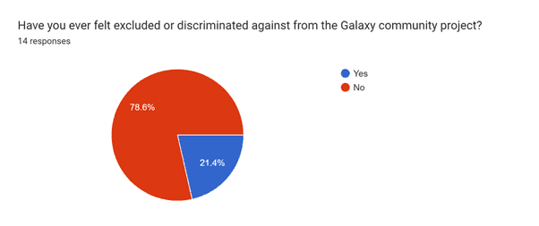|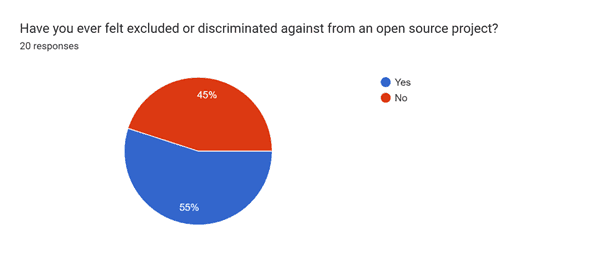|

Regarding work stress,

* Most respondents from both surveys felt like they didn’t have enough time to finish the work they did for their open-source project responding with never (21.4% from the Galaxy community survey and 25% from other open-source communities survey) and rarely (28.6% from the Galaxy community survey and 45% from other open-source communities survey) having enough time.

* Regarding having the possibility to influence decisions in the project, most participants from the Galaxy community survey responded with sometimes (57.1%) and often (21.4%), while in other open-source communities survey, most participants responded with sometimes (45%) and always (25%). From both surveys, most “often” (71.42%) and “always” (80%) answers came from male participants, while most female participants responded with “sometimes” (61.5%).

* More than 60% of the participants from the Galaxy survey reported workload increase over the past six months, while in other open-source communities survey, 50% of the participants reported workload increase, with most participants from both surveys perceiving that as stressful and a bit stressful.

|Galaxy Community|Other Open-source Communities|
|:-:|:-:|
|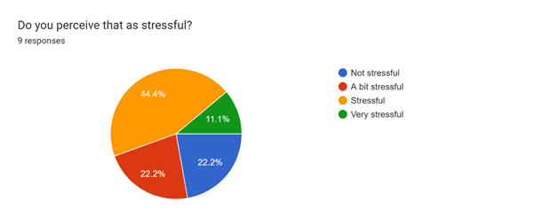|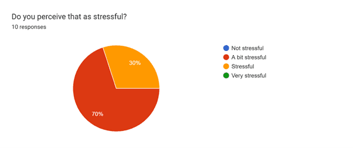|

* Most participants from both surveys reported having an unclear (more than 20%) or partially clear (more than 50%) open-source project roadmap, with most perceiving it as a bit stressful and not stressful.

|Galaxy Community|Other Open-source Communities|
|:-:|:-:|
|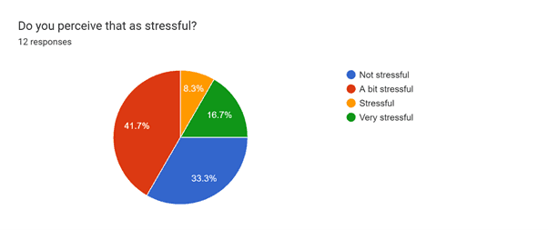|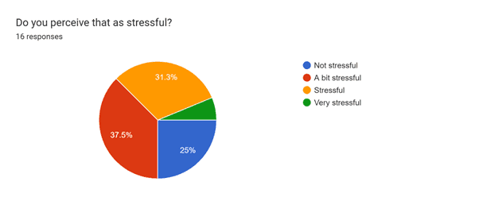|

* 40% of the participants from other open-source communities survey and 28.6% from the Galaxy community survey responded that they only partially knew who makes decisions concerning their project. 28.6% also responded that they did not know who makes decisions in the Galaxy community. Most participants from Galaxy perceived it as a bit stressful, whereas in other open-source communities survey, it was perceived as very stressful.

|Galaxy Community|Other Open-source Communities|
|:-:|:-:|
|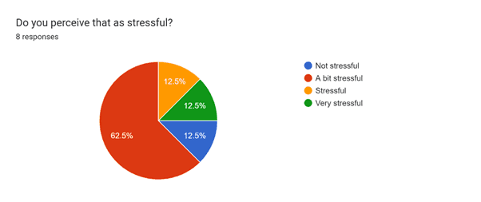|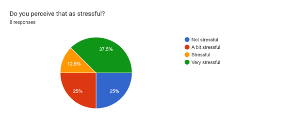|

* Regarding the existence of conflicts in the project, participants from the Galaxy community survey responded with I don't know (50%), followed by yes (42.9%), whereas in other open-source communities survey, 40% responded with yes, followed by I don’t know (30%) and no (30%), with most who responded with yes perceiving it as stressful.

* When participants were asked if anyone from the project (Management Body, Collaborators, Contributors, or CoC Committee) had done anything to solve the conflicts, they responded with yes (25% from other open-source communities survey and 33.3% from the Galaxy community survey), no (25% from other open-source communities survey and 33.3% from the Galaxy community survey), and partially (50% from other open-source communities survey and 33.3% from the Galaxy community survey) with most from the Galaxy community survey perceiving it as a bit stressful (75%) whereas in other open-source communities survey 50% found it very stressful and 50% found it a bit stressful.

* More than 75% from other open-source communities survey and 85% from the Galaxy community survey reported often spending a lot of time working on the project’s tasks, with most participants from Galaxy perceiving it as not stressful (41.7%) followed by stressful (33.3%) whereas in other open-source communities survey perceiving it as a bit stressful (46.7%) followed by stressful (26.7%).

* 35.7% of the participants from the Galaxy community survey and 55% of the participants from other open-source communities survey responded that they take more responsibility in the project than they ought to, with most participants from Galaxy perceiving it as a bit stressful, whereas in the other open-source communities survey perceived it as very stressful.

|Galaxy Community|Other Open-source Communities|
|:-:|:-:|
|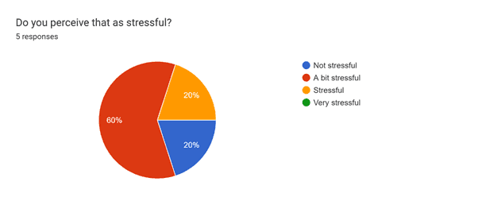|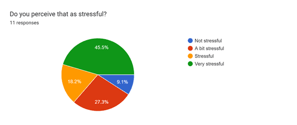|

* 42.9% of participants from the Galaxy community survey and 65% of the participants from other open-source communities survey reported partially finding it hard to sleep because their mind is occupied with work on the project, with most from the Galaxy survey perceiving it as stressful and in other open-source communities survey finding it a bit stressful.

|Galaxy Community|Other Open-source Communities|
|:-:|:-:|
|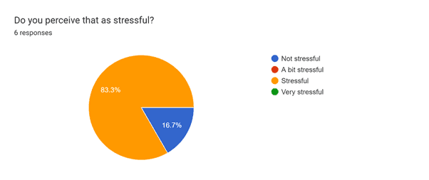|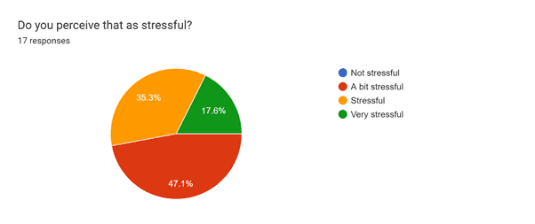|

Regarding mental health knowledge,

* 100% of the participants from both surveys believed that mental health is a component of health.

* Most participants from both surveys don't believe that mental disorders result from incorrect thinking (78.6% from the Galaxy community survey and 55% from other open-source communities survey), whereas the rest thought it did (21.4% from the Galaxy community survey and 5% from other open-source communities survey) or thought it was unknown (40 % from other open-source communities survey).

* Over 90% of the participants from both surveys believed that many people have mental health problems without realizing it.

* 85.7% from the Galaxy community survey and 65% from other open-source communities survey believed mental disorders and psychological problems could be prevented.

In addition, participants mentioned other challenges they face while working on an open-source project, such as

* Time zone differences
* Sexism
* Not being informed when important decisions are taking place
* Publish or perish
* Uncertain contracts
* PIs disregarding community priorities
* Dealing with inconsiderate leaders
* Fear of missing out
* The stress of creating projects when funding runs out

Participants were also asked what they would like to see get addressed in open-source communities regarding mental health. They responded with

* Having free webinars on mental health to familiarise people with the topic
* The stress of unpaid work
* To continue creating awareness about mental health
* Time zone differences
* Setting boundaries at work
* Mental health stigma
* Work-life balance
* Performance anxiety
* Fear of missing out
* Promoting mental health in teams
* Having safe spaces to discuss mental health
* Mental health problems as a social problem instead of an individualized one

# Conclusion

The survey results show the need to create awareness about mental health and reduce stigma, as most participants reported having mental health problems. It also shows that some people feel excluded from communities, so it's essential to think of how we can make open source more welcoming and a safe space for everyone. In addition, there is a need to address work-related stressors such as workload and conflict, as well as the need to keep community members involved and informed on what's going on in the community, who are making critical decisions, and having a clear project roadmap. Regarding mental health knowledge, most participants demonstrated a sufficient understanding of mental health matters addressed in the questionnaire. It also showed that most acknowledged and accepted mental health as a component of health and agreed that mental health problems could be preventable. So why is mental health not being adequately addressed in the communities?

# References

Holmgren, K. (2008). *Work‐related stress in women: Assessment, prevalence and return to work* (Master’s thesis). University of Gothenburg, Sweden. https://gupea.ub.gu.se/bitstream/handle/2077/17726/gupea_2077_17726_1.pdf?sequence=1&isAllowed=y

Li, J., Zhang, M. M., Zhao, L., Li, W. Q., Mu, J. L., & Zhang, Z. H. (2018). Evaluation of attitudes and knowledge toward mental disorders in a sample of the Chinese population using a web-based approach. *BMC Psychiatry*, *18*(1), 367. https://doi.org/10.1186/s12888-018-1949-7
