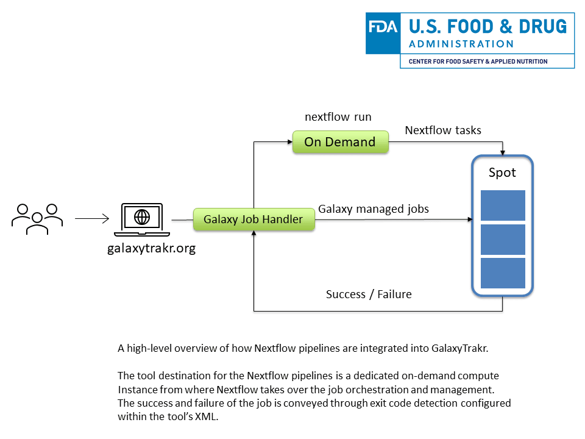

**Center for Food Safety and Applied Nutrition**'s (**CFSAN**) scientists, reseachers and developers are increasingly adopting [Nextflow](https://www.nextflow.io/index.html) to write purpose-built pipelines to tackle various data intensive research problems. **Nextflow** is a community-driven project which enables scalable and reproducible workflows which can be run almost anywhere using various run time execution environments, software containers or virtual software enviroments. At CFSAN, we are building pipelines using **Nextflow DSL2** modules as the foundation, which are part of the community driven [nf-core](https://github.com/nf-core/modules) effort.

As part of our continued mission to simplify data analysis tasks, we wanted to integrate our Nextflow pipelines into **GalaxyTrakr** to enable the interoperability of the data sets among many workflows and since many state labs and centers already use GalaxyTrakr. [GalaxyTrakr](https://galaxytrakr.org) is [GenomeTrakr](https://www.fda.gov/food/whole-genome-sequencing-wgs-program/genometrakr-network)’s own hosted instance of the Galaxy Project, an open source, web-based platform for collaboration and science. GalaxyTrakr’s team of engineers and developers curate tools for use in workflows and data exploration by the community of food pathogen researchers.

\
&nbsp;

## Just an another tool for Galaxy

From Galaxy's point of view, it sees the Nextflow pipeline that needs to be run as any other tool as the whole pipeline invocation is done via the `<command>` tag in the [Galaxy Tool XML File](https://docs.galaxyproject.org/en/latest/dev/schema.html#tool-command). In the example below, **Nextflow** and **Graphviz** are the only required packages for the Nextflow pipeline to be installed into Galaxy. The required bioinformatics tools and software packages for the Nextflow pipeline are either managed via software containers or conda virtual environments directly. We highly recommend going through one of the nf-core's [Nextflow DSL2](https://github.com/nf-core/modules/blob/master/modules/bwa/index/main.nf) module to get an idea about how a specific required software dependency is defined.

Example:

```xml
<requirements>
    <requirement type="package" version="22.04">nextflow</requirement>
    <requirement type="package">graphviz</requirement>
</requirements>
<command detect_errors="exit_code"><![CDATA[
    nextflow run $__tool_directory__/nf-pipelines/my_pipeline.nf --input /path/to/input
]]></command>
```

Where the tool directory contains a folder called `nf-pipelines` which should host all of your Nextflow code and configuration files.

\
&nbsp;

## Considerations when writing your Nextflow pipelines

You can avoid majority of the issues during integration, by simplifying the data ingestion and output generation for your Nextflow pipelines. This is what has worked for us:

* The entry point for our Nextflow workflows is a single absolute `*nix` full path which should contain all the inputs i.e. FASTQ files etc... This makes it easy to consolidate the required inputs and outputs as a dataset collections.
* Our workflows require the actual file names which is achieved by [creating soft links to the data sets](https://galaxyproject.org/search/?q=original%20file%20name#gsc.tab=0&gsc.q=original%20file%20name).
* We use pre-cached conda environments using `cacheDir` within `conda` configuration scope to define a location to store and re-use conda virtual enviroments. It is important to set the `cacheDir` to a `*NIX` location that does not interfere with the one that Galaxy maintains. It is adviced to run your Nextflow pipeline once on the command-line where the Galaxy instance runs to propogate the conda enviroment cache.
* We use the [dynamic retry with backoff](https://www.nextflow.io/docs/latest/process.html?highlight=dynamic%20retry#dynamic-retry-with-backoff) approach to handle a case when a spot instance gets taken away where a Nextflow task was currently running.
* Finally, make sure your Nextflow pipeline sets proper exit codes to determine the success or failure of the pipeline as this will be picked up by Galaxy which is indicated as a success or failure on the interface.

\
&nbsp;

## Infrastructure specific considerations

* Our GalaxyTrakr instance uses a combination of on-demand and spot **AWS** compute instances to reduce cost and meet the computational resources demand and as such we exclusively use spot instances for computation. Since there is a chance that [AWS spot instances may get taken down](https://docs.aws.amazon.com/AWSEC2/latest/UserGuide/spot-interruptions.html), it is important to run the main driver Nextflow script on an on-demand node from where the Nextflow TaskProcessor can execute and manage jobs on the spot instances.


