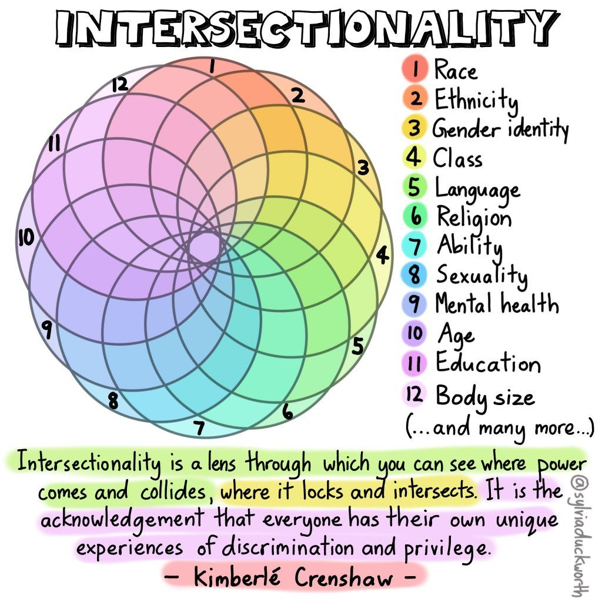

The underrepresented communities are groups that are not represented in the majority with respect to gender, race, sexual orientation, mental health, ability, religion, education, socio-economic status, age, and such. Underrepresented communities often experience social exclusion (when certain groups of people are systematically prevented from participating in mainstream institutions or activities), which can have serious consequences that can lead to isolation and poor mental health. When members of minority groups don't feel like they belong, they are less likely to participate in activities or interact with people outside their group. This can perpetuate the cycle of isolation and exclusion. 

Additionally, underrepresented communities are often the target of discrimination and prejudice. People can belong to multiple underrepresented groups due to [intersectionality](https://ecampusontario.pressbooks.pub/universaldesign/chapter/positionality-intersectionality/), which can lead to being discriminated against in different aspects. On the opposite end, someone can also have multiple privileges. A privilege is an unearned benefit or advantage granted to a particular group backed by systemic and institutional power. Someone can also have privileges and factors that put them at a disadvantage when it comes to gaining access to resources and opportunities.

|  |
|:--:|
| <b>Image Credit - Sylvia Duckworth (2020)</b>|

Supporting underrepresented communities is important because it helps break down barriers and foster inclusion. When everyone feels welcome and supported, everyone benefits. When underrepresented communities are supported, they can reach their full potential and contribute their unique talents and perspectives. 

# What can be done to support underrepresented communities?

Empowering underrepresented communities can create opportunities for everyone involved. There are many ways to support underrepresented communities. Some of the ways can be by

**Supporting equitable outcomes**: provide access to resources so everyone in the community can reach their full potential and the desired outcome. This means tackling barriers and providing resources, opportunities, and support that people might need to succeed.

**Creating an inclusive space**: provide a welcoming environment where everyone feels like they belong. When people feel like they belong and are included, they are more likely to participate in activities and interact with people outside their group. This leads to a richer exchange of ideas and perspectives, which benefits everyone. Inclusion also fosters understanding and respect for different cultures and experiences.

**Eliminating unconscious bias**: Most people would like to consider themselves unbiased. However, the reality is that everyone has unconscious biases. These are biases that we are not aware of and that we cannot control. They are a result of the way our brain is wired and the way we have been socialized. Unconscious biases can lead to discriminatory behaviors. They can also impact our decision-making, even when trying to be fair. There are many ways to reduce or eliminate unconscious bias, such as through self-awareness or taking training.

**Allyship**: Allyship can take many forms, but ultimately it is about using your privilege to support marginalized communities. This might mean using your voice to speak up against discrimination or taking action to ensure everyone has the opportunity to succeed. It could also involve simply being a friend and ally to someone who needs one. Whatever form it takes, allyship is important because it helps create a more just and equitable place for everyone.
