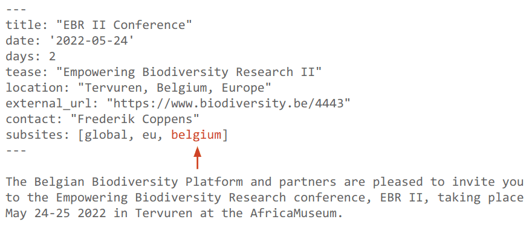

A year ago we [launched](/news/2021-09-hub2/) the new version of the Community Hub. This change brought author-friendly features, a modern, Vue-based architecture, and a fast browsing experience.

But galaxyproject.org is not the only Galaxy community site out there. [Communities](https://galaxyproject.eu) [across](https://site.usegalaxy.org.au) the [world](https://www.galaxyproject.in) run websites with similar features and a similar purpose. This leads to duplication of effort in a few ways. We reimplement similar features and each have to maintain a separate hosting setup. Another duplication is in cross-posting of updates. The majority of [news](/news/) and [events](/events/) posts are pointers to posts on other sites, often to other community sites.

To reduce this extra effort, we took a page from [galaxyproject.eu](https://galaxyproject.eu), which has a concept of "Member Sites". These are subsites within the galaxyproject.eu domain for each European group, like [galaxyproject.eu/freiburg/](https://galaxyproject.eu/freiburg/) for the University of Freiburg or [galaxyproject.eu/pasteur/](https://galaxyproject.eu/pasteur/) for the Pasteur Institute. Each subsite has its namespace under their url prefix. We've adopted this model so that every community can have their own home under the galaxyproject.org roof. For example:

| Subsite  | Homepage | Events feed | Content page |
|----------|----------|-------------|--------------|
| Global   | galaxyproject.org<strong>/</strong>    | galaxyproject.org<strong>/events/</strong>    | galaxyproject.org<strong>/learn/</strong> |
| Europe   | galaxyproject.org<strong>/eu/</strong> | galaxyproject.org<strong>/eu/events/</strong> | galaxyproject.org<strong>/eu/tools/</strong> |
| US       | galaxyproject.org<strong>/us/</strong> | galaxyproject.org<strong>/us/events/</strong> | galaxyproject.org<strong>/us/faq/</strong> |
| Freiburg | galaxyproject.org<strong>/freiburg/</strong> | galaxyproject.org<strong>/freiburg/events/</strong> | galaxyproject.org<strong>/freiburg/projects/</strong> |

We currently support every European community, plus a subsite for the [US](/us/) and of course a non-regional, Galaxy-wide [Global](/) space.

Now each community can benefit from having their own space with their own feeds and content, but without the need to maintain it on their own. And now cross-posting your content is as easy as adding a tag to the post metadata:

This post will then automatically show up in the feed at [galaxyproject.org/belgium/events/](/belgium/events/).

The system also makes it very easy to create a new subsite for your community. Previously, you'd have to fork another community site or develop your own, customize it, and figure out your own hosting. Now, you simply clone the [galaxy-hub repo](https://github.com/galaxyproject/galaxy-hub), make a small edit to the `config.json` file, and submit the PR.

`config.json`:

## Governance

Communities retain full control over their subsites in the new system. They can freely create any content they want, customize their styling, or add features. When a new community joins, their leaders are given commit access so that they can manage their subsite independently. If you're trying to publish a new post while the US team is asleep, don't worry, you don't need us!

## Rollout

Today we're unveiling the new subsites, which you can find in the "Regions" dropdown menu in the navbar. Every community from galaxyproject.eu is there, but we're still working on migrating all the content from that domain. We currently have all events and news posts from the last 3 months, but older content still lives on the old domain.

As always, please let us know if you have feedback or see anything amiss. You can file an issue on [Github](https://github.com/galaxyproject/galaxy-hub/issues), or contact us on [Gitter](https://gitter.im/galaxyproject/hub2), [Matrix](https://matrix.to/#/#galaxyproject_hub2:gitter.im), or [email](mailto:outreach@galaxyproject.org?subject=Global%20Hub%20issue).

## Want your own subsite?

We have some tips on how to create a subsite for your own community [here](/hub/global/). And we're continuing to add to the documentation, so if you don't find what you need, it may be there the next week. Not sure if a subsite fits your needs? Contact us through any of the methods above and we'd be happy to help.

## Thanks

I'd like to give a special thanks to Björn Grüning, Dannon Baker, Beatriz Serrano-Solano, and Helena Rasche for their support in this effort.
