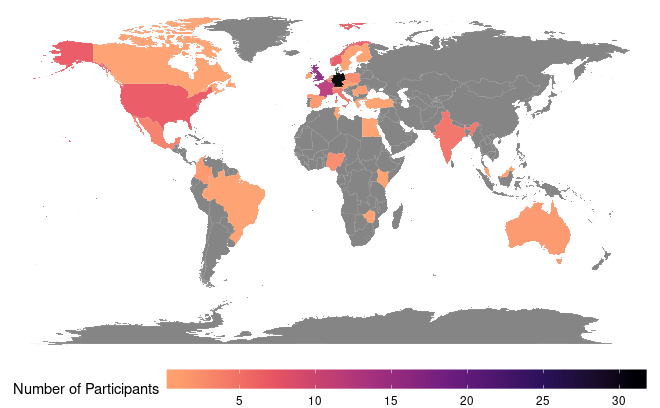

The week of the 3-7 October 2022, the European Galaxy Days took place in Freiburg. We held 3 events in a very intense week!

We started the week with [**ELIXIR Galaxy Implementation Study (IS2021)**](/events/2022-10-egd/elixir-is2021/) where updates on the data management side of Galaxy were presented and discussed. On Tuesday, the [**European Galaxy Days (EGD)**](/events/2022-10-egd/egd/) got started with a total of 25 talks (all the slides available in the schedule) in 6 blocks of content. At the end of Wednesday, we had Birds of a Feather on [diverse topics](https://docs.google.com/document/d/1ucZb4868ZYQqK7RdyhPwXPoyfFgKuaNz39-ZHXxqa2Q/edit).

For Thursday and Friday, the community split into parallel activities: on one side, a very productive [**EGD CoFest**](https://docs.google.com/document/d/1YrECXIGy92mu6qmMXADMvqvKSHdk7Y8Olughb6-ksHQ/edit) and on the other, the [**EuroScienceGateway (ESG)  kick-off**](/events/2022-10-egd/esg/), an EU-funded project to build a mature network of national Galaxy servers and Pulsar endpoints in European clouds and HPC centers.

Although it was an European Galaxy community event, 130+ registrants from all over the world could participate, in part thanks to the online participation. 

There were no incidents reported to the Code of Conduct committee and we got very nice feedback from the attendees, highlighting the interactions and the community feeling. We've selected one comment that shows the values of the Galaxy community: _"I was surprised to see that Galaxy people are so welcome, willing to help, friendful and supportive"._

(Pictures by Bérénice Batut, [see more in her flickr](https://www.flickr.com/photos/134305289@N03/shares/TT07w5S0S0/))

We would like to thank all the participants for attending, the presenters for sharing their work, the Freiburg Galaxy team for taking care of the logistics and organisation and to ELIXIR for the generous support of this event!

