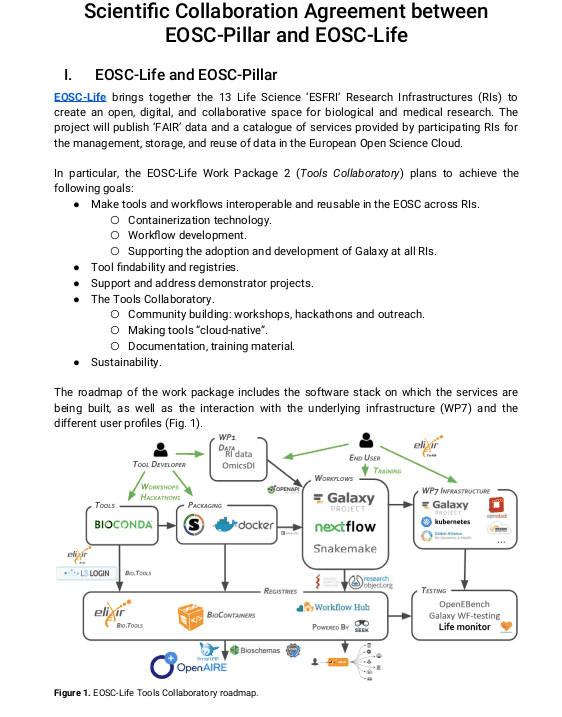

[{width=350}](/media/../../../media/scientific-collab-agreement-eosc-pillar-eosc-life.pdf)

The Galaxy community has been working on yet another scientific collaboration agreement between projects of the European Open Science Cloud (EOSC), this time between [EOSC-Pillar](https://www.eosc-pillar.eu/) and [EOSC-Life](https://www.eosc-life.eu/) (see the full document [here](/media/../../../media/scientific-collab-agreement-eosc-pillar-eosc-life.pdf)). 

With this new agreement, Galaxy positions itself as a cross-EOSC platform, capable of performing analyses that meet the needs of different scientific disciplines across the EOSC.

This effort adds to [another scientific collaboration agreement](https://docs.google.com/document/d/14MRMxsKX_AADY4A7mKEZze4aZgIZn2Gn_iksN4z-jwA/edit#heading=h.n5vk1b9tgwr8) between EOSC-Life and [EOSC-Nordic](https://www.eosc-nordic.eu/), also driven by use cases and the underlying infrastructure.

The [European Galaxy Server](https://usegalaxy.eu/) is also a [service provided at the EOSC catalogue and marketplace](https://marketplace.eosc-portal.eu/services/european-galaxy-server?q=European+Galaxy+Server), a repository that gathers all the different services and resources provided by the European Open Science Cloud.

Thank you to all the participants that made it possible!