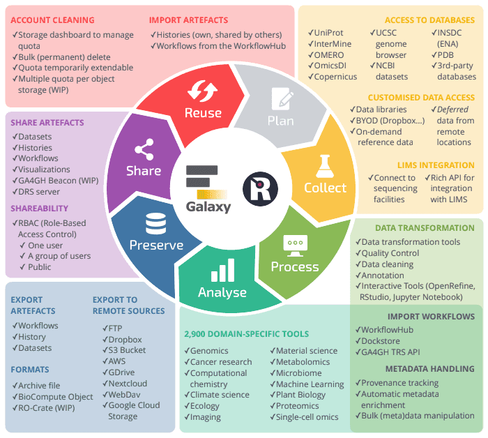

Galaxy is well known for its computational capabilities: tools, workflows and infrastructure to run analyses. However, to be able to reproduce and reuse those analyses, a proper data management stategy is needed. And the good news is that Galaxy does it without you noticing! 

THere are typically seven stages involved in the data life cycle: Plan, Collect, Process, Analyse, Preserve, Share and Reuse. Galaxy is involved in almost all those stages managing your (meta)data.

Figure adapted from the [RDMkit data life cycle](https://rdmkit.elixir-europe.org/data_life_cycle) by Amandine Nunes-Jorge and Beatriz Serrano-Solano. 

