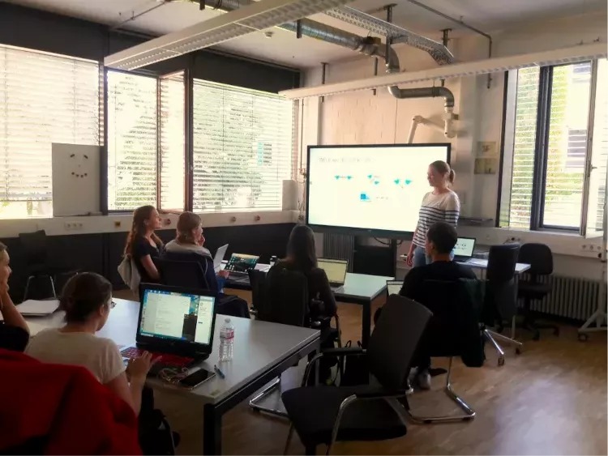

Chiara Schröder at the [AG Arnold Lab](https://arnold-lab.com/)
within the Institute of Experimental and Clinical Pharmacology
and Toxicology, hosts a Galaxy crash-course in ChIP-seq and
ATAC-seq to medical students.

The course runs on a local instance of Galaxy customized to
facilitate the analysis of mouse embryonic development, and
serves as a primer for onboarding medical students onto the wider
Freiburg Galaxy instance.

