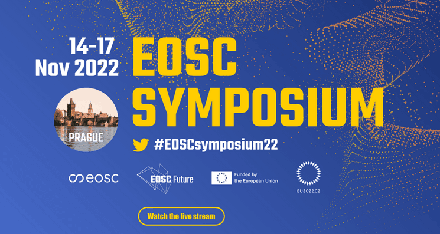

Over 500 stakeholders from ministries, policy makers, research organisations, service providers, research infrastructures and research communities across Europe and beyond met at the Symposium to reflect on the EOSC key achievements and strategic challenges, and to identify priorities and concrete actions at the European, national, and institutional level to speed up EOSC implementation.

We attended the annual [EOSC Symposium](https://eosc-portal.eu/events/eosc-symposium-2022) from 14-17th November 2022 in Prague to discuss projects and extend our network. [Photos](https://www.flickr.com/photos/197073959@N08/sets/72177720303945432/) and [recording](https://events.eoscfuture.eu/symposium2022/2606111) from all presentations are available on their website.
