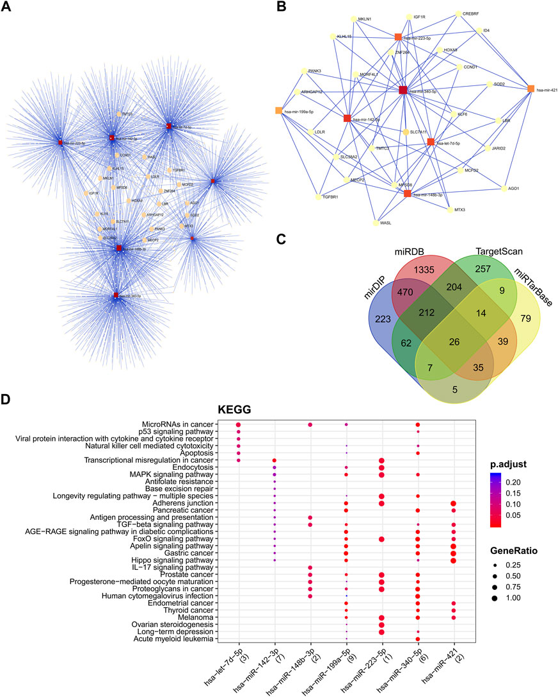

Sabbaghian and colleagues have used the [European Galaxy server](https://usegalaxy.eu) to identify a signature of seven stable miRNAs which dysregulate in several cancer types and may serve as potential pan-cancer biomarkers. Read their [paper](https://www.frontiersin.org/articles/10.3389/fmolb.2022.1030749/full) about their findings.

**Congratulations** to this nice publication and thanks for using the **European Galaxy server** and sharing your results with us!

**Abstract:**

Introduction: MicroRNAs have a significant role in the regulation of the transcriptome. Several miRNAs have been proposed as potential biomarkers in different malignancies. However, contradictory results have been reported on the capability of miRNA biomarkers in cancer detection. The human biological clock involves molecular mechanisms that regulate several genes over time. Therefore, the sampling time becomes one of the significant factors in gene expression studies.

Method: In the present study, we have tried to find miRNAs with minimum fluctuation in expression levels at different time points that could be more accurate candidates as diagnostic biomarkers. The small RNA-seq raw data of ten healthy individuals across nine-time points were analyzed to identify miRNAs with stable expression.

Results: We have found five oscillation patterns. The stable miRNAs were investigated in 779 small-RNA-seq datasets of eleven cancer types. All miRNAs with the highest differential expression were selected for further analysis. The selected miRNAs were explored for functional pathways. The predominantly enriched pathways were miRNA in cancer and the P53-signaling pathway. Finally, we have found seven miRNAs, including miR-142-3p, miR-199a-5p, miR-223-5p, let-7d-5p, miR-148b-3p, miR-340-5p, and miR-421. These miRNAs showed minimum fluctuation in healthy blood and were dysregulated in the blood of eleven cancer types.

Conclusion: We have found a signature of seven stable miRNAs which dysregulate in several cancer types and may serve as potential pan-cancer biomarkers.

