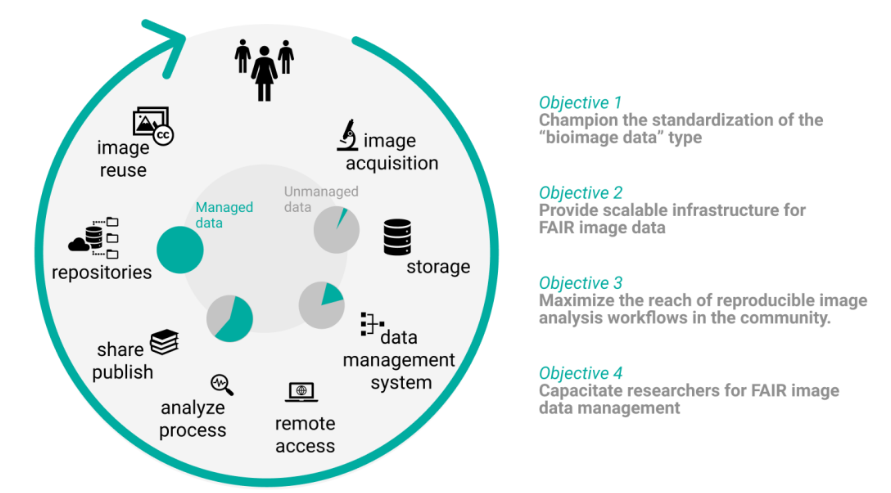

**Galaxy is part of another NFDI - the NFDI4Bioimage**

The National Research Data Infrastructure (Nationale Forschungsdateninfrastruktur, NFDI) is an initiative jointly funded by the federal-state and the Länder to establish an infrastructure framework for research data management in Germany. The Galaxy Team Freiburg is already part of the [NFDI DataPlant](https://www.nfdi4plants.de/).

[NFDI4BIOIMAGE](https://nfdi4bioimage.de/en/start) is a consortium of the National Research Data Infrastructure  in Germany. Its focus is on all steps of the research data life cycle for microscopy and bioimage analysis. NFDI4BIOIMAGE applied as a consortium in the third call for applications (2021) and was approved as an official part of the NFDI in November 2022. The project was [kicked-off](https://www.hhu.de/news-einzelansicht/page?tx_news_pi1%5Bnews%5D=37167&cHash=629f9d432a9bfeb1341141829d8490d4) in January 2023. 
NFDI4BIOIMAGE will strive to provide scientists from all natural science and biomedical research fields with workable and trusted solutions to handle the ever-increasing amount of bioimage data from the various (light) microscopy techniques and related biophotonic technologies. Bioimaging data should thus be in accordance with the FAIR principles.

The [Galaxy Team Freiburg](https://usegalaxy-eu.github.io/people) is taking part in Task Area (TA) 2 and provide Galaxy and remote access to powerful compute resources via virtual workstations for analysis, visualization, and training (e.g. [TIaaS](https://usegalaxy-eu.github.io/tiaas)) to all members of the consortium and the imaging community. Specifically, we will create robust OMERO deployments, either public or private depending on the community needs.
To support the community training needs, we are running TIaaS and will offer admin and developer training to onboard the community to new concepts of cloud computing and containers.

