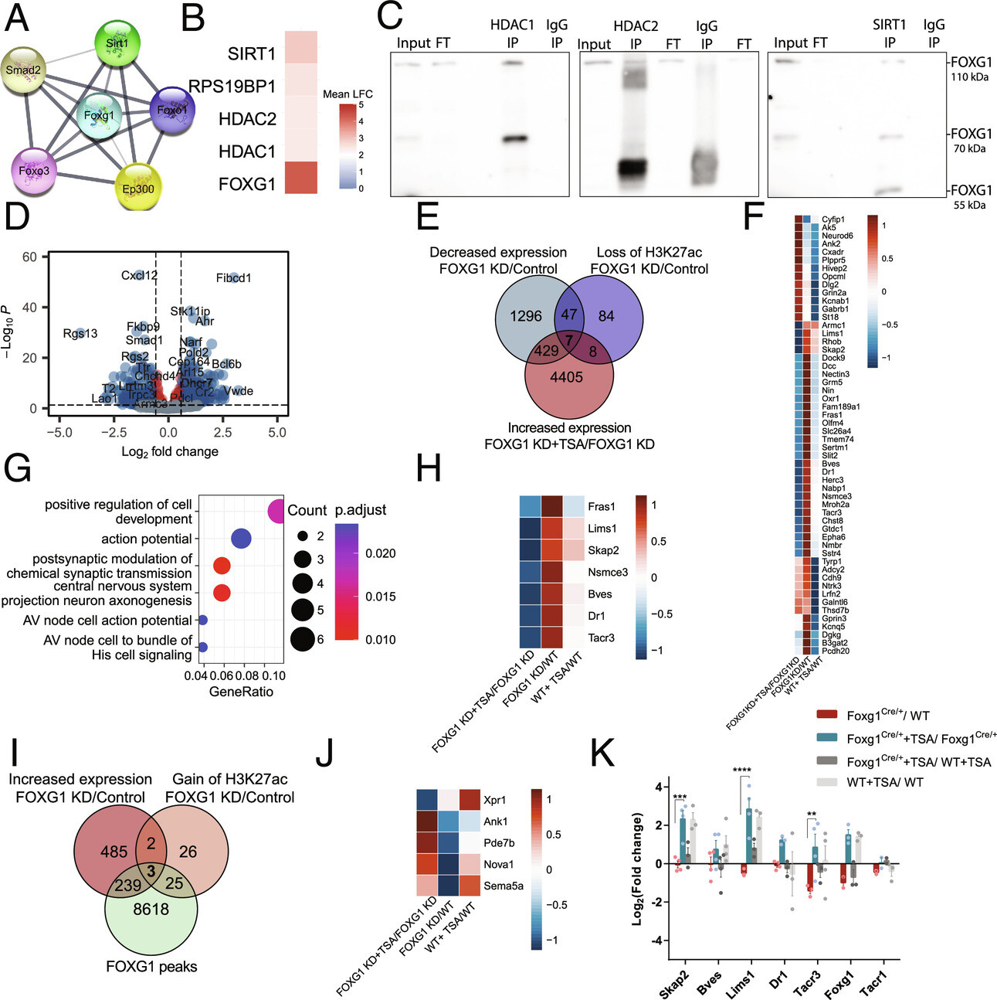

Akol and colleagues explored the pleiotropy of molecular changes underlying neuronal abnormalities upon loss of FOXG1. The analyses of multiomics data exploring functions of mouse FOXG1 at the chromatin level and alterations of the epigenetic landscape was carried out on the [European Galaxy server](https://usegalaxy.eu). For further details how the cooperation of FOXG1 with the proneuronal transcription factor NEUROD1 and HDACs in controlling gene transcription, indicating complex and multimodal FOXG1 functions regarding neuronal maturation and function was identified read the [paper](https://www.pnas.org/doi/full/10.1073/pnas.2122467120).

**Congratulations** to this nice publication and thanks for using the **European Galaxy server** and sharing your results with us!

**Abstract:**

Forkhead box G1 (FOXG1) has important functions in neuronal differentiation and balances excitatory/inhibitory network activity. Thus far, molecular processes underlying FOXG1 function are largely unexplored. Here, we present a multiomics data set exploring how FOXG1 impacts neuronal maturation at the chromatin level in the mouse hippocampus. At a genome-wide level, FOXG1 i) both represses and activates transcription, ii) binds mainly to enhancer regions, iii) reconfigures the epigenetic landscape through bidirectional alteration of H3K27ac, H3K4me3, and chromatin accessibility, and iv) operates synergistically with NEUROD1. Interestingly, we could not detect a clear hierarchy of FOXG1 and NEUROD1, but instead, provide the evidence that they act in a highly cooperative manner to control neuronal maturation. Genes affected by the chromatin alterations impact synaptogenesis and axonogenesis. Inhibition of histone deacetylases partially rescues transcriptional alterations upon FOXG1 reduction. This integrated multiomics view of changes upon FOXG1 reduction reveals an unprecedented multimodality of FOXG1 functions converging on neuronal maturation. It fuels therapeutic options based on epigenetic drugs to alleviate, at least in part, neuronal dysfunction.

