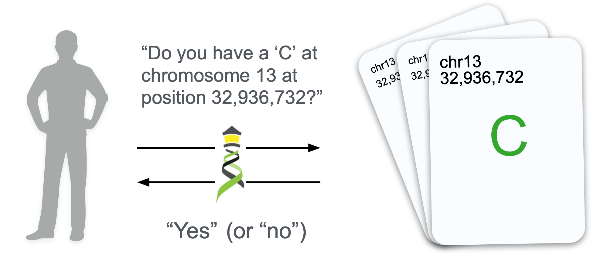
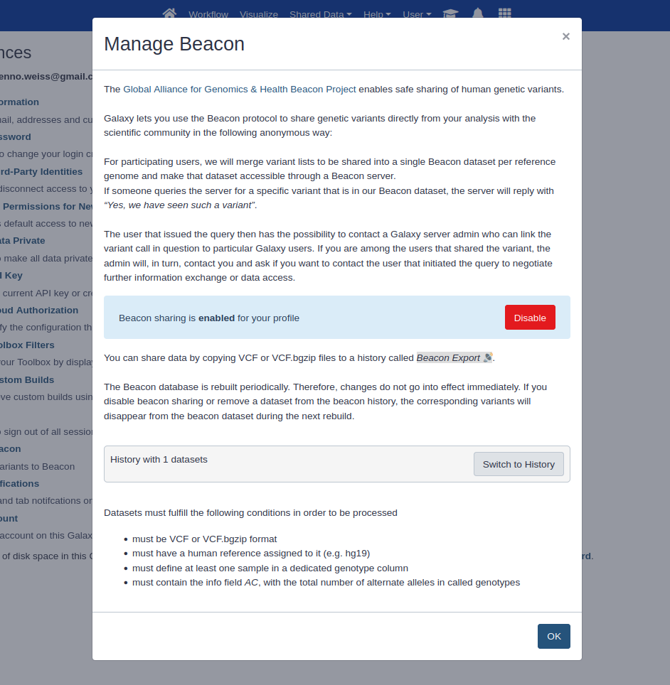
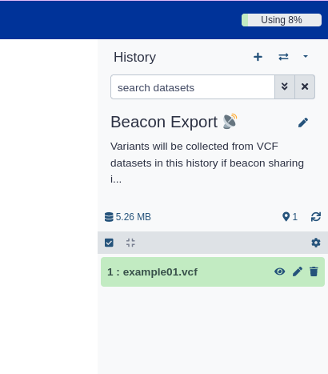

Science is most efficient when researchers share their data and results, so others can re-use them. Some datasets, however, cannot easily be shared
because they contain sensitive information about, for example, a patient. Is there a way to share information among scientists without
exposing sensitive patient data? The answer to that question for human genome variation data is: yes. 
The [Beacon network](https://beacon-project.io) enables querying genomic variant catalogues without the risk of exposing sensitive data.
With Beacon, the data owner is responsible for the data and also for their Beacon server in the network. In this way the data never leaves the data owner.
A Beacon only contains the raw variants, think about it as some marked coordinates on the chromosome.
A researcher interested in the genomic position 32,936,732 on chromosome 13 can ask the entire Beacon network if something about this position is known.
In the simplest case the researcher gets a “Yes” or “No” answer. In a positive case, the researcher gets a contact address to the Beacon server,
or data owner, so that both parties can negotiate the exchange of more detailed data. 
In that sense Beacon facilitates the first-contact and speeds up knowledge exchange dramatically - often benefiting the patients in clinical care.



*example beacon request. source: [Beacon Project](https://beacon-project.io/)*

---

The bottleneck in this scenario is the data integration into a Beacon server. Often the researcher studying, for example, a cancer genome
is not the same person as the Beacon server administrator, so the loading of data into the Beacon server might be an unnecessarily long procedure.
This is what the Galaxy-Beacon integration will speed up. Assuming your researchers are using Galaxy to analyze variation data, the data is already in
Galaxy or, even better, is automatically produced by a Galaxy workflow. The researcher can now mark the variation datasets (VCF) to be shared with Beacon. 
Those marked datasets are then picked up by a periodic process that loads the variants into a Galaxy-associated Beacon server.
This means in practice that a researcher could ask the question “Is something known about chr8: 11712 on the European Galaxy server?” - and
if the answer is “Yes” the Galaxy instance's support team will arrange the contact between the data owner and the inquiring researcher.
If and how they exchange more information is then out of scope of the Galaxy team.
In that sense the Galaxy Beacon integration facilitates the first-contact even more and makes it easier for clinicians and
data scientists that do not have access to another Beacon server to participate in the Beacon project.

---

In the current Galaxy-Beacon integration we made sure that no data is shared with Beacon accidentally. There is a 4-times-opt-in procedure that
needs to be taken to share data. First the admin needs to enable this feature for the Galaxy server. Second, the user needs to enable the Beacon integration in their user preferences. This will create a magic Beacon history, which only when it contains VCF data (3rd step) will
be considered as relevant Beacon data. This means a user needs to actively drag and drop data into this history.
The 4th opt-in procedure is of course that the Galaxy admin needs to setup a Beacon server and the background processes
that are harvesting the data from the magic Beacon history.
 



*Beacon settings Dialog*



*Beacon history with VCF file*


If all 4 things are in place, any person can query the Beacon server associated with the Galaxy instance, e.g. with the following `curl` command (the API documentation can be found [here](https://app.swaggerhub.com/apis/ELIXIR-Finland/ga-4_gh_beacon_api_specification/1.0.0-rc1)):

    curl "https://usegalaxy.eu/beacon/query?referenceName=8&assemblyId=hg38&referenceBases=C&alternateBases=T&start=11712"

and receive a response similar to this one:
```json
{
   "alleleRequest" : {
      "alternateBases" : "T",
      "assemblyId" : "hg38",
      "includeDatasetResponses" : "NONE",
      "referenceBases" : "C",
      "referenceName" : "8",
      "start" : 11712
   },
   "apiVersion" : "1.1.0",
   "beaconId" : "eu.galaxyproject.beacon",
   "datasetAlleleResponses" : [],
   "exists" : true
}
```

----

This is the first version of a Beacon integration. We have many ideas for the future, including the upate to the new Beacon V2,
and are happy to receive feedback.

Thanks to Benno Weiß, Mira Kuntz and Wolfgang Maier for the Galaxy bits and pieces, and to the entire Beacon team for this great
collaboration. We hope this work will make it easier in the future to share more data faster.

P.S. Beacon is a GA4GH project, read more about [Galaxy and GA4GH](/ga4gh/). 
