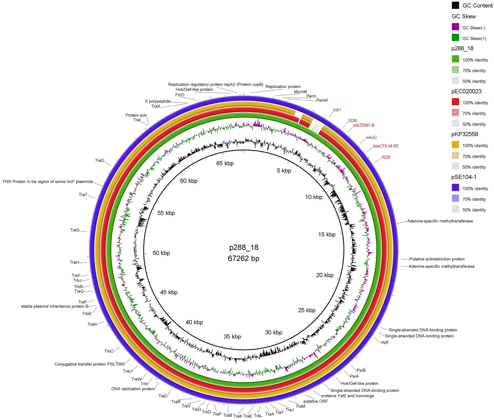

**New *Nature Scientific Report* Paper on whole genome sequence analysis of the first reported isolate of the foodborne pathogen Salmonella Agona"**

Bertani et al. have used the [European Galaxy server](https://usegalaxy.eu) to analyse for the first time the genome of Salmonella Agona carrying blaCTX-M-55 gene, which confers resistance to third-generation cephalosporin in Brazil. In the [paper](https://www.nature.com/articles/s41598-023-29599-5) they describe the analysis of the genomic findings of this Salmonella isolate which was recovered from a bacteremic patient from Brazil. 

Congratulations to this nice publication and thanks for using the European Galaxy server and sharing your results with us!

**Abstract:**

This study analyzes the genomic findings of the first report of Salmonella isolate carrying the blaCTX-M-55 gene, recovered from a bacteremic patient from Brazil. A bacterial isolate positive for the blaCTX-M-55 gene was submitted to antimicrobial susceptibility testing by disk diffusion and epsilometric test. Whole genome sequencing was performed using Illumina technology. Conjugation assay was performed; plasmid sizes determined by S1-PFGE and plasmid content were investigated by hybrid assembly after MinION long reads sequencing. Isolate 288_18 was identified as sequence type ST13, resistant to ampicillin, cefotaxime, ceftazidime, cefepime, ceftriaxone, and aztreonam. A transferable IncFII plasmid sized approximately 67 kb was found to carry the blaTEM-1 and blaCTX-M-55 in a module consisting of IS26-blaTEM-1B-WbuC-blaCTX-M-55-IS26. In addition, an 117 kb IncI1plasmid was also identified in the 288_18 isolate, but without additional resistance genes. To the best of our knowledge, this is the first report of blaCTX-M-55 in Salmonella isolated from human infection in Brazil. The occurrence of blaCTX-M-55 in the IncFII epidemic plasmid in a relevant clinical human isolate of Salmonella Agona underscores the urgent need for enhanced and effective continuous surveillance for controlling its dissemination.

