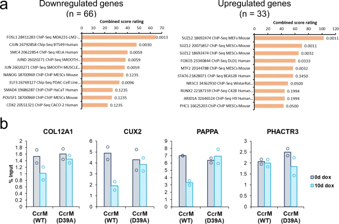

**New *Nature Communications Biology* Paper on "Genome-wide deposition of 6-methyladenine in human DNA reduces the viability of HEK293 cells and directly influences gene expression"**

Broche et al. have used the [European Galaxy server](https://usegalaxy.eu) to analyse the role of m3dA in human DNA. In the [paper](https://www.nature.com/articles/s42003-023-04466-1) they describe the identification of several genes that are directly regulated by m6dA in a GANTC context.

**Congratulations** to this nice publication and thanks for using the **European Galaxy server** and sharing your results with us!

**Abstract:**

While cytosine-C5 methylation of DNA is an essential regulatory system in higher eukaryotes, the presence and relevance of 6-methyladenine (m6dA) in human cells is controversial. To study the role of m6dA in human DNA, we introduced it in human cells at a genome-wide scale at GANTC and GATC sites by expression of bacterial DNA methyltransferases and observed concomitant reductions in cell viability, in particular after global GANTC methylation. We identified several genes that are directly regulated by m6dA in a GANTC context. Upregulated genes showed m6dA-dependent reduction of H3K27me3 suggesting that the PRC2 complex is inhibited by m6dA. Genes downregulated by m6dA showed enrichment of JUN family transcription factor binding sites. JUN binds m6dA containing DNA with reduced affinity suggesting that m6dA can reduce the recruitment of JUN transcription factors to target genes. Our study documents that global introduction of m6dA in human DNA has physiological effects. Furthermore, we identified a set of target genes which are directly regulated by m6dA in human cells, and we defined two molecular pathways with opposing effects by which artificially introduced m6dA in GANTC motifs can directly control gene expression and phenotypes of human cells.

