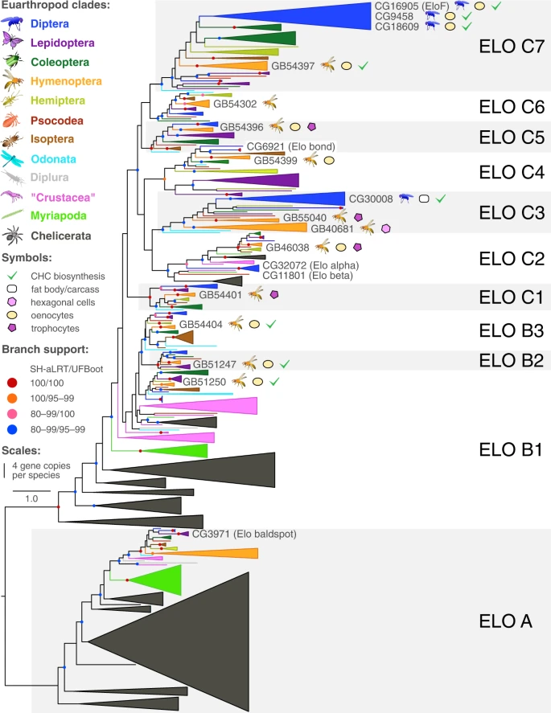

**New *Nature Communications Biology* Paper on whole-genome sequencing and comparative transcriptomics of the mason wasp Odynerus spinipes"**

Moris and colleagues have used the [European Galaxy server](https://usegalaxy.eu) to show that a RNAi-mediated knockdown of twelve candidate gene orthologs in the honey bee, Apis mellifera, confirmed nine genes impacting CHC profile composition. In the [paper](https://www.nature.com/articles/s42003-022-04370-0) they present results which set the base for experimental CHC profile manipulation in Hymenoptera and imply that the evolutionary origin of CHC biosynthesis predates the arthropods’ colonization of land.

**Congratulations** to this nice publication and thanks for using the **European Galaxy server** and sharing your results with us!

**Abstract:**

Cuticular hydrocarbons (CHCs) cover the cuticle of insects and serve as desiccation barrier and as semiochemicals. While the main enzymatic steps of CHC biosynthesis are well understood, few of the underlying genes have been identified. Here we show how exploitation of intrasexual CHC dimorphism in a mason wasp, Odynerus spinipes, in combination with whole-genome sequencing and comparative transcriptomics facilitated identification of such genes. RNAi-mediated knockdown of twelve candidate gene orthologs in the honey bee, Apis mellifera, confirmed nine genes impacting CHC profile composition. Most of them have predicted functions consistent with current knowledge of CHC metabolism. However, we found first-time evidence for a fatty acid amide hydrolase also influencing CHC profile composition. In situ hybridization experiments furthermore suggest trophocytes participating in CHC biosynthesis. Our results set the base for experimental CHC profile manipulation in Hymenoptera and imply that the evolutionary origin of CHC biosynthesis predates the arthropods’ colonization of land.

