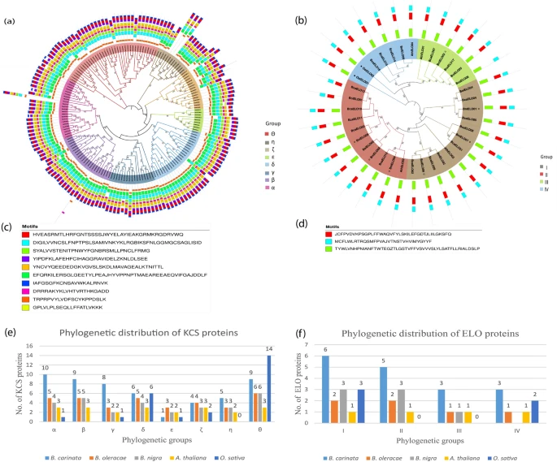

**New *Nature Scientific Report* Paper on Comparative phylogenomic of FAE (Fatty Acid Elongation) like genes in the tetraploid Brassica carinata and its diploid progenitors"**

Khan and colleagues have used the [European Galaxy server](https://usegalaxy.eu) to analyse FAE (Fatty Acid Elongation) like genes which take part in the biosynthesis of VLCFAs, growth regulation, and stress responses. In the [paper](https://www.nature.com/articles/s41598-023-28665-2) they classified KCS and ELO proteins into eight and four major groups based on comparative phylogenetics.

**Congratulations** to this nice publication and thanks for using the **European Galaxy server** and sharing your results with us!

**Abstract:**

Very long-chain fatty acids (VLCFAs) possess more than twenty carbon atoms and are the major components of seed storage oil, wax, and lipids. FAE (Fatty Acid Elongation) like genes take part in the biosynthesis of VLCFAs, growth regulation, and stress responses, and are further comprised of KCS (Ketoacyl-CoA synthase) and ELO (Elongation Defective Elongase) sub-gene families. The comparative genome-wide analysis and mode of evolution of KCS and ELO gene families have not been investigated in tetraploid Brassica carinata and its diploid progenitors. In this study, 53 KCS genes were identified in B. carinata compared to 32 and 33 KCS genes in B. nigra and B. oleracea respectively, which suggests that polyploidization might has impacted the fatty acid elongation process during Brassica evolution. Polyploidization has also increased the number of ELO genes in B. carinata (17) over its progenitors B. nigra (7) and B. oleracea (6). Based on comparative phylogenetics, KCS, and ELO proteins can be classified into eight and four major groups, respectively. The approximate date of divergence for duplicated KCS and ELO genes varied from 0.03 to 3.20 million years ago (MYA). Gene structure analysis indicated that the maximum number of genes were intron-less and remained conserved during evolution. The neutral type of selection seemed to be predominant in both KCS and ELO genes evolution. String-based protein-protein interaction analysis suggested that bZIP53, a transcription factor might be involved in the activation of transcription of ELO/KCS genes. The presence of biotic and abiotic stress-related cis-regulatory elements in the promoter region suggests that both KCS and ELO genes might also play their role in stress tolerance. The expression analysis of both gene family members reflect their preferential seed-specific expression, especially during the mature embryo development stage. Furthermore, some KCS and ELO genes were found to be specifically expressed under heat stress, phosphorus starvation, and Xanthomonas campestris infection. The current study provides a basis to understand the evolution of both KCS and ELO genes in fatty acid elongation and their role in stress tolerance.

