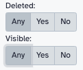

In the previous [`release_22.05`](http://localhost:8080/news/2022-08-galaxy-release-22-05/) (_August 2022_), Galaxy's History Panel was updated to a fresh and enhanced interface that users have been getting used to since. For the latest `release_23.0`, Galaxy developers have worked hard on perfecting and enhancing the user experience of the history:

| `22.05` (_August 2022_) | `23.0` (March 2023) |
| ----------------------- | ------------------- |
|  |  |

## Ways of searching items in a Galaxy history

Apart from other major improvements made to the history panel user experience (such as the [new tags interface](https://github.com/galaxyproject/galaxy/pull/14936) or the [accessibility changes](https://galaxyproject.org/news/2023-01-20-accessibility-report/), both by [_Laila Los_](https://github.com/ElectronicBlueberry)), the advanced history search has been a great addition to Galaxy's history panel. Here are some ways Galaxy users can leverage the search features to find items in their histories with ease.

### History Search Bar

Users can use the search bar at the top of the history panel to look for items in the history by the item's name:

However, if a user wants to filter their history by additional parameters, they can add filters to the search bar:

### History Advanced Filters

Using the search bar to add filters can be very non-intuitive; therefore, we have the advanced search panel that shows users all possible history filters and allows them to add desired filters to the query using intuitive fields and selectors. This advanced panel can be opened by a simple click on the double-down-arrow button in the search bar and the user can populate the given fields:

Here are all possible values a user can filter the history items by, using the search bar alone or better, the advanced menu:

| Filter | Description | Example Filter |
| ------ | ----------- | ------------- |
| `name` | The name of a dataset or collection | `name:'filename here'` | 
| `extension` | The extension of a dataset | `extension:bed` |
| `tag`  | Tag added to a dataset or collection | `tag:ecoli` |
| `state` | The state of a dataset or collection. The list of states is populated on clicking the input field as shown below:    | `state:error` |
| `database` | The database of a dataset | `genome_build:hg38` |
| `related` | The `hid` (history item index) of a dataset or collection to find related items for. [_More on this below..._](#history-related-items-filter) | `related:23` |
| `hid` | The history item index of a dataset or collection. The greater than/less than input fields in the advanced menu can be used to populate this filter:    | `hid:403` or `hid>3` or `hid<300` |
| `create_time` | The creation time of a dataset or collection. Users can type in the date or they can use the datepickers to select the date in the advanced menu:    | `create_time>2023-03-10` or `create_time<2023-03-28` |
| `deleted` | Whether a dataset or collection has been deleted or not. | `deleted:true` |
| `visible` | Whether a dataset or collection is visible or hidden. | `visible:false` |
| | **Pro Tip:** For the `deleted` and `visible` filters, the user can select the `Any` option for both in the advanced menu, to see ALL the items in their history:      Feature added by [_Aysam Guerler_](https://github.com/guerler) in PR [#13973](https://github.com/galaxyproject/galaxy/pull/13973) |

## History Related Items Filter

-- *WIP: Add information about the History Related Items filter here* --

This work is a collective effort of the [Galaxy UI/UX working group](https://github.com/orgs/galaxyproject/teams/wg-uiux).
Thanks to , , , , and  for working on this project.
