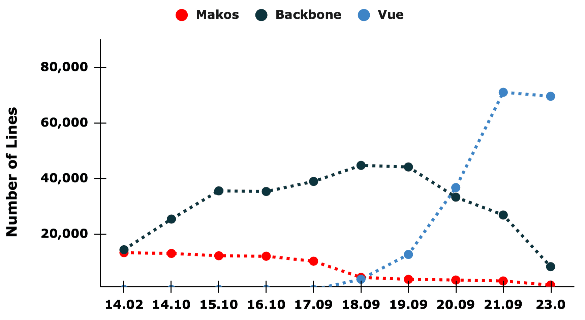
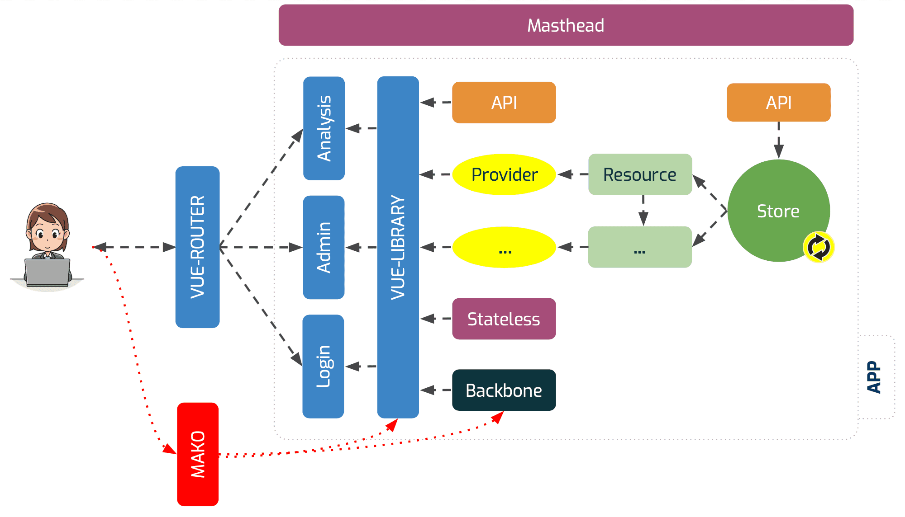

Five years ago, we embarked on a journey to transform our client application from a mix of backend-generated Mako and frontend-based Backbone.js to a single consistent Vue framework. We made significant strides towards this goal in the last years, particularly by rewriting major components such as the History, the Tool Panel, the Workflow Editor and all Input Forms, which all received major upgrades with this new 23.0 release.

Here is a simplified view of this transition process in which we counted the files and number of lines corresponding to different technologies distributed over the years.

## How does our client component structure look like now?

With these recent changes, we almost completely transitioned our client structure to a consistent Vue application. Although some legacy Makos and Backbone.js modules remain, all essential root components and routes have been transformed as can be seen in our new client map below.

## Why is this relevant for users?

Having transformed most of the client to a modern framework, we were able to introduce a single top router which allows users to navigate the interface with significantly less page reloads. Additionally, it preserves client stores, used e.g. to store history datasets, which otherwise would have been cleared when navigating away from the Analysis view. Furthermore, pages opened in our recently introduced Window Manager are now preserved instead of being closed upon navigation. Overall this development yields a seamless and significantly faster user interface and improves the user experience. It also is an overall driver for client development and the integration of new features.

Try it out by navigating from the Analysis panel to the Workflow list, then load an existing Workflow into the Workflow Editor, modify your Workflow and continue to the Workflow execution form. Notice how the page never needs to reload when navigating this path. There are many such new, reload-free navigation pathways in this release and we will continuously enable more.

## Benefits at a Glance

for Users:
* Instant page rendering without reloads.
* Window location can be copied and shared.
* Increased test coverage.

for Developers:
* Excellent routing features, consistent throughout the application.
* Better software management and feature deployment.
* Allows whole client performance and memory usage analysis.

## What are the next steps?

Although the majority of work for this project has been completed, there are still some components which rely on Backbone and jQuery which we will have fully tackled this year.

For more details on this news contribution take a look a these slides [here](/assets/media/router_slides.pdf).

If you are interested to learn more, have question or want to contribute to the client development, join our [UI/UX Working Group](https://app.gitter.im/#/room/#galaxyproject_wg-ui-ux:gitter.im).
