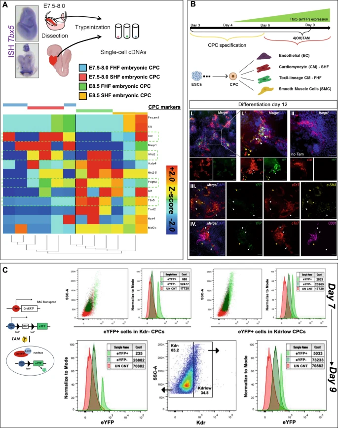

**New *Nature Regeneratice Medicine* Paper on Tbx5a as a vital transcription factor for cardiomyocyte regeneration"**

Siatra and colleagues have used the [European Galaxy server](https://usegalaxy.eu) to identify a Tbx5-specific cardiomyocyte precursor-like cell population, which is capable of dedifferentiating and potentially deploying a cardiomyocyte regenerative program. In the [paper](https://www.nature.com/articles/s41536-023-00280-9) they describe a clear target cell population for translationally-relevant heart interventional studies.

**Congratulations** to this nice publication and thanks for using the **European Galaxy server** and sharing your results with us!

**Abstract:**

The single curative measure for heart failure patients is a heart transplantation, which is limited due to a shortage of donors, the need for immunosuppression and economic costs. Therefore, there is an urgent unmet need for identifying cell populations capable of cardiac regeneration that we will be able to trace and monitor. Injury to the adult mammalian cardiac muscle, often leads to a heart attack through the irreversible loss of a large number of cardiomyocytes, due to an idle regenerative capability. Recent reports in zebrafish indicate that Tbx5a is a vital transcription factor for cardiomyocyte regeneration. Preclinical data underscore the cardioprotective role of Tbx5 upon heart failure. Data from our earlier murine developmental studies have identified a prominent unipotent Tbx5-expressing embryonic cardiac precursor cell population able to form cardiomyocytes, in vivo, in vitro and ex vivo. Using a developmental approach to an adult heart injury model and by employing a lineage-tracing mouse model as well as the use of single-cell RNA-seq technology, we identify a Tbx5-expressing ventricular cardiomyocyte-like precursor population, in the injured adult mammalian heart. The transcriptional profile of that precursor cell population is closer to that of neonatal than embryonic cardiomyocyte precursors. Tbx5, a cardinal cardiac development transcription factor, lies in the center of a ventricular adult precursor cell population, which seems to be affected by neurohormonal spatiotemporal cues. The identification of a Tbx5-specific cardiomyocyte precursor-like cell population, which is capable of dedifferentiating and potentially deploying a cardiomyocyte regenerative program, provides a clear target cell population for translationally-relevant heart interventional studies.

