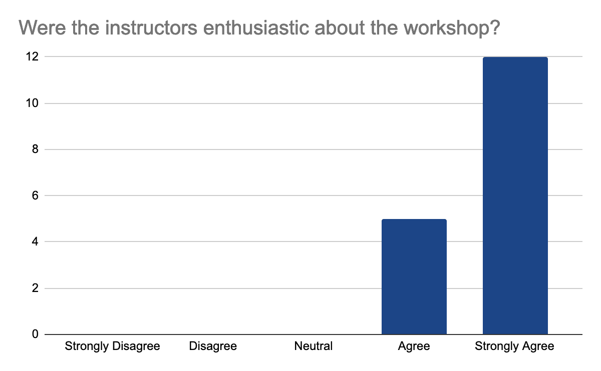

Food contamination with pathogens are a major burden on our society. Globally, they affect an estimated 600 million people a year and impact socioeconomic development at different levels. These outbreaks are mainly due to *Salmonella* spp. followed by *Campylobacter* spp. and Noroviruses.

The evolution of techniques in the last decades has made possible the development of methods to quickly identify responsible pathogen using their **DNA and without prior isolation**. Long-read sequencing techniques like ONT make these methods even **easier and more practical to identify strains quicker and with fewer reads**.

## Intoduction to the project behind the training material

With the support of [__EOSC-Life industry call__](https://www.eosc-life.eu/industrycall/) funding, the Freiburg Galaxy team and Biolytix developed a series of Galaxy **FAIR** workflows to make foodborne pathogens detection, identification and tracking from Nanopore sequenced data **accessible** and **scalable**.

Even better, the implemented workflow series can:
1. **agnostically detect pathogens**: what exactly is this pathogen and what is the degree of its severity (its virulence factors) from data extracted directly (without prior cultivation) from a potentially contaminated sample (e.g. food like chicken, cow, etc.,) and sequenced using Nanopore
2. **compare different samples to track** the possible source of contamination
The workflows are supported by a dedicated tutorial.

## A tutorial for pathogen detection from (direct Nanopore) sequencing data using Galaxy

Our tutorial material is available since January on the Galaxy Training Network: ["Pathogen detection from (direct Nanopore) sequencing data using Galaxy - Foodborne Edition"](https://training.galaxyproject.org/training-material/topics/metagenomics/tutorials/pathogen-detection-from-nanopore-foodborne-data/tutorial.html)

The training includes two versions:

- A **Short Version**: where learners will run 5 prebuilt workflows, such that at the end they have the full workflow running.
- A **Long Version**: Where a step by step, tool by tool, is presented along with its parameters for the learners to run

The workflow or the step by step tools used in the training can be summaried as follows:

# Workshops
Several workshops using this tutorial have been run or will be run in the next months.

## A practical workshop for (foodborne) pathogen detection from (direct Nanopore) sequencing data using Galaxy

A [__first workshop__](/events/2023-02-02-foodborne-pathogen-detection-workshop/) to test this training was conducted on the 2nd of February 2023 as a 1-day hybrid (F2F at FHNW Muttenz, Switzerland and online), free and practical workshop.

**35** on-site and online participants from different background knowledge have attended the workshop. The workshop started with an introduction to Galaxy and the GTN, an introduction to the Foodborne pathogen detection project funded by EOSC-Life, and finally our new GTN material was explained.

More than **90 people registered**, 53% male, with diverse career stages and locations:

**63 confirmed** their registration and gave us more information about their motivation in participating in the workshop.

To help prepare for the course, we also questioned them about their background in the generation of pathogen sequencing data, using Galaxy, but also about their confidence about the topics, here are their answers:

As we expected and given the target, we had for this training, **most participants were new or beginner to Galaxy** but also in the data analysis, especially of pathogen sequencing data.

The workshop took place at FHNW Muttenz, Switzerland, and simultaneously broadcasted online via Zoom, with some instructors and helpers on each setup.

After a short Welcome and general information talk, we dived into a short Introduction to Galaxy with [__slides__](https://training.galaxyproject.org/training-material/topics/introduction/tutorials/galaxy-intro-short/slides.html#1) and a [__hands-on tutorial__](https://training.galaxyproject.org/training-material/topics/introduction/tutorials/galaxy-intro-short/slides.html#1), led by Bérénice Batut. After that, Anna Henger gave a short talk introducing pathogen detection from the wet lab perspective. After the (lunch) break, Engy Nasr led the main tutorial of the day: Pathogen detection from (direct Nanopore) sequencing data using Galaxy - Foodborne Edition.

At the end of the workshop, we summarised everything, shared extra resources (tutorials, events, etc), and asked participants to fill up a survey.

During the day, all information and links were shared in a shared Google document. Questions from onsite participants were loudly onsite and answered by onsite helpers. Online participants were requested to ask their questions in a dedicated Slack channel, answered by an online helper. In both setups, the interesting questions were repeated loudly by instructors and tracked in the shared Google document, so they could be reused to prepare for further training.

**90% of the participants** registered for online participation but many did not show up. In the end, we had around **35 participants** both online and onsite. **17** answered our survey. Globally, the feedback is good.

2 answers reported accessibility issues, due to the hybrid setup making it sometimes hard to hear people in the onsite audience and difficult to follow the steps in the second part of the day when multiple things were done at once, but the instructors were able to repeat the steps. Otherwise, participants felt **comfortable learning in this workshop environment**. They feel comfortable interacting with instructors, who were enthusiastic, knowledgeable about the content, and able to answer questions, the following graphes shows the 17 participants' feedback:

In detail, they liked the **well-documented and detailed training materials with the hands-on part** and data interpretation in addition to **Slack for interactions** and **prompt answers**. They feel that the instructions are very clear on what to do and knowledgeable about the materials of the workshop.
One mentioned loving the fact that this workshop is accessible for those who live in Indonesia to learn more about analysis and tools of Nanopore sequencing

They raised some concerns about the structure of the workshop with maybe a longer workshop or organized a bit differently to be able to do all the steps and explain them in more details. Indeed, the second part was pretty unclear to follow and interpret results. One also suggested having an overview of all the important tools. We will process all comments to improve our training and delivery for next time.

Anyway, they mostly agree that **they can immediately apply what they learned** and they would **recommend the workshop**

## Follow-up workshops

Based on the success of this workshop, we improved the tutorial, added the questions as FAQ and also worked on the delivery.

The same training was then part of the [__High-Throughput Data Analysis workshop with Galaxy (HTS)__](/events/2023-02-20-freiburg-workshop/) running from the 20th till the 24th of Feburary.

Finally, this tutorial will be recorded to be part of the [__GTN 2023 Smörgåsbord__](https://gallantries.github.io/video-library/events/smorgasbord3/) in May.
