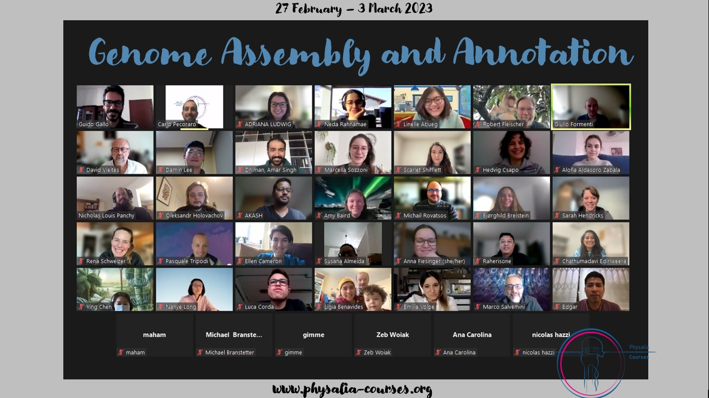

## Using Galaxy's training infrastructure as a service (TIaaS) to teach hands-on genome assembly and annotation

[Physalia Courses](https://www.physalia-courses.org/courses-workshops/course20/) recently offered a Genome Assembly and Annotation course from February 27 to March 3, 2023. This course was led by Dr. Giulio Formenti (The Rockefeller University, USA), Dr. Guido Gallo (University of Milan, Italy) with teaching support from Linelle Abueg (The Rockefeller University), Marcella Sozzoni (University of Florence, Italy). We also had wonderful focused talks from several invited speakers: Prof. Aureliano Bombarely (IBMCP-CSIC, Spain), Nadolina Brajuka (The Rockefeller University), Dr. Sarah Pelan (Wellcome Sanger Institute), and Dr. Simona Secomandi (University of Cyprus). The course consisted of lectures about the history of DNA sequencing technology as well as modern approaches to genome assembly as well as annotation, intertwined with hands-on practical sessions that took place on Galaxy, with the aid of Galaxy EU machines generously provided to us through the [Training Infrastructure as a Service (TIaaS)](https://galaxyproject.eu/tiaas.html) program. 

Having Galaxy as a teaching tool really enabled this large online workshop to work, as it was (in my experience) much easier to instruct students on using the intuitive GUI instead of having to first teach how to work in command line before even getting to the actual bioinformatics training. Galaxy histories also enabled students to share their work more easily than trying to figure out how multiple students choose to structure their work directories. Since genome assembly and annotation use multiple computationally heavy programs, it was great to have resources dedicated for our students where they would be in a prioritized queue. This helped everyone be on the same page, more or less, since students' jobs would finish in a similar timeframe with each other, so we would be able to discuss our results all together, instead of having some students ready while others would have jobs finishing much later. The TIaaS feature also provided a dashboard to us where we could monitor our students' job submissions and progress, which helped with timing the practical and lecture sessions, as we are able to see the overall state of the jobs live, instead of trying to survey the students about whose job is finished, running, or queued.

