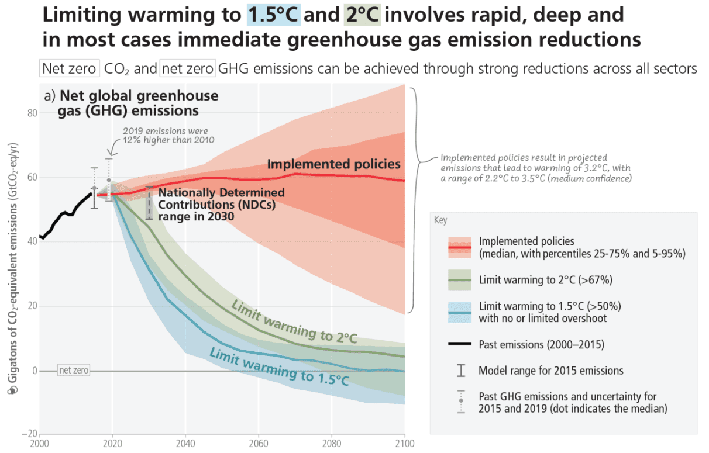

A [statement signed by an impressive number of German-speaking scientists](https://handeln-statt-kriminalisieren.com/) defends peaceful, but bold forms of protest of groups of climate activists, like the "Letzte Generation" ("Last generation") in Germany and Austria.
The statement draws parallels between these protests and historic movements in support of women's right to vote, desegregation, and for democracy in former Eastern Germany and Czechoslovakia, emphasizing that all of them were driven substantially by nonviolent civil disobedience. It goes on to point out that, like the current protests, these earlier movements, which are nowadays seen by many as historic achievements, were facing public indignation initially, yet they succeeded eventually. In light of this, the signing scientists urge the media in particular to report on the facts that climate activists are trying to draw attention to rather than to fuel public outrage against the messengers.

As members of the German branch of Galaxy Europe, we endorse the statement. Further, we believe that scientists are in a privileged position in that we are all capable to interpret data, and to realize that the data delivered by climate models does not look good at all even after accounting for the current insufficient political measures [1], while, at the same time, we tend to be rather well connected at both national and international levels.

We conclude from this that it is the responsibility of scientists to not only understand the data, but also to act on it and use whatever influence and peaceful means we have to call on politicians to do the same. There are plenty of ways to get engaged - do a bit of research and you will very likely find active groups of like-minded scientists in your country.

[1] see [Climate Change 2023: Synthesis Report of the IPCC Sixth Assessment Report (AR6)](https://www.ipcc.ch/report/ar6/syr/). The above image is a part of Figure SPM.5 of the [Summary for Policymakers](https://www.ipcc.ch/report/ar6/syr/downloads/report/IPCC_AR6_SYR_SPM.pdf).

