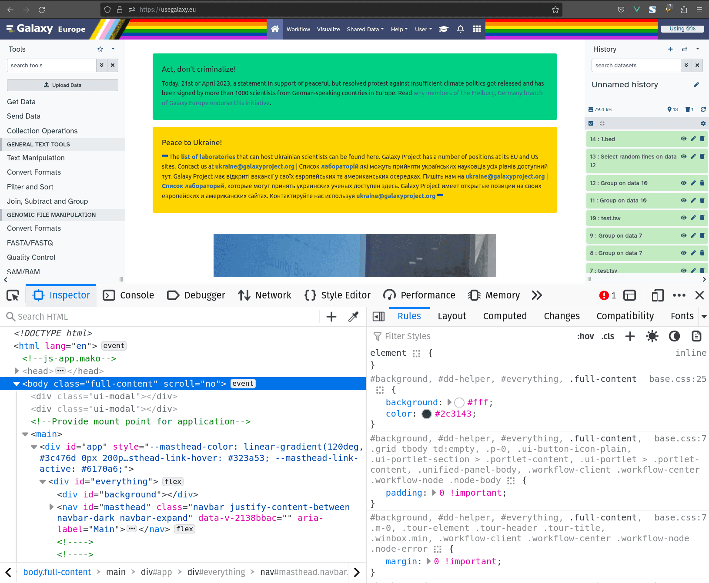
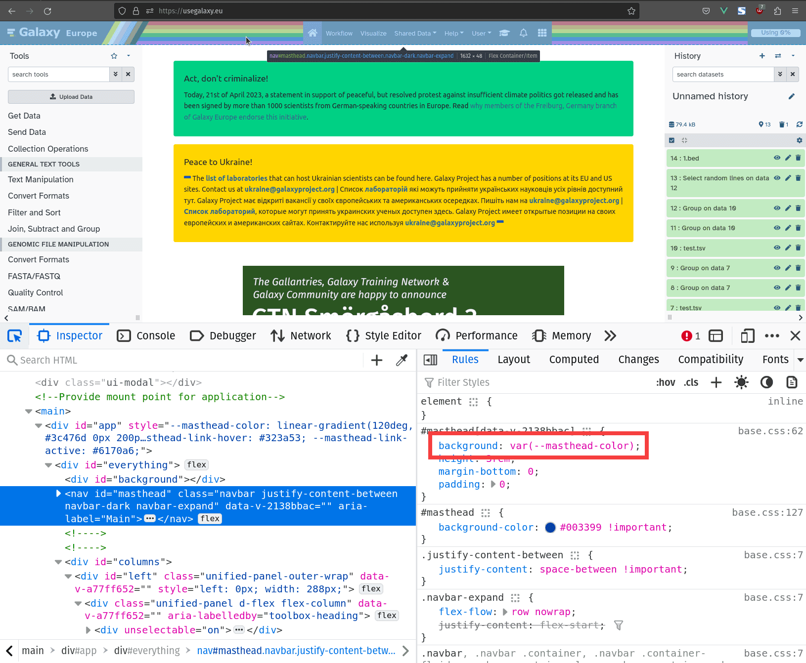

Galaxy 23.0 comes with a new theming system, which lays out the ground work for a fully themeable Galaxy.
Themes differ from past customization options by allowing users to switch between themes while Galaxy is running.
In their current iteration, they are implemented only in the masthead, but will be rolled out to allow for theming many more parts of Galaxy in the future.

This article will outline how to configure themes, how they work, some tips on developing new themes, and a hidden feature which may come in handy with highly customized Galaxy instances.

## 🎨 What are Themes?


*The pride theme being used on [usegalaxy.eu](https://usegalaxy.eu/)*

In one sentence themes can be described by: they change the way Galaxy looks.

What theme is used can be decided per user.
The setting to change your current theme can be found under user preferences.

Further, themes can help tell apart sub-domains, as each sub-domain of a Galaxy instance can have it's own theme file.

## 🗒️ Activate Themes

Activating the theming feature is as simple as setting the `themes_config_file` option in the Galaxy config:

```yaml
  themes_config_file: themes_conf.yml
```

By default this will point to the sample themes file, containing 4 themes.

The first theme in the themes file will always be the default theme which logged out users will see.

> ***Tip!*** - 
> If your running multiple sub-domains you can have a separate theme file per sub-domain.
> Simply change the `themes_config_file` option to:

```yaml
  themes_config_file_by_host:
    'usegalaxy.mars': themes_main.yml
    'olympus.usegalaxy.mars': themes_olympus.yml
```

(of course with your own sub-domains)

[You can learn more about themes from an admin perspective on the Galaxy Training Network](https://training.galaxyproject.org/training-material/topics/admin/tutorials/customization/tutorial.html)

## 🪡 The Anatomy of a Theme


A theme is always an ID / Name, followed by nested selectors which define a value.
These selectors are turned into CSS variable names, which are then injected into the front-end, and applied by specific parts of the CSS.

For example, the highlighted selectors "masthead", "text" and "color" will be turned into the CSS variable `--masthead-text-color`, which is then assigned the value of "#f8f9fa".
This conversion takes place in the backend.
The front-end simply applies all CSS variables it receives from the backend to the documents CSS.

This makes the theming system very flexible and extensible.

In order to make other parts of the UI themeable, all that has to be done is to replace the values with CSS variables,
and the theming system will take care of the rest.

## 🧑‍🎨 Making a Theme

Where ever possible broad css shorthands are used (e.g. the `background` property instead of `background-color`).
This allows for complex themes, like the pride theme, to use gradients and images.

When creating your own theme, it can become very cumbersome to keep reloading the config and clearing the cache to see your changes in the browser.
Instead you can use the browsers dev-tools.

In Firefox you can access them under the Menu Icon in the top right -> More tools -> Web Developer tools, or via the keyboard shortcut `CTRL + SHIFT + I`.



We will only require the "Inspector" tab to develop our theme.

Let's click the icon in the top left of the inspector. This will bring up an HTML element selection tool.
With it we can click the mastheads background to select it.

You now should have selected a `nav` element with the id `masthead`.

In the left half of the inspector, under rules, you can see what property the theme is applied to, by searching for a CSS variable in the naming pattern mentioned above.



Now we can see that the theme selector "masthead" -> "color" is being applied to a property called background.
You can read about what values this property can take on the [Mozilla Developers Network](https://developer.mozilla.org/en-US/docs/Web/CSS/background).

We could change the value here, however a better place would be where we can affect all of these values at once.

Use the inspector to select the first `div` element inside `main`. This is where the theme is being applied.

> ***Note*** - 
> Some values may be consumed via JavaScript instead of CSS. These currently include the `logo` selectors.

Here you can now try the look of your new theme, by changing the values in the right-hand side of the Inspector.
Once you are happy with them, copy them into the theme file into the appropriate selectors.

## 🤫 Super Secret Hidden Feature

A side effect of theme files being converted to CSS variables is that they can be used within Galaxy customizations, such as webhooks.


Here we add a theme for the pdh comics webhook used in [usegalaxy.eu](https://usegalaxy.eu) which changes the webhooks boxes color to red.

This would inject the CSS variable `--pdh-comics-box-color: red;` into the front-end.

If we then implement this CSS variable into the webhook, we can now apply themes to it!

---

In the future we hope to integrate themes into many more parts of Galaxy, and even use them to ship a dark-mode with the default themes. 🌒

I hope you are excited about the future of themes as we are, thank you for reading!
