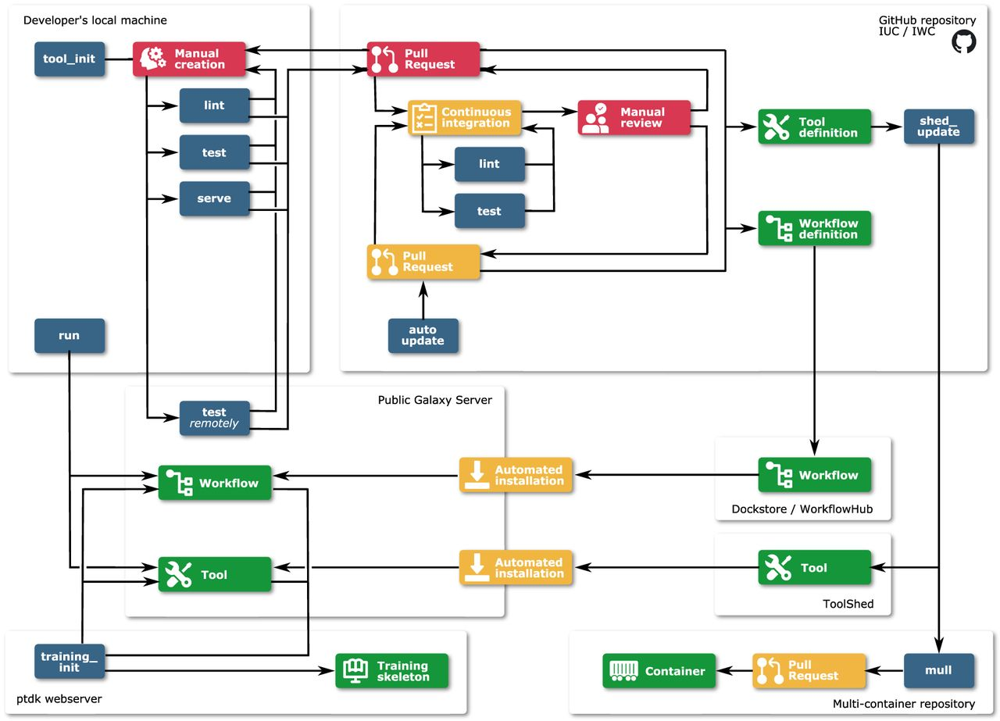

Back somewhere in 2014, a decision for lowering the barrier in tool development sparked in the Galaxy Community. The idea: although Galaxy follows generic concepts for integrating tools, writing the wrappers challenges those developers being new to Galaxy with learning the schema, designing, testing, maintaining, ... So, how to provide support here?

At GCC 2015 the implemented result was [publically presented](https://gcc2015.tsl.ac.uk/Abstracts/#Planemo_8211_A_Galaxy_Tool_SDK) as 'Planemo' by John Chilton and taken up by the community. Planemo is a still growing library and application that has achieved widespread usage among Galaxy developers for tools, workflows, and training materials; among Galaxy power users; and as part of numerous automated deployment solutions. Planemo provides the developers of command-line software with an easy way to create a graphical interface, taking advantage of the many features developed by the Galaxy community and the compute resources provided by public Galaxy instances. 

Now in 2023, Bray *et al.* finally have published the [Planemo paper](https://genome.cshlp.org/content/33/2/261.full) in 'Genome Research'. The authors describe the complex infrastructure the Galaxy community has developed for creating and interacting with artifacts such as tools, workflows, and training material. Planemo plays the crucial role of bridging the gaps between the human and automated components of this infrastructure, addressing continuous integration (CI) systems, ultimately freeing members of the community to devote their time to developing, reviewing, and performing novel scientific analyses.

Planemo is implemented as a Python package and distributed via GitHub, PyPI, and Bioconda [Gruening *et al.* 2018](https://pubmed.ncbi.nlm.nih.gov/29967506/). Being a highly flexible, multifunctional software, Planemo can be used for (1) different types of artifacts (e.g., tools, workflows), (2) different workflow/tool languages and management systems (e.g., Galaxy, CWL), and (3) different tasks (e.g., linting, testing, executing). The paper introduces the numerous subcommands, demonstrating the broad range of functionality, sketches the principal workflows when using Planemo (comp. figure down below), and draws the connection to Bioconda, Biocontainers, the Galaxy Toolshed and other software in the context of automation.

Planemo's documentation is hosted on a [ReadTheDocs site](https://planemo.readthedocs.io). In addition, there are several tutorials as part of the Galaxy Training Network. For instance, available are: 

* [Creating Galaxy tools from Conda through deployment](https://training.galaxyproject.org/training-material/topics/dev/tutorials/tool-from-scratch/tutorial.html)

* [Creating training material with Planemo](https://training.galaxyproject.org/training-material/topics/contributing/tutorials/create-new-tutorial/tutorial.html)

* [Automating Galaxy workflows using the command line](https://training.galaxyproject.org/training-material/topics/galaxy-interface/tutorials/workflow-automation/tutorial.html)

* [Test-driven development with Planemo](https://planemo.readthedocs.io/en/latest/writing_advanced.html#test-driven-development)

Furthermore, a frequently asked questions (FAQ) page is available at [ReadTheDocs](https://planemo.readthedocs.io/en/latest/faqs.html).

We thank the broader Galaxy community for their support and software development efforts!
