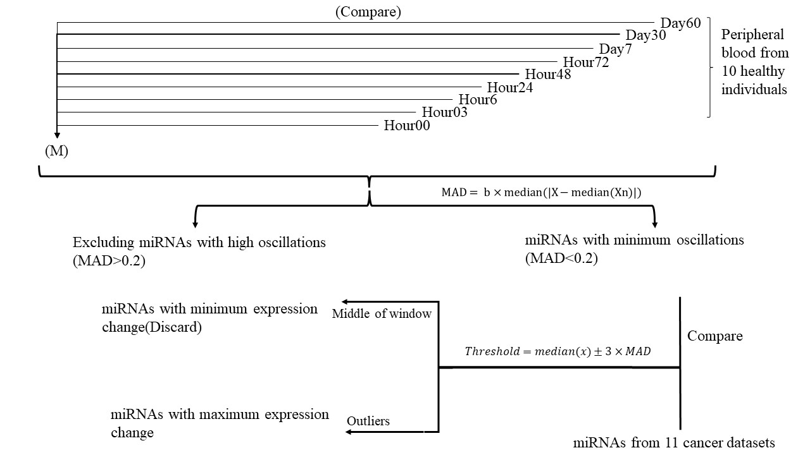

**New *Frontiers in Molecular Biosciences* Paper: "A panel of blood-derived miRNAs with a stable expression pattern as a potential pan-cancer detection signature"**

My five-year experience with the Galaxy online platform for transcriptomics/proteomics analysis, has been nothing short of exceptional. Its user-friendly interface, rich collection of analysis tools, collaborative features, and supportive community have collectively made Galaxy an invaluable resource that has greatly enhanced my research capabilities and outcomes. I look forward to continuing to utilize Galaxy for my future analysis needs.

**Abstract:**

MicroRNAs have a significant role in the regulation of the transcriptome. Several miRNAs have been proposed as potential biomarkers in different malignancies. However, contradictory results have been reported on the capability of miRNA biomarkers in cancer detection. In the present study, we have tried to find miRNAs with minimum fluctuation in expression levels at different time points that could be more accurate candidates as diagnostic biomarkers. The small RNA-seq raw data of ten healthy individuals across nine-time points were analyzed to identify miRNAs with stable expression. We have found five oscillation patterns. The stable miRNAs were investigated in 779 small-RNA-seq datasets of eleven cancer types. All miRNAs with the highest differential expression were selected for further analysis. The selected miRNAs were explored for functional pathways. The predominantly enriched pathways were miRNA in cancer and the P53-signaling pathway. Finally, we have found seven miRNAs, including miR-142-3p, miR-199a-5p, miR-223-5p, let-7d-5p, miR-148b-3p, miR-340-5p, and miR-421. These miRNAs showed minimum fluctuation in healthy blood and were dysregulated in the blood of eleven cancer types.In conclusion, We have found a signature of seven stable miRNAs which dysregulated in several cancer types and may serve as potential pan-cancer biomarkers.

