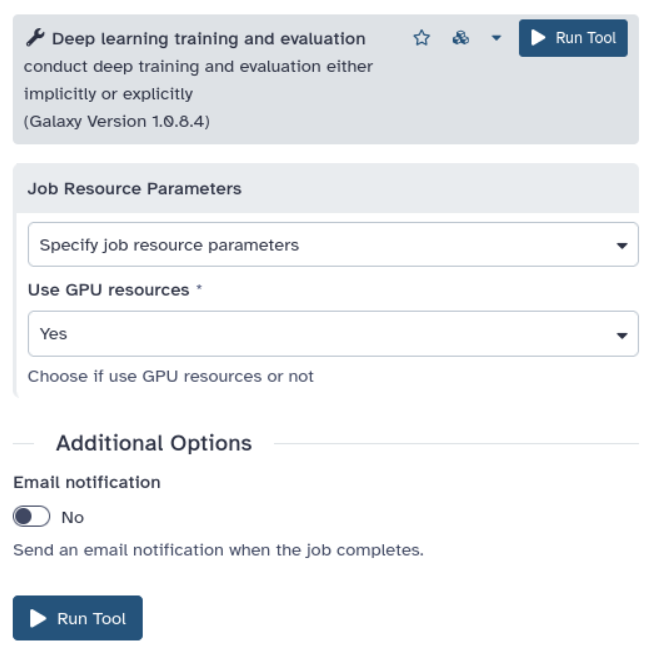

The European Galaxy server relies on the compute nodes provided by the [de.NBI-Cloud](https://www.denbi.de/cloud). Did you know that some of them are **GPU-enabled**?

Any Galaxy tools that require a GPU to function (e.g. [instaGRAAL](https://usegalaxy.eu/?tool_id=toolshed.g2.bx.psu.edu%2Frepos%2Fbgruening%2Finstagraal%2Finstagraal%2F0.1.6%2Bgalaxy0&version=0.1.6%20galaxy0)) will automatically be scheduled to run on a GPU node by our [job router](https://galaxyproject.org/news/2023-05-08-tpv-switch/). However, there are tools that _can_ take advantage of a GPU, although they run on a CPU by default. Galaxy lets you select the type of compute node where such tools should be sent.

Among those tools is ["Deep learning training and evaluation"](https://usegalaxy.eu/?tool_id=toolshed.g2.bx.psu.edu%2Frepos%2Fbgruening%2Fkeras_train_and_eval%2Fkeras_train_and_eval%2F1.0.8.4&version=1.0.8.4), which runs [Keras](https://keras.io/) under the hood. Under certain circumstances, the use of a GPU can accelerate the training. In fact, deep learning model architectures such as convolutional neural networks (CNNs) and feed-forward neural networks can be trained several times faster on GPUs, while for other model architectures such as recurrent neural networks (RNNs), the advantage is less significant as they have recurrent connections that are harder to parallelize.

To use a GPU for training deep learning models, go to the [tool's page](https://usegalaxy.eu/?tool_id=toolshed.g2.bx.psu.edu%2Frepos%2Fbgruening%2Fkeras_train_and_eval%2Fkeras_train_and_eval%2F1.0.8.4&version=1.0.8.4) and scroll down to the "Job Resource Parameters" section at the end of the tool's definition. Choose "Specify job resource parameters" and then under "Use GPU resources" select "Yes".

## [Implementing job resource selectors on your own Galaxy server](https://galaxyproject.org/admin/)

If you are an administrator of a Galaxy server and are interested in this feature, visit the [TPV job router tutorial](https://training.galaxyproject.org/training-material/topics/admin/tutorials/job-destinations/tutorial.html#job-resource-selectors) on the [Galaxy Training Network](https://training.galaxyproject.org/) to learn how to add a job resource selector to a tool's page. Additionally, for the GPU use-case you can take inspiration from [UseGalaxy.eu](https://usegalaxy.eu/)'s implementation: check out our [job_resource_params_conf.xml](https://github.com/usegalaxy-eu/infrastructure-playbook/blob/06823c5fed9a4e589b02d46d3a224baa78596929/files/galaxy/config/job_resource_params_conf.xml#L3-L6), [job configuration file](https://github.com/usegalaxy-eu/infrastructure-playbook/blob/06823c5fed9a4e589b02d46d3a224baa78596929/templates/galaxy/config/job_conf.yml#L465-L474), [list of configuration files](https://github.com/usegalaxy-eu/infrastructure-playbook/blob/06823c5fed9a4e589b02d46d3a224baa78596929/group_vars/sn06.yml#L516-L517), [Galaxy configuration file](https://github.com/usegalaxy-eu/infrastructure-playbook/blob/06823c5fed9a4e589b02d46d3a224baa78596929/group_vars/gxconfig.yml#L2180-L2186), [TPV tools configuration file](https://github.com/usegalaxy-eu/infrastructure-playbook/blob/06823c5fed9a4e589b02d46d3a224baa78596929/files/galaxy/tpv/tools.yml#L4-L12) and (within the latter file) [the configuration to be applied to each tool](https://github.com/usegalaxy-eu/infrastructure-playbook/blob/06823c5fed9a4e589b02d46d3a224baa78596929/files/galaxy/tpv/tools.yml#L63-L64).
