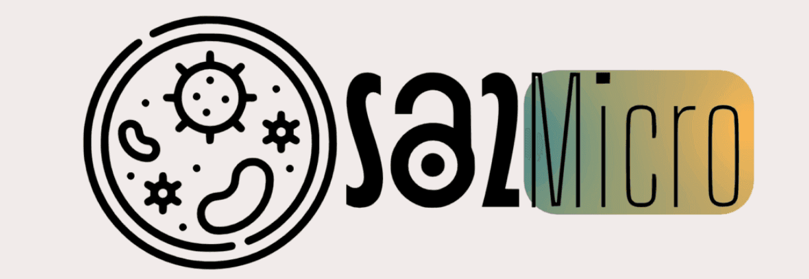
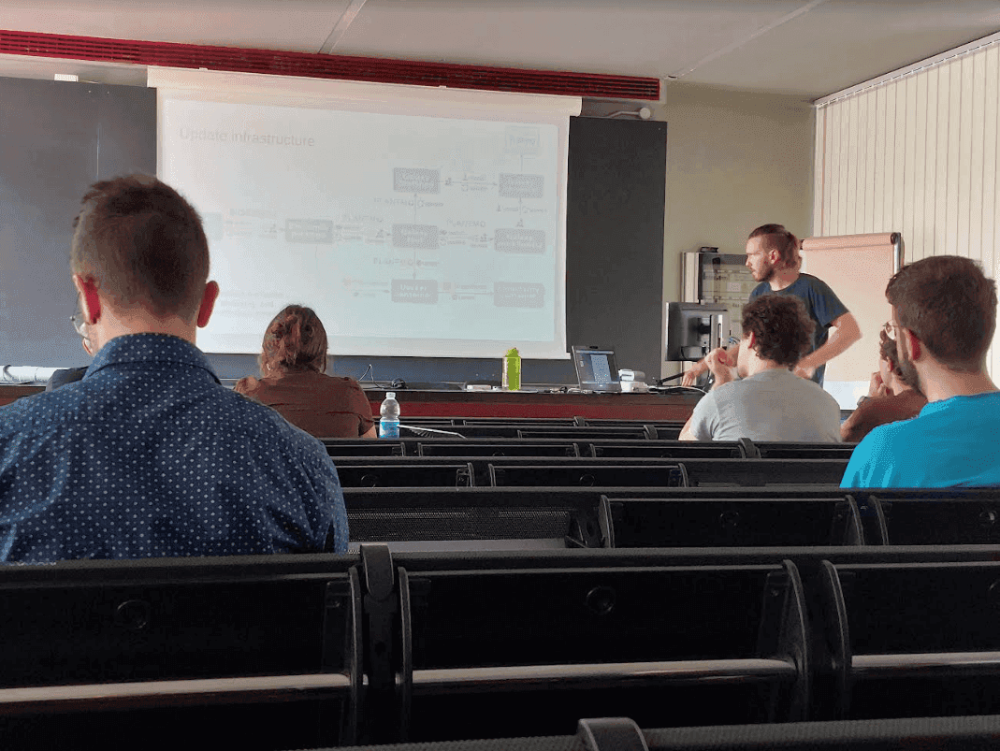

# OSA2Micro in Torino

Paul Zierep traveled to Turino on behalf of Bérénice Batut and gave a [talk](https://docs.google.com/presentation/d/1ft5FGuDsqpkriyRdDfKAVGH0GI9FMkuQDvIYou8-PyY/edit?usp=sharing) and [live demo](https://training.galaxyproject.org/training-material/topics/metagenomics/tutorials/pathogen-detection-from-nanopore-foodborne-data/tutorial.html) for the [OSA2Micro](https://qbio.di.unito.it/cool_timeline/osa2micro/) event. Have a look on the [programme](https://qbio.di.unito.it/wp-content/uploads/2023/04/OSA2Micro_programme_2023-06-30.pdf) to see other interesting talks and lecturers.

The event did present the main achievements of WP2 of the [EOSC-Life project](https://www.eosc-life.eu/) and was visited by 20 students.
The overall feedback of the students was very positive, mainly due to the practical usability of Galaxy! 

# Thank you !

Paul Zierep would like to thank the organizers for the warm welcome and the support during the workshop.

