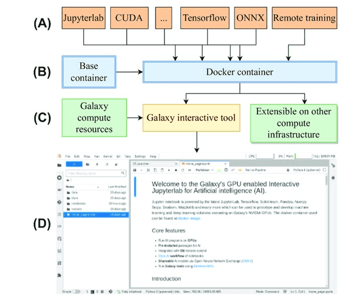

**New *GigaScience* Paper on "An accessible infrastructure for artificial intelligence using a Docker-based JupyterLab in Galaxy"**

**Abstract:**

Artificial intelligence (AI) programs that train on large datasets require powerful compute infrastructure consisting of several CPU cores and GPUs. JupyterLab provides an excellent framework for developing AI programs, but it needs to be hosted on such an infrastructure to enable faster training of AI programs using parallel computing.

An open-source, docker-based, and GPU-enabled JupyterLab infrastructure is developed that runs on the public compute infrastructure of Galaxy Europe consisting of thousands of CPU cores, many GPUs, and several petabytes of storage to prototype and develop end-to-end AI projects rapidly. Using a JupyterLab notebook, long-running AI model training programs can also be executed remotely to create trained models, represented in open neural network exchange (ONNX) format, and other output datasets in Galaxy. Other features include Git integration for version control, creating and executing notebook pipelines, and multiple dashboards and packages for monitoring compute resources and visualization, respectively.

These features make JupyterLab in Galaxy Europe highly suitable for creating and managing AI projects. A recent scientific publication that predicts infected regions in COVID-19 computed tomography scan images is reproduced using various features of JupyterLab on Galaxy Europe. In addition, ColabFold, a faster implementation of AlphaFold2, is accessed in JupyterLab to predict the 3-dimensional structure of protein sequences. JupyterLab is accessible in 2 ways—one as an interactive Galaxy tool and the other by running the underlying Docker container. Long-running training can be executed on Galaxy’s compute infrastructure in both ways. Scripts to create the Docker container are available under MIT license at https://github.com/usegalaxy-eu/gpu-jupyterlab-docker.

## Implementation

A Docker container is created that installs several packages such as JupyterLab, TensorFlow, Scikit-learn, Pandas,
Bokeh, Elyra AI, Seaborn, ONNX, Git, GPU dashboard, ColabFold, JAX and many others for machine learning and data science projects.
 The container inherits an official ["NVIDIA/CUDA"](https://hub.docker.com/layers/nvidia/cuda/11.8.0-cudnn8-runtime-ubuntu20.04/images/sha256-74b166e2091bb705e9ada685dffe79930612c725669bc87e01125b5245d13f97?context=explore) base container containing CUDA packages for GPUs to work with TensorFlow and then installs the abovementioned packages. The Docker container is downloaded by a [Galaxy interactive tool](https://github.com/galaxyproject/galaxy/blob/release_23.0/tools/interactive/interactivetool_ml_jupyter_notebook.xml)
to make it available on Galaxy. Having a Docker container running in the backend provides many security benefits as it interacts
minimally with the remote computer's operating system. In addition, a non-root user inside the container provides additional security benefits.
These benefits are significant as users can execute arbitrary code on JupyterLab notebooks. The Docker container can be downloaded separately to any laptop or personal computer (with at least 20 GBs of space), or any other compute infrastructure from the [Docker hub](https://hub.docker.com/layers/anupkumar/docker-ml-jupyterlab/galaxy-integration-0.2/images/sha256-e2d7e28a2f975523db0f5ac29c2e2ce3c7a35b061072098ad388d5b42ee86fba?context=repo) and used.
If NVIDIA GPUs are available, the Docker container will automatically recognise them. Otherwise, it will run on CPUs.
The scripts to run the container is mentioned in the [GitHub repository](https://github.com/usegalaxy-eu/gpu-jupyterlab-docker). In JupyterLab notebooks, additional packages to create different scientific analyses can be installed, and development environments such as `conda` or `mamba` can be created.

## Use-cases

A recent scientific publication that predicts infected regions of [COVID-19 CT scan images](https://www.sciencedirect.com/science/article/pii/S2666990021000069) is reproduced using multiple features of JupyterLab.
In addition, [ColabFold](https://github.com/sokrypton/ColabFold), a faster implementation of
[AlphaFold2](https://www.nature.com/articles/s41586-021-03819-2), can also be accessed in this notebook to predict
the 3D structure of protein sequences. JupyterLab notebook is accessible in two ways - first as an interactive Galaxy
tool and second, by running the underlying docker container. Long-running training can be executed on Galaxy’s compute infrastructure in both ways. The figure below shows COVID-CT scan images' predicted infected regions by training the Unet AI model on the JupyterLab infrastructure. The accuracy is similar to as published in the
associated [paper](https://www.sciencedirect.com/science/article/pii/S2666990021000069). 

### Use-case 1: Image segmentation of COVID-19 CT scans

The figure below shows COVID-CT scan images' predicted infected regions by training the Unet AI model on the JupyterLab infrastructure. The accuracy is similar to as published in the associated [paper](https://www.sciencedirect.com/science/article/pii/S2666990021000069).

### Use-case 2: Prediction of 3D structures of proteins

The figure above shows predicted 3D structure of spike protein of SARS-CoV-2 using ColabFold.

## GPU JupyterLab as a Galaxy tool in a workflow

GPU JupyterLab intergation in Galaxy can be used as normal Galaxy tool. It takes input datasets from other Galaxy tools, process them in an
IPython notebook and produce output datasets. Those feature makes Jupyterlab perfectly able to be run inside Galaxy workflows.
The following figure shows a sample workflow where GPU JupyterLab tool is used in a Galaxy workflow.

## How to apply for this resource

Please follow these steps for application:

1. Create an account on [Galaxy Europe](https://usegalaxy.eu/) using your official university/company email id.
  `*` If you already have an account change make sure to use an official university/company email in your user preferences.
2. [Apply for accessing GPU JupyterLab](http://usegalaxy.eu/gpu-request).
3. Use your official university/company email id in the Google form that matches your Galaxy account.
4. Once your request is approved, you will be able to run the GPU-enabled JupyterLab notebook on Galaxy.
5. If your are not authorised, you will get an error message that will guide you to the request [form](http://usegalaxy.eu/gpu-request).
6. [Contact us](mailto:consegalaxy.eu?subject=request%20GPU%20access) if there are any issues.

## Useful links

- [Code](https://github.com/usegalaxy-eu/gpu-jupyterlab-docker) to create the Docker container
- [Docker container](https://hub.docker.com/layers/anupkumar/docker-ml-jupyterlab/galaxy-integration-0.2/images/sha256-e2d7e28a2f975523db0f5ac29c2e2ce3c7a35b061072098ad388d5b42ee86fba?context=repo) on Docker hub
- JupyterLab in a [Galaxy workflow](https://usegalaxy.eu/u/kumara/w/gpujupytool-imported-from-uploaded-file)
- Galaxy training network (GTN) [tutorial](https://training.galaxyproject.org/training-material/topics/statistics/tutorials/gpu_jupyter_lab/tutorial.html) on how to use this resource
- An accessible infrastructure for artificial intelligence using a Docker-based JupyterLab in Galaxy [DOI](https://doi.org/10.1093/gigascience/giad028).
