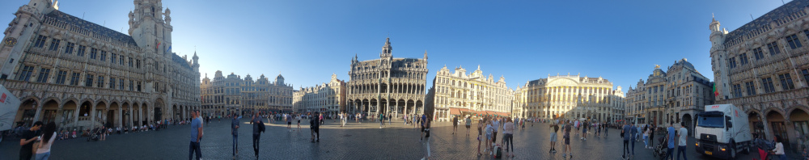
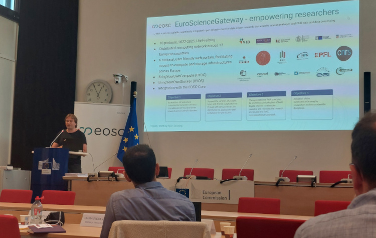
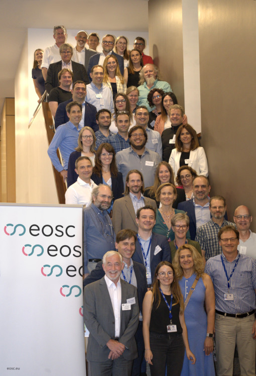

Representatives from 19 EOSC-related Horizon Europe (HE) projects met over two days in Brussels, 15-16 June, for a coordination meeting with the EOSC Association (EOSC-A) and the European Commission in order to deepen collaboration, exchange expertise, and provide project updates. The meeting, held on the joint invitation of DG RTD, DG CNECT and the EC's Research Executive Agency (REA), was the second of its kind following a successful gathering in October 2022, and sought to consolidate and advance discussions among the 19 projects with a particular focus on those funded under the 2022 HE calls.

Björn and Anika (WP1) from the European Galaxy Team represented the [EuroScienceGateway](https://galaxyproject.org/projects/esg) project and contributed to the discussion about the meeting objectives:

- To deepen the collaboration between the consortia involved in EOSC-related projects funded
under Horizon Europe, the EOSC Association and the EC in the context of implementing the EOSC
European Partnership and its Strategic Research and Innovation Agenda (SRIA).
- To provide an update of the contributions made by projects consortia, the EOSC-A and the EC
towards achieving the strategic and operational objectives of the SRIA.
- To discuss the challenges and next steps for the implementation of EOSC as fully operational,
federated infrastructure that enables the sharing of FAIR data and services across borders and
disciplines.

