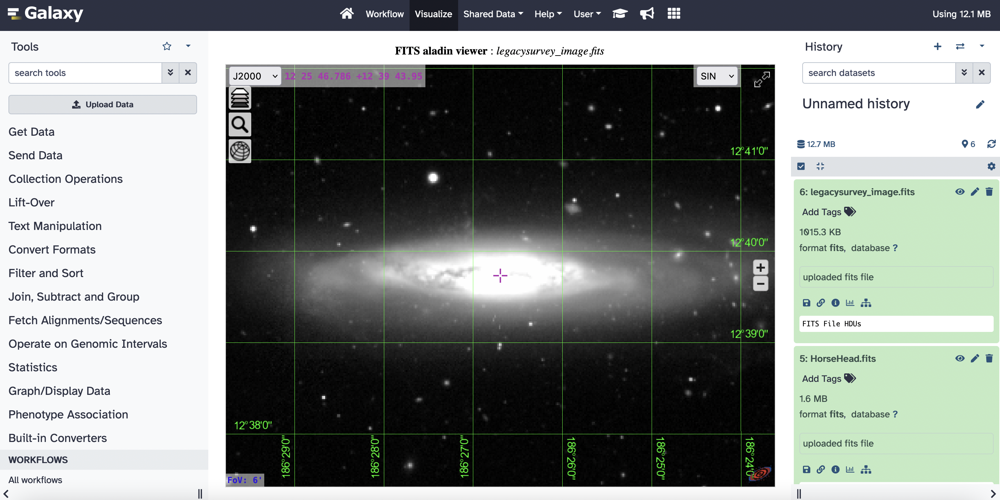

As part of the EuroScienceGateway project [WP5](https://galaxyproject.org/projects/esg/news/?tag=esg-wp5) the [EPFL](https://www.epfl.ch/en/) and [UPC](https://apc.u-paris.fr/APC_CS/) have worked towards the integration of the, widely used in Astronomy, [FITS](https://fits.gsfc.nasa.gov/fits_primer.html) file format which represents sky images.

This integration comes in two parts :

-   The implementation of native support for the FITS format inside Galaxy
-   The development of a specific plugin to add visualization and exploration capabilities for FITS files  

Native support for the FITS format will let astronomers work with FITS files inside Galaxy and generate specific metadata as well as enabling the development of tools and plugins which could be used in astronomical workflows.

The visualization plugin which relies on the [Aladin-lite Viewer](https://aladin.cds.unistra.fr/#AladinLite) developed by the [University of Strasbourg](https://www.unistra.fr/) add the possibility to visualize sky images contained in FITS files and brings an array of features like sky coordinates grid and colormaps used in astronomy.

These additions are part of an ongoing effort to integrate astronomical workflows and data sources like astronomical archives and virtual observatories into galaxy

  

<figcaption>
  A sky image visualized through the Aladin-lite Viewer plugin inside Galaxy
</figcaption>

  