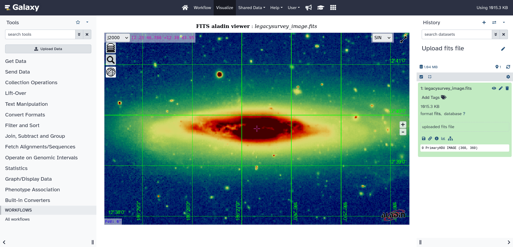

In the scope of EuroScienceGateway project [WP5](https://galaxyproject.org/projects/esg/news/?tag=esg-wp5) [EPFL](https://www.epfl.ch/en/) and [UPC](https://apc.u-paris.fr/APC_CS/) teams contributed to Galaxy code base with integration of [FITS](https://fits.gsfc.nasa.gov/fits_primer.html) file format, widely used in Astronomy to represent sky images, light curves, spectra, and other data.

This integration comes in two parts:

* Introducing to Galaxy native support for FITS format (see [Pull Request](https://github.com/galaxyproject/galaxy/pull/15905)). It allows Galaxy to recognize FITS files and extract from them useful metadata.

* Visualization of images stored in FITS files by embedding widely used in Astronomy [AladinLite Viewer](https://aladin.cds.unistra.fr/#AladinLite) developed by the [University of Strasbourg](https://www.unistra.fr/). This visualization allows to represent dynamic range of the image with a variety of colormaps, overlays sky coordinate system grid, and allows to compare the image stored in Galaxy with other sky images fetched from Virtual Observatory archives (see [Pull Request](https://github.com/galaxyproject/galaxy/pull/16187) for more details).

Both features will be available on all major Galaxy servers in version 23.1.

These additions are part of an ongoing effort to integrate astronomical tools, workflows, and data archives into Galaxy.

We are grateful to [Centre de Données astronomiques de Strasbourg](https://cds.unistra.fr/) for developing AladinLite Viewer.

  

<figcaption>
  A sky image of NGC 4388 active galaxy visualized through the AladinLite Viewer plugin inside Galaxy
</figcaption>

  
