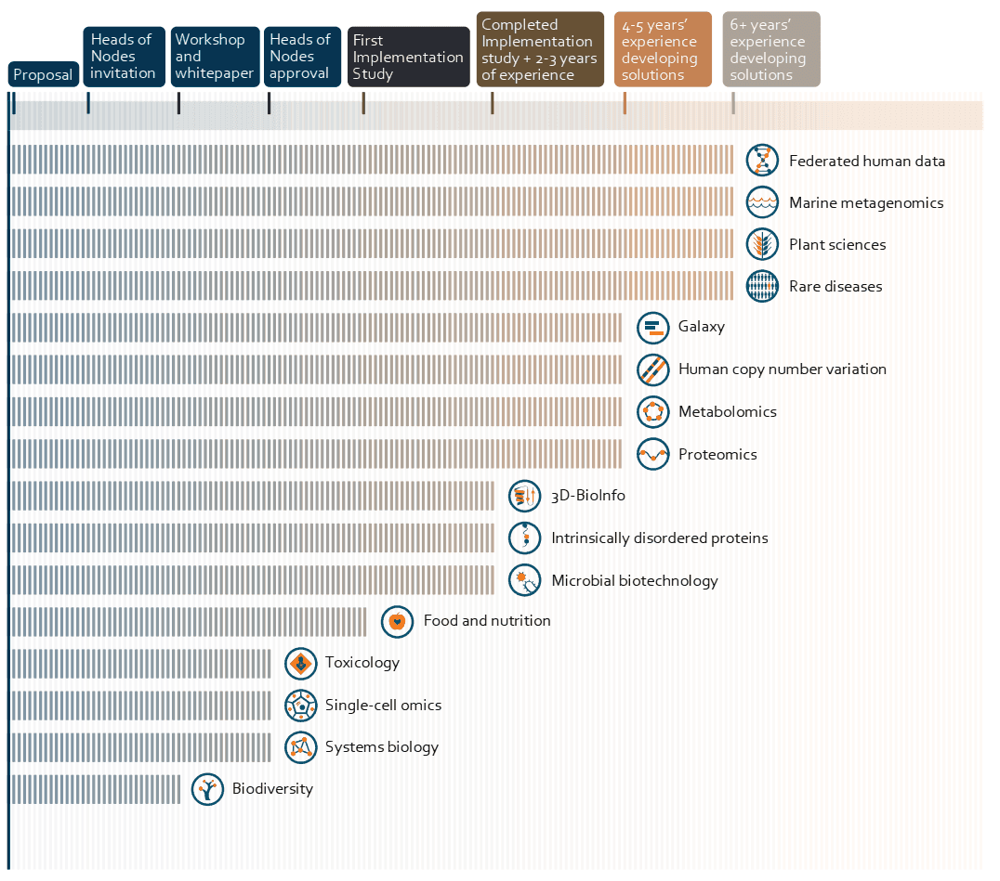

2022 was a year of growth for ELIXIR, the European life sciences infrastructure, which brings together scientists from currently 23 countries and over 250 research institutes. [ELIXIR is organized](https://elixir-europe.org/how-we-work) in [national nodes](https://elixir-europe.org/about-us/who-we-are/nodes), but also acts in cross-national structures, like technical [platforms](https://elixir-europe.org/platforms), domain-driven [communities](https://elixir-europe.org/communities), [internal projects](https://elixir-europe.org/internal-projects), and more. Galaxy is a widely spread project, represented in ELIXIR since 2015, and to be considered both a framework as well as a community. Accordingly, it comes with a number of mentions in [ELIXIR's annual report](https://elixir-europe.org/news/elixir-releases-2022-annual-report) ([PDF](https://elixir-europe.org/sites/default/files/documents/annual-report-2022.pdf)).

## The Platforms

Galaxy is active in all five [platforms](https://elixir-europe.org/platforms); several mentions and cross-connections in the report underlined various involvements.

In the **Compute Platform's** context, Galaxy's initial clientside GA4GH TES API implementation has been acknowledged to be [delivered](https://github.com/galaxyproject/galaxy/pull/14777), and further such integrations are planned in the EuroScienceGateway (ESG) project (see down below). Moreover, the [migration of ELIXIR AAI to Life Science Login](https://elixir-europe.org/AAI-migration) (LS Login) was a central topic, and for sure usegalaxy.eu supports LS Login.

The **Training Platform's** report referred to the [Containers Strategic Implementation Study](https://elixir-europe.org/internal-projects/commissioned-services/making-container-services-integratable), [ELIXIR-CONVERGE](https://elixir-europe.org/about-us/how-funded/eu-projects/converge) (data management and stewardship) and [BY-COVID](https://by-covid.org) (infectious diseases); projects in which Galaxy was/is involved. For the Training Platform roadmap workshop at the ELIXIR All Hands Meeting (AHM) 2022, the Galaxy Community contributed an outline, presented the Galaxy Training Network (GTN) contents and developments towards [learning pathways](https://training.galaxyproject.org/training-material/learning-pathways/). More on the AHM 2022 in [this blog post](https://galaxyproject.org/news/2022-06-21-elixirah22/).

The **Interoperability Platform** takes care for a number of FAIR services, including [RDMkit](https://rdmkit.elixir-europe.org/); [with RDMkit's data life cycle we aligned](https://galaxyproject.org/news/2022-10-19-rdm-galaxy/) in the same year. Another mention addressed [RO-Crate](https://www.researchobject.org/ro-crate/), a community effort to establish a lightweight approach to packaging research data with their metadata. [RO-Crate functionalities are already available Galaxy](https://galaxyproject.org/news/2023-02-23-structured-data-exports-ro-bco/), and the core developers are included in EuroScienceGateway with their own work package 'Stimulate FAIR and reusable research'. Finally, the most recent call for  [Recommended Interoperability Resources](https://elixir-europe.org/platforms/interoperability/rirs) (RIRs) has been initiated in 2022, and Galaxy Europe has applied in early 2023.

Within the **Tools Platform**, Galaxy is one of five in-production services and tightly connected with the other four: [Bio.tools](https://bio.tools) (+ [EDAM](https://edamontology.org)), [BioConda](https://bioconda.github.io)/[BioContainers](https://biocontainers.pro), [OpenEBench](https://openebench.bsc.es/dashboard/) and [WorkflowHub](https://workflowhub.eu). Accordingly, the launch of the ESG project was highlighted, as it will strengthen the promotion of ELIXIR’s mature life science services in EOSC. As a result of the [Tools Platform Ecosystem](https://elixir-europe.org/internal-projects/commissioned-services/tools-platform-ecosystem) project, a [sandbox version](https://github.com/bio-tools/content-sandbox) of the targeted metadata exchange platform ecosystem got available. 

## EuroScienceGateway (ESG)

In September 2022, the new [EuroScienceGateway project](https://www.eurosciencegateway.org) was launched as a joint effort between Galaxy and EOSC. Galaxy project’s first European funded project is a milestone for the community. The overall aim is to establish a distributed workflow‐based gateway to computing and storage infrastructures and services for European scientists.
With the claim to strengthen and consolidate Galaxy as a European research infrastructure, the project works closely with the EOSC Association (EOSC-A) and involves many ELIXIR partners and members, bringing ELIXIR Nodes closer together. Beyond, further external key research partners and other infrastructures in Europe are involved, e.g. EGI and EuroHPC. A key feature is the onboarding of new communities, even beyond the life sciences.

## Communities

In 2022, there were 15 ELIXIR Communities, and Galaxy is one of them. 

For the [**Galaxy Community**](https://elixir-europe.org/communities/galaxy) the general focus was on enabling data intensive analysis, and extending to domains other than life sciences. The onboarding of new scientific fields is a core element of the initiated EuroScienceGateway project, which is a remarkable success on its own for the Community. 
While being involved in [EOSC-Life](https://www.eosc-life.eu) and [BY-COVID](https://by-covid.org), the start of the [Biodiversity Genomics Europe](https://biodiversitygenomics.eu) (BGE) project allowed further engagement with the emerging [**Biodiversity Community**](https://elixir-europe.org/communities/biodiversity). The Galaxy Training Network has been extended and covered 308 tutorials, spanning now 19 different scientific areas. Through events such as the [Smörgåsbord 2022](https://gallantries.github.io/video-library/events/smorgasbord2/tapas.html) online training week, [European Galaxy Days 2022](https://galaxyproject.org/events/2022-10-egd/) and [BioHackathon Europe 2022](https://elixir-europe.org/events/biohackathon-europe-2022) the Galaxy Community connected a multitude of people, in return leading to further improvements of the Galaxy platform. 
In the frame of the Community's Implementation Study '[Strengthen Data Management in Galaxy](https://elixir-europe.org/internal-projects/commissioned-services/strengthen-data-management-galaxy)', the [CWL](https://www.commonwl.org) conformance was increased and export of provenance through RO-Crate implemented. Furthermore, GA4GH standards like [DRS](https://www.ga4gh.org/product/data-repository-service-drs/), [TRS](https://www.ga4gh.org/product/tool-registry-service-trs/), [TES](https://www.ga4gh.org/product/task-execution-service-tes/) and [Beacon](https://www.ga4gh.org/product/beacon-api/) were integrated.

Considering the maturity journey of the ELIXIR Communities, Galaxy appears in tier 3 ("Communities with over four years of work developing standards or technical solutions to meet the Community's needs."): 

Multiple of these Communities are connected to Galaxy, and some explicitly mentioned collaboration efforts:

The **Human Copy Number Variation (hCNV)** Community coordinated with the Galaxy Community and the Tools Platform to adapt and test Beacon v2 specifications with respect to the CNV domain. Both Communities met in the ELIXIR studies "[Reference hCNV datasets, use-case workflows and benchmarks](https://elixir-europe.org/internal-projects/commissioned-services/reference-hcnv-datasets)" and "[Beacon and beyond - Implementation-driven standards and protocols for CNV discovery and data exchange](https://elixir-europe.org/internal-projects/commissioned-services/beacon-and-beyond)". Specifically, a benchmarking environment for CNV detection tools has been prototyped. Plans were worked out for containerization and inclusion in Galaxy CNV callers as well as evaluation against whole genome sequencing (WGS) reference datasets. The **Marine Metagenomics** Community brought their notebooks on the Galaxy Europe infrastructure. Galaxy's strong connections to the **Australian BioCommons** supported ELIXIR's Collaboration Strategy: Technical touchpoints included the Tools and Training Platforms, RO-Crate, EDAM, WorkflowHub, TeSS, FAIR training materials, Galaxy itself, and the **Single Cell Omics** Community.

## Summary

Galaxy is an integrative component of ELIXIR and in turn takes a lot of advantages from the underlying networks. These spread out to various additional efforts, other funding structures like EOSC and even new scientific domains. Meanwhile, there is constant growth of Galaxy's user base; in 2022, we grew by 42% to 55,000 registered users.

