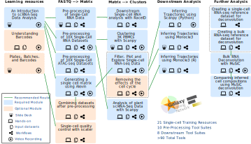

# Overview
Last year has been a marvelous year in the development of single-cell-related tools and workflows on Galaxy. So far the scope of our tools were limited to scRNA-seq. In this update, we included new bioinformatic tools and training materials for analyzing data from other modalities like single-cell ATAC-seq and CITE-Seq. We also extended our scRNA-seq analysis tools beyond clustering and cell type annotation. We now have more downstream analysis tools for trajectory analysis. Furthermore, we integrated advanced analysis tools and tutorials for estimating cell type proportions from bulk RNA-seq data. We also made several updates/improvements to existing tools and training material. The particulars of the updates are as follows:

## Updated **STARSolo** with new options and tutorial 
- Updated **RNA STARSolo** to version 2.7.10b. In this update, we restructured the tool UI, added Velocyto-like UMI counting, and several alternatives for the quantification of single nuclei data. If you used the inbuilt filtering option, you can now output the raw matrix in addition to the filtered one. New junction limit parameters come in handy for mapping large Smart-seq data sets. We also updated the hands-on and video recordings for the [Pre-processing of 10X Single-Cell RNA Datasets](https://training.galaxyproject.org/training-material/topics/single-cell/tutorials/scrna-preprocessing-tenx/tutorial.html) tutorial.

## Single-cell ATAC-seq analysis on Galaxy using **EpiScanpy** and **Sinto**
It is now possible to analyze single-cell ATAC-seq data on Galaxy using [**EpiScanpy**](https://colomemaria.github.io/episcanpy_doc/) tool suite. **EpiScanpy** is built up on the renowned [**Scanpy**](https://scanpy.readthedocs.io/en/stable/) toolkit. Both these toolkits create similar Anndata layers and functions can be used interchangeably. A selection of tools from the [**Sinto**](https://timoast.github.io/sinto/index.html) (single-cell analysis tools) toolkit are also now available for Galaxy. These tools can be used in combination with **EpiScanpy** toolkit for preprocessing the scATAC-seq data on Galaxy. To demonstrate this, we developed a new tutorial named [Pre-processing of 10X Single-Cell ATAC-seq Datasets](https://training.galaxyproject.org/training-material/topics/single-cell/tutorials/scatac-preprocessing-tenx/tutorial.html). This tutorial is used to create a quality count matrix starting from scATAC-seq FASTQ files.

## Bulk RNA-Seq deconvolution using **MuSic**
The new deconvolution tools in Galaxy via the [**MuSiC**](https://xuranw.github.io/MuSiC/articles/MuSiC.html) tool suite now enables the discovery of cell type composition of a bulk RNA-seq using cell types within scRNA-seq. The suite was extended to permit multi-faceted comparisons between multiple bulk RNA and scRNA-seq datasets via the **MuSiC Compare** tool. This is demonstrated in the [Bulk RNA Deconvolution with MuSiC](https://training.galaxyproject.org/training-material/topics/single-cell/tutorials/bulk-music/tutorial.html) tutorial, the data input [formatting](https://training.galaxyproject.org/training-material/topics/single-cell/tutorials/bulk-music-2-preparescref/tutorial.html) [tutorials](https://training.galaxyproject.org/training-material/topics/single-cell/tutorials/bulk-music-3-preparebulk/tutorial.html), and the [comparison tutorial](https://training.galaxyproject.org/training-material/topics/single-cell/tutorials/bulk-music-4-compare/tutorial.html).
Pseudobulk samples can be created by randomly downsampling scRNA-seq cell data into single tissue, useful in validation studies of cell type composition.

## Trajectory inference using **Scanpy** (Python) or **Monocle3** (R)
Want to learn how to analyze single-cell data on Galaxy? We’ve also been working to provide end-to-end analysis in both the [Galaxy GUI](https://training.galaxyproject.org/training-material/topics/single-cell/tutorials/scrna-case_monocle3-trajectories/tutorial.html) as well as in programming languages themselves, starting with parallel trajectory analysis tutorials in [R](https://training.galaxyproject.org/training-material/topics/single-cell/tutorials/scrna-case_monocle3-rstudio/tutorial.html) and [Python](https://training.galaxyproject.org/training-material/topics/single-cell/tutorials/scrna-case_JUPYTER-trajectories/tutorial.html).

## New tutorial on removing the effects of the cell cycle
In response to user demand, we also created a workflow for assessing and [removing cell cycle variation](https://training.galaxyproject.org/training-material/topics/single-cell/tutorials/scrna-case_cell-cycle/tutorial.html) from the clustering analysis.

## Seurat updates and CITE-Seq analysis on Galaxy
[Updates to the **Seurat**](https://github.com/galaxyproject/tools-iuc/pull/5339) tool have added additional functionality! Intermediate outputs are now available which can be used in outside **Seurat** analyses and alternative CITE-seq capabilities are now optional at run time.

# Galaxy single-cell training resources
So far we have developed 21 single-cell training resources for Galaxy covering preprocessing, clustering, downstream, specialized and advanced analysis tutorials that also include hands-on exercises in Python and R programming languages. The following figure shows the single-cell Galaxy training resources with possible learning paths:

