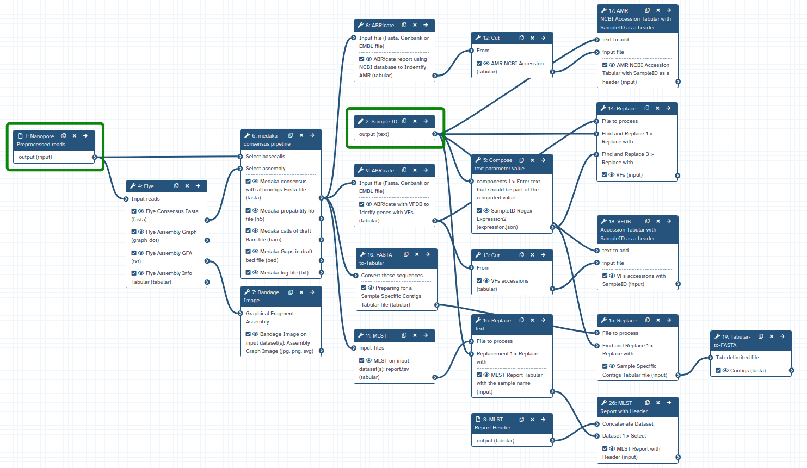
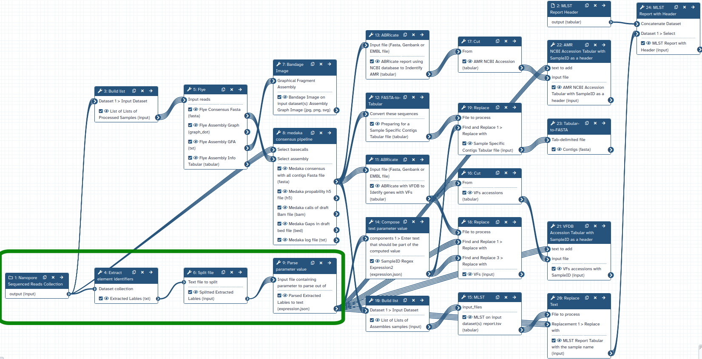
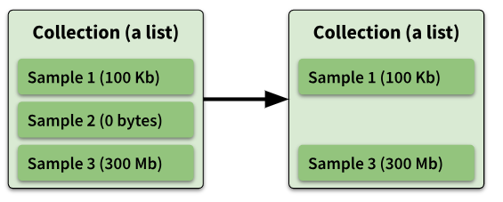
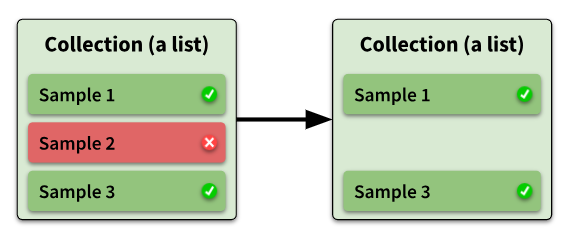
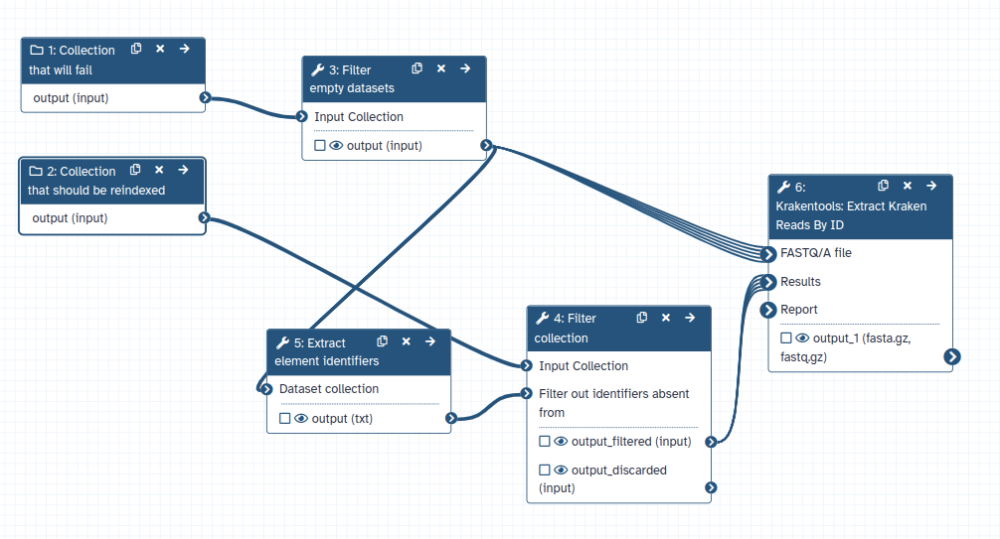
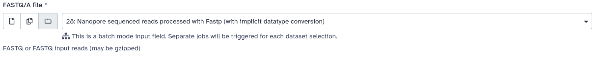
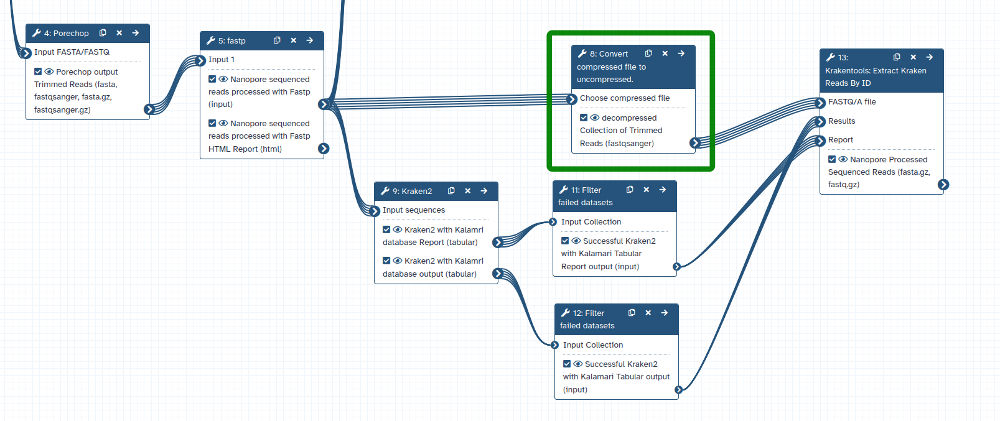

Collections are a great way to bundle multiple dataset into single entities (as shown in the history) that can be 

processed collectively. In fact, when the amount of datasets rises up to 1000+ it becomes essential to use collections.
Galaxy can also use collections in tools that are not specifically designed to process 
collections using the mapping-over strategy (run the tool for each of the elements in a collection). 
Therefore, it should be a peace of cake to port complete workflows that 
were based on processing single files to use collections as well.

However, when applying this idea on our latest metagenomics workflow  [Foodborne Pathogen detection](https://training.galaxyproject.org/training-material/topics/metagenomics/tutorials/pathogen-detection-from-nanopore-foodborne-data/tutorial.html) we encountered some problems 

that arise when switching from single files to collections. 
In the following we would like to present some of those issues and how we solved them, in the hopes that these strategies can help
others to port their workflows to collections.

# Case 1 - Simple inputs for workflow logic

It is often useful to add simple inputs to a workflow such as integers or text to specify specific parameters of tools. Galaxy can also use the output of a tool as input

parameter for another tool. Details are described in the tutorial [Using Workflow Parameters](https://training.galaxyproject.org/training-material/topics/galaxy-interface/tutorials/workflow-parameters/tutorial.html). In the case of the `single file` Foodborne Pathogen Detection Workflow a text input `Sample ID` is used downstream by multiple tools as input.

This figure shows 1 out of 5 workflows, which form together the complete Pathogen Detection workflow. This workflow is the Gene based Pathogenic Identification, which takes as an input the Pre-processed sample reads and the sample ID both marked in green, and mainly identifies all possible pathogens by identifying the genes with Virulence factor for all contigs of the input sample.

  
<figcaption>
  Gene Based Pathogenic Identification For Single Sample Workflow: Green Boxes identifies the single sample input sequences file and the text `Sample ID`, these are to be changed to convert this workflow from taking only one sample to taking a collection of samples 
</figcaption>

* `TODO Link to WF in IWC`

This could not be transformed straight forward into a collection logic, since the input in this case would need to be a list with matching `Sample IDs`.
The problem was solved by using the name of the collection elements as `Sample IDs` and transforming them into workflow parameters using the following set of tools marked in Green, which are `Extract element identifiers`, `Split file` and `Parse parameter value`.

  
<figcaption>
  Gene Based Pathogenic Identification For Collection of Samples Workflow: Green Boxes identifies the collection of samples sequences files as the main input and the tools used to replace the input text `Sample ID`. By this way the user doesn't have to worry about manually entering the `Sample IDs` rather these marked tools will extract them from the collection element names.
</figcaption>

* `TODO Link to WF in IWC`

In case the `Sample IDs` does not match the element identifies a list with matching IDs could 
be provided by the user that is then processed similarly to the described approach.

# Case 2 - Failing or empty elements in a collection

Even if a workflow is well designed, in some cases in can happen that only few elements of a collection fail. This happened to us rather randomly in case of Kraken2, since
it requires large amounts of memory (>70 GB), which were not assigned to every run of the tool by the server. That issue was solved by increasing the minimum memory required by the tool on the EU server (`TODO how was that done`). But there are various other scenarios where the failure of the tool can be attributed e.g. to specific input data. In other cases only a few elements of a collection are empty (e.g. if an assembly can not be made due to not overlapping reads).

If an element of a collection is failed or empty the entire downstream processing is stopped, which can be rather annoying if one want to process large amount of data and got stuck due 
to a few elements. Two solutions are proposed to handle such cases.

## Intermediate workflow specific solution

Collections can be filtered for failed or empty datasets using collection tools such as [filter empty datasets](https://usegalaxy.eu/?tool_id=__FILTER_EMPTY_DATASETS__&version=1.0.0)  
and [filter failed datasets](https://usegalaxy.eu/?tool_id=__FILTER_FAILED_DATASETS__&version=1.0.0). 

  
<figcaption>
  Filter failed collection elements
</figcaption>

  
<figcaption>
  Filter empty collection elements
</figcaption>

Although this can solve the issue in some cases immediately, further considerations need to be made. 
First, often one cannot really know at which step the collection will be affected.
To cover all cases one would need to add the filter steps for every produced collection, which will increase the workflow steps unreasonably. 
Secondly, the filtering will change the size of the collection. If downstream tools depend on a specific collection size, which is always the case if a tool
takes two or more collections as input, the tool will also fail. That's basically a follow up problem of the first problem.
This case can still be solved by a intermediate step where the second collection is basically reindexed by the same element identifiers then the collection with
missing elements. 

  
<figcaption>
  Proposed solution to reindex second collection using elements of the first collection
</figcaption>

  

However, if this logic needs to be applied to multiple collection or again for multiple steps, the workflow becomes even more unreasonably large and complex. 

`TODO explain that filter can also hide actual problems`

## Global tool dependent solution

Since this issue cannot be solved satisfactory on the workflow level, one can still aim to improve the problem for the community by solving it on the tool level.
In general the aim should be that the tool neither fails nor produces empty output. This is much more work but will ultimately have a benefit for all users.
Two things need to be considered here.

* Why does the tool fail, can it be solved? In our case we had to increase the memory of kraken for the server. In other cases it could be necessary to inspect the tool wrapper 
    and find individual solutions.
* Why does the tool produce empty elements? If the tool produces empty elements when in fact it has an output but the output it nothing (e.g. if a detection tools detects nothing), it
might be as simple as adding an empty table or fasta file for this tool, to allow follow up tools to work.

# Case 3 - Collection workflow logic does not fully comply with single file logic 

## Implicit Conversions

Some of our tools ,used in our Foodborne Pathogen Detection Workflow for collection, fails when we run the workflow and succeed when the tool runs alone without a workflow, for example Krakentools: `Extract Kraken Reads By ID` and `Filter Sequence by ID`.

After a bit of investigation we noticed that when these tools run alone (without being in a workflow) they perform an implicit decompressing of the input zipped files, which make the output successful, however when these same tools run with the same exact inputs with-in a workflow this implicit decompressing does not take place, which cause the output to fail.

  
<figcaption>
  Example of the implicit datatype conversion performed by the tools while running stand alone without a workflow in a history
</figcaption>

  

The initial solution was to add `Convert compressed file to uncompressed` tool before running these tools, as shown in green in the figure below

  
<figcaption>
  Part of the Pre-processing pathogen detection workflow for collection, showing the initial solution for decompressing within a workflow
</figcaption>

  

However, this initial solution is not the optimal, since by hundreds and thousands of sequence files the size will increase dramatically in the user's history by running the workflow. For that we have proposed another solution by updating the tools wrappers themselves to perform the decompression internally without the need to use the `Convert compressed file to uncompressed` tool.

The most optimal solution would be updating Galaxy workflow to perform implicit conversions similar to the ones done when running the tool without a workflow.

