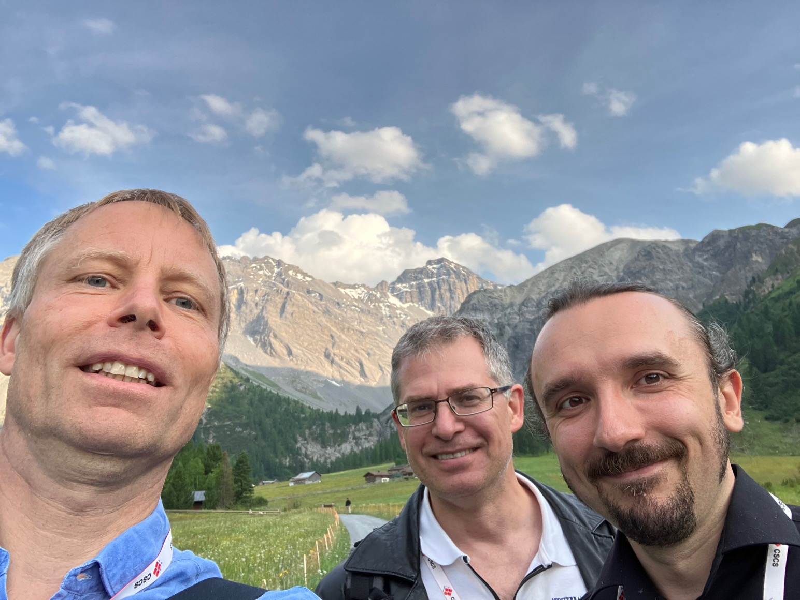
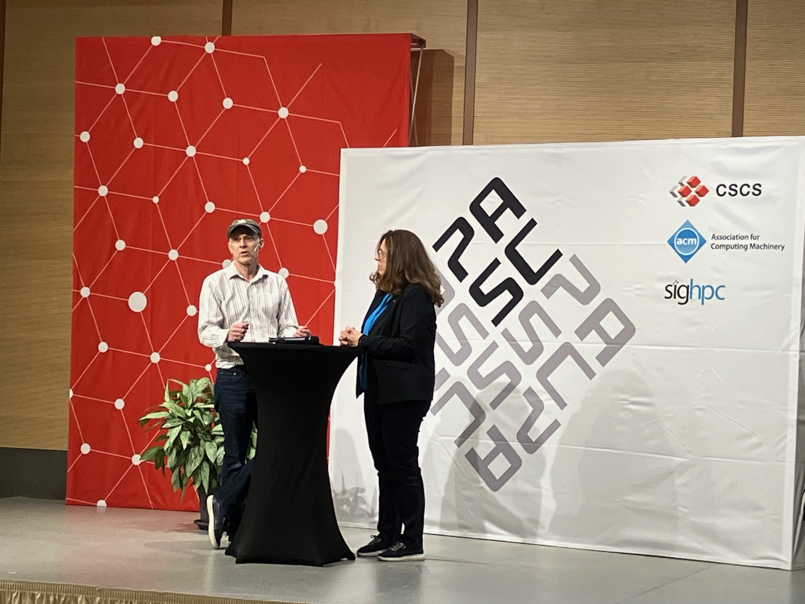

'Computing Across Scales, Domains, and Communities' was the theme of this year's [**Platform for Advanced Scientific Computing (PASC) Conference**](https://pasc23.pasc-conference.org/) which took place in the alpine town Davos during the last week of June. A theme which mirrors many aspects of the Galaxy community. Greg Watson (Oak Ridge National Laboratory, USA), and Leandro Liborio (Science and Technology Facilities Council, UK) took up the opportunity and organized a minisymposium "Galaxy: An Open Web-Based Platform for FAIR Data Analysis and Computing across Scales, Domains and Communities": 

Sergey Yakubov (Oak Ridge National Laboratory, USA) was presenting [**Lessons Learned Deploying Galaxy at a Neutron Scattering Facility**](https://pasc23.pasc-conference.org/presentation/?id=msa158&sess=sess169).

Rolf Verberg (Cornell High Energy Synchrotron Source, USA) was presenting [**Transitioning Existing Data Reduction Workflows at the Cornell High Energy Synchrotron Source to Galaxy**](https://pasc23.pasc-conference.org/presentation/?id=msa221&sess=sess169).

Hans-Rudolf Hotz (Friedrich Miescher Institute, CH) was presenting [**The Galaxy Training Network: A Powerful Framework for Teaching Science**](https://pasc23.pasc-conference.org/presentation/?id=msa165&sess=sess169).

Leandro Liborio (Science and Technology Facilities Council, UK) was presenting [**Galaxy and Scientific Communities: How to Incorporate New Ones, Uplift Engaged Ones and Maintain Mature Ones**](https://pasc23.pasc-conference.org/presentation/?id=msa156&sess=sess169), describing several examples from the [**EuroScienceGateway project**](https://galaxyproject.org/projects/esg/).

 
(Sergey, on-line; Leandro; Greg; Rolf; Hans-Rudolf)  

 
(catching up with Volodymyr Savchenko (École Polytechnique Fédérale de Lausanne, CH) another collaborator from the [**EuroScienceGateway project**](https://galaxyproject.org/projects/esg/), see his recent blog post on 
[**Galaxy for Astronomy: Integration of the FITS file format**](https://galaxyproject.org/news/2023-06-20-esg-wp5-astronomy-fits/) )

 

(Greg is being interviewed by the conference organizers. watch the video on [**youtube**](https://www.youtube.com/watch?v=oJBDPzcxxiA) )

Overall, it has been an interesting and valuable experience to present the Galaxy project from so many different angles.
