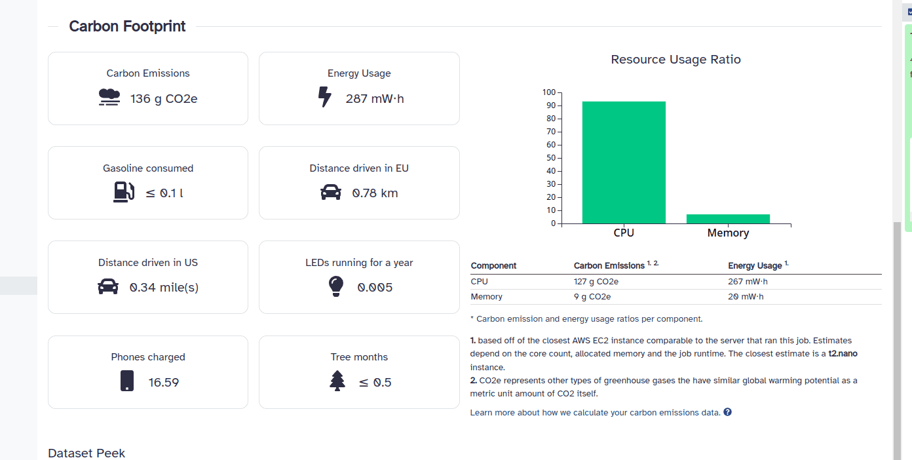
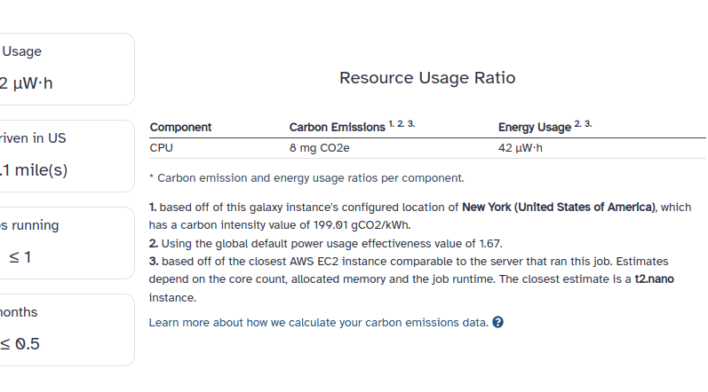

Hello, I'm Rendani, a front-end developer and computer science student working in the Galaxy Freiburg team. For my bachelor project, I had the pleasure of
implementing the carbon emissions reporting feature for jobs in Galaxy.

## Why calculate carbon emissions in the first place?

As we know, cloud computing doesn't come for free. While storing a few files on your local computer may not have a significant carbon footprint,
running large bioinformatic workflows can have a substantial impact. During my research for this project, I was surprised to learn about the various
factors that effect carbon emissions, such as the [power usage](https://en.wikipedia.org/wiki/Power_usage_effectiveness)
of the data center housing your server and the [carbon intensity](https://en.wikipedia.org/wiki/Emission_intensity) of the country its running in.
Algorithm runtime, hardware specifications and geographical location all have an impact on how "green" your computations are.

## What's new

Carbon emissions reporting in Galaxy is based off of the work done by the [Green Algorithms Project](https://www.green-algorithms.org/)
and in particular their implementation of the ["carbon footprint calculator"](http://calculator.green-algorithms.org/). Our implementation has
been slightly adjusted to better fit our use case. Additionally, some of our carbon emissions reporting is based off of calculations done by the
[United States Environmental Protection Agency (EPA)](https://www.epa.gov/energy/greenhouse-gases-equivalencies-calculator-calculations-and-references).

Currently, whenever you run a job in Galaxy and navigate to the dataset details section of that job, you're presented with a carbon emissions summary
detailing the estimated CO2 output and energy usage of that job. Additionally, we compare your job's carbon footprint to things like the distance driven in a car
or the amount of smartphones you could have charged given your job's energy usage. This helps make the numbers more relatable. Here's an example carbon emissions report:

<div style="display: flex; justify-content: center; align-items: center;">
    
</div>

## Implementation details

In order to estimate a job's carbon footprint, we first compute its energy usage in watts. We consider metrics like the job runtime (in hours),
its memory usage (in MiB) and hardware specific information about the server running your job. In particular, make use of information like the
number of compute cores allocated to the job, the total available cores and the [TDP (Thermal Design Power)](https://www.tomshardware.com/reviews/tdp-thermal-design-power-definition,5764.html)
of the server's CPU. We also assume that 100% of each core allocated is used.

Since hardware specifications vary greatly and that we can't always assume that this information is provided, we estimate the server's hardware configuration
by matching your job's CPU and/or memory usage to a comparable general purpose [AWS EC2 instance](https://aws.amazon.com/ec2/instance-types/).
EC2 offers a wide range of server configurations allowing us to cover more real-world situations.

Once we have the information needed, we calculate the power usage of the CPU and memory in watts. For each component, the respective power usage is
the product of the amount of allocated resources, a [power usage effectiveness](https://en.wikipedia.org/wiki/Power_usage_effectiveness) value and a power usage factor.
For CPUs, the power usage factor is the CPU TDP per core and, for memory, we use a reference average [power draw constant](http://dl.acm.org/citation.cfm?doid=3076113.3076117)
of 0.375 W/GiB from the "Carbon Footprint Calculator". Here's what that calculation looks like:

```
    memory_allocated_in_gibibyte = memory_allocated_in_mebibyte / 1024
    tdp_per_core = cpu_TDP / cpu_core_count
    normalized_tdp_per_core = tdp_per_core * cores_allocated_to_job

    power_needed_cpu = pue * normalized_tdp_per_core
    power_needed_memory = pue * memory_allocated_in_gibibyte * memory_power_usage_constant
    total_power_needed = power_needed_cpu + power_needed_memory
```

The power usage is then converted into energy usage (in kWh) by factoring in the job runtime (in hours):

```
    energy_needed_cpu = runtime * power_needed_cpu / 1000
    energy_needed_memory = runtime * power_needed_memory / 1000
    total_energy_needed = runtime * total_power_needed / 1000
```

Finally, we convert the energy usage into estimated carbon emissions (in metric units CO2e) by multiplying the carbon intensity of the server location.
CO2e represents other green house gases that have the same global warming effect as a metric unit of carbon dioxide, while carbon intensity is
a measure of how environmentally friendly the energy production is in a particular country. The carbon intensity is dependent on geographical location,
so Galaxy allows admins to specify the geographical location of the server running the Galaxy instance. In the current implementation, we assume
that all jobs are run in the same geographical location as the configured location.

```
    cpu_carbon_emissions = energy_needed_cpu * carbon_intensity
    memory_carbon_emissions = energy_needed_memory * carbon_intensity
    total_carbon_emissions = total_energy_needed * carbon_intensity
```

We compare your job's total carbon emissions with [values calculated by the EPA](https://www.epa.gov/energy/greenhouse-gases-equivalencies-calculator-calculations-and-references).
When calculating the equivalent distance driven, we use the reference values from the Green Algorithms Project's "Carbon Footprint Calculator".

```
    gasoline_consumed = total_carbon_emissions / gasoline_emissions_as_per_epa
    carbon_carbon_savings_by_using_leds = total_carbon_emissions / led_carbon_savings_as_per_epa
    equivalent_km_in_eu = total_carbon_emissions / average_passenger_car_emissions_eu
    equivalent_km_in_us = total_carbon_emissions / average_passenger_car_emissions_us
    smartphones_charged = total_carbon_emissions / smartphone_charged_emissions_as_per_epa
    tree_months = total_carbon_emissions / tree_year * 12
```

## Configuration options

The Galaxy configuration interface has been extended to allow admins customize the carbon emissions reporting behavior and improve estimation accuracy
The following flags were added:

-   `geographical_server_location_code` an [ISO 3166](https://en.wikipedia.org/wiki/ISO_3166) code specifying the geographical location of the Galaxy instance.
-   `power_usage_effectiveness` the PUE value to use in carbon emissions calculations.
-   `carbon_emission_estimates` a feature toggle flag allowing the to be completely disabled when needed.

As mentioned, we assume that jobs are run in the same geographical location as the configured Galaxy server location. An example of a galaxy instance
configured with a location looks as follows:

<div style="display: flex; justify-content: center; align-items: center;">
    
</div>

## Next steps

It would be interesting to consider computations using GPU cores, for jobs that use them, or to look into estimating data storage and transfer emissions for
file upload jobs. Another useful feature would be calculating the total carbon emissions of an entire history or specific workflow.

## References

-   Lannelongue, L., Grealey, J., Inouye, M., Green Algorithms: Quantifying the Carbon Footprint of Computation. Adv. Sci. 2021, 8, 2100707. [https://doi.org/10.1002/advs.202100707](https://doi.org/10.1002/advs.202100707)
-   "Greenhouse Gases Equivalencies Calculator - Calculations And References | US EPA". 2015. US EPA. [https://www.epa.gov/energy/greenhouse-gases-equivalencies-calculator-calculations-and-references](https://www.epa.gov/energy/greenhouse-gases-equivalencies-calculator-calculations-and-references).
